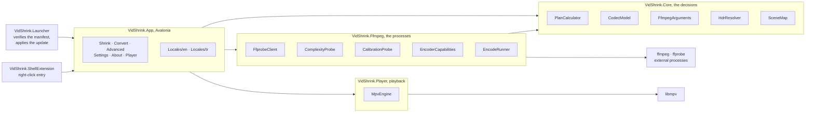

# Contributing

Thanks for taking the time. A few things worth knowing before you open a pull request.

## License

This project is licensed under **AGPL-3.0-or-later**. Every contribution you submit is
licensed under the same terms. If you are not comfortable with that, please do not submit
a contribution.

The reason for copyleft here is a promise, not a business model: this software is free and
stays free. AGPL is what makes that promise binding on everyone downstream, not just on
the author.

## Developer Certificate of Origin

Every commit must be signed off. This is a statement that you wrote the code, or otherwise
have the right to submit it under the project's license. It is not a copyright assignment
and you keep the copyright to your work.

Add the sign-off with `-s`:

```bash
git commit -s -m "your message"
```

That appends a line to the commit message:

```
Signed-off-by: Your Name <your.email@example.com>
```

The full text you are certifying is the Developer Certificate of Origin 1.1, reproduced in
[DCO](DCO). Commits without a sign-off will not be merged.

## Pull requests

- One concern per pull request. A license fix and a feature do not belong in the same
  branch.
- Match the surrounding code. Comment density, naming, and idiom should read as if the
  file had one author.
- Run the project's test suite before opening the pull request. If the README documents a
  command for it, use that one.

## Reporting problems

Open an issue with what you did, what you expected, and what happened instead. Steps to
reproduce are worth more than a description of the symptom.

## Development

Building from a clone needs the .NET 8 SDK.

```sh
dotnet build VidShrink.sln -c Release
```

```sh
dotnet test VidShrink.sln
```

Four shipped projects and one shell integration. Decisions live in `Core`, processes live
in `Ffmpeg`, and the interface reads a decision rather than making one.



```text
src/VidShrink.Core            complexity model, strategy, planning, ffmpeg argument construction
src/VidShrink.Ffmpeg          ffprobe, probes, encode execution
src/VidShrink.Player          libmpv playback engine behind the player tab and the comparison panel
src/VidShrink.App             Avalonia interface, one source tree for all three platforms
src/VidShrink.Launcher        Windows launcher, applies the file-level update before the app loads
src/VidShrink.ShellExtension  the Explorer right-click entry
tests/VidShrink.Tests         engine and argument-generation regression tests
tools/VidShrink.Bench         the measurement harness behind every published number
docs/gorseller/               every screenshot and badge this README and its Turkish twin use
```

Design notes worth knowing before you send a patch. Colours and measurements come only from
tokens, never from the call site. Every colour lives in the palette under
`src/VidShrink.App/Themes/Palette/<Name>/Theme.axaml`, and every measurement in
`src/VidShrink.App/Themes/Theme.axaml`. Changing the palette file changes the whole look,
splash image included; `App.axaml` names the palette in use and every reader follows it. Every string
on screen comes from `Locales/<language>/<area>.json` and is read by key. Any number that
reaches a document comes out of `tools/VidShrink.Bench`, not out of an estimate.

Images are all under `docs/gorseller/` and referenced with repository-relative paths. Keep
it that way: a `C:\Users\...` path or a `file://` URL exists only on the machine that made
it, and GitHub is case-sensitive about filenames.

Release history is in [`CHANGELOG.md`](CHANGELOG.md). The engine audit and the benchmark
requirements are in
[`docs/claude-engine-audit-report.md`](docs/claude-engine-audit-report.md); the measurements
behind the roadmap are in [`docs/olcumler/`](docs/olcumler/).


## Branches

Only the maintainer merges into `main`. Work on your own branch and push there:
`git switch -c <owner>/<subject>`. Do not write directly in the working tree of `main`.
