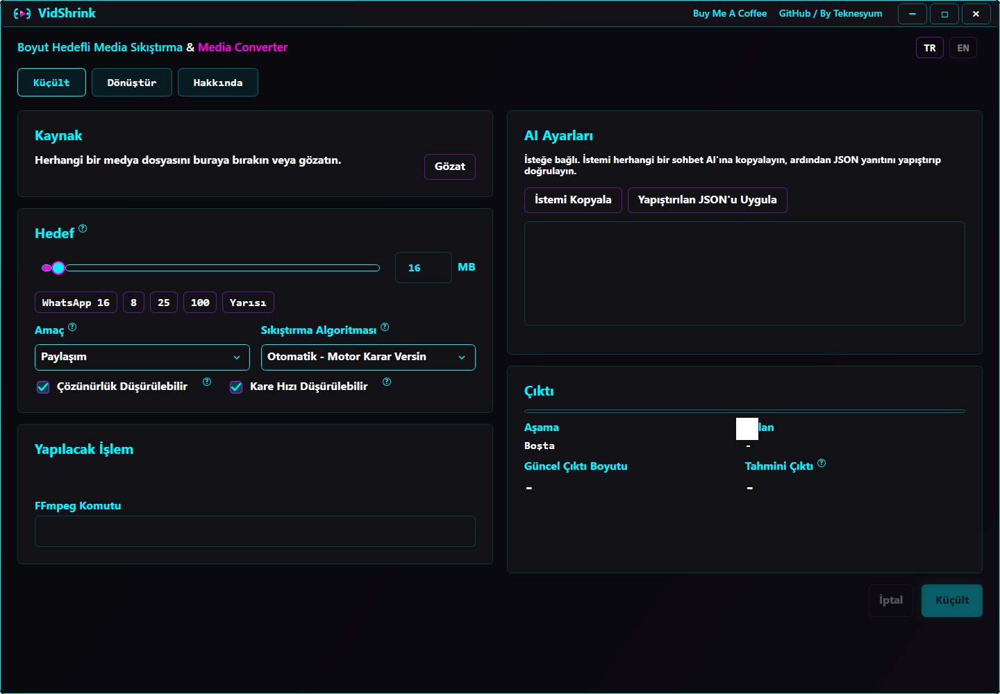
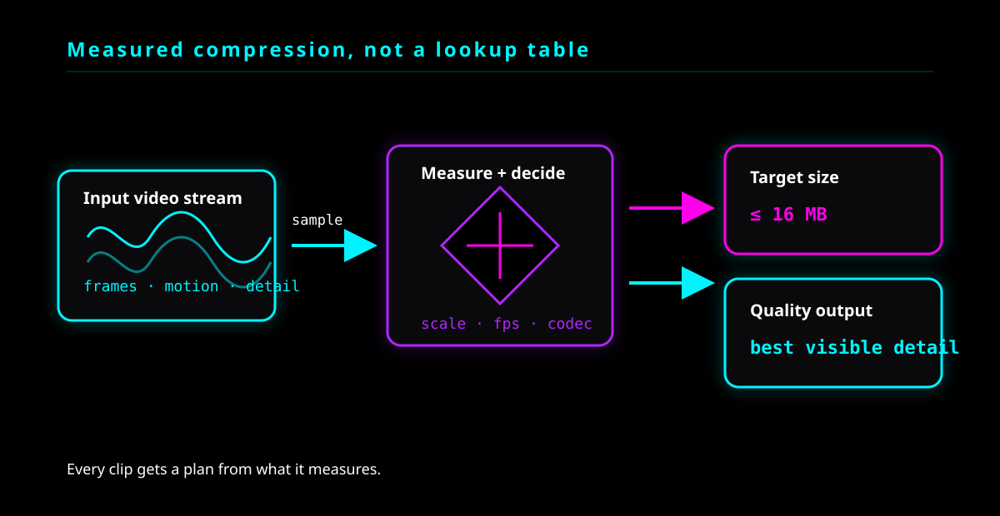

# VidShrink

Free, offline desktop app for Windows, macOS and Linux that shrinks a video to a target file size — and loses the least of what a person can actually see while doing it.

Give it a file and a ceiling in megabytes. It never returns a file larger than you asked for, and it tells you the expected size before you press start.

The interface starts in Turkish and switches to English instantly with the `TR` / `EN` buttons.



### Measured compression flow



## One-command installation

### Windows

Open PowerShell and run:

```powershell
irm https://raw.githubusercontent.com/Teknesyum/VidShrink/main/Install-VidShrink.ps1 | iex
```

The installer needs no administrator rights. It reuses an installed .NET 8 SDK when it finds one and otherwise bootstraps it with Microsoft's own `dotnet-install.ps1` into `%LOCALAPPDATA%\Microsoft\dotnet`; FFmpeg and FFprobe come from WinGet. It then downloads the latest `main` source, publishes a self-contained Release build for the machine's own architecture, installs it under `%LOCALAPPDATA%\Programs\VidShrink`, and creates Desktop and Start Menu shortcuts. Running the same command again replaces the installed app with the newest version.

The command needs no change to your execution policy. `irm | iex` runs the installer from memory rather than from a file, and the installer runs Microsoft's `dotnet-install.ps1` the same way, so Windows' default `Restricted` policy blocks neither of them. If a stricter organizational policy blocks the command outright, download and inspect [`Install-VidShrink.ps1`](Install-VidShrink.ps1), then run it from an allowed PowerShell session with the command below. Read the file explicitly as UTF-8 rather than passing `-File`: the script is stored as UTF-8 without a byte order mark, and Windows PowerShell 5.1 reads a mark-less script file in the system ANSI code page, which turns every non-ASCII character in the installer's messages into mojibake.

```powershell
powershell -NoProfile -ExecutionPolicy Bypass -Command "iex ([IO.File]::ReadAllText('C:\path\to\Install-VidShrink.ps1',[Text.Encoding]::UTF8))"
```

### macOS and Linux

Open a terminal and run:

```sh
curl -fsSL https://raw.githubusercontent.com/Teknesyum/VidShrink/main/install-vidshrink.sh | sh
```

The installer needs no root. It reuses an installed .NET 8 SDK when it finds one and otherwise bootstraps it with Microsoft's own `dotnet-install.sh` into `~/.dotnet`. It then downloads the latest `main` source, publishes a self-contained Release build for the machine's own architecture — `osx-arm64`, `osx-x64`, `linux-x64` or `linux-arm64`, decided from `uname` — installs it under `~/.local/share/vidshrink`, and links it as `~/.local/bin/vidshrink`. Running the same command again replaces the installed app with the newest version.

FFmpeg is the one thing this installer will not put on your machine for you. If `ffmpeg` or `ffprobe` is missing it prints the command for your package manager — `brew install ffmpeg`, `sudo apt install ffmpeg`, `sudo dnf install ffmpeg` — and stops before downloading anything else.

### Staying up to date

**On Windows the application updates itself while it opens, without asking.** The Desktop and Start Menu shortcuts point at `VidShrink.exe`, a small launcher that sits above the application. Before the application is loaded, the launcher fetches the release manifest, compares the SHA-256 of every file under `app\` with the published one, downloads only the files whose digest differs, verifies each download against the manifest, and applies them in one step. A typical release changes about 1.7 MB of a 519 MB installation, so that is what comes down the wire.

**The check runs at most once a day.** The launcher records when it last looked and, until twenty-four hours have passed, does not go to the network at all — no manifest fetch, no waiting, the application simply starts. The time of the last check is kept next to the setting in `%APPDATA%\VidShrink`. An update that was interrupted is exempt from the limit: it is finished on the next launch whenever that happens.

The launcher never blocks the application from opening. No network, unresolved DNS, a rate limit, a broken manifest, a full disk: in all of them it gives up silently and starts the installed version as it is. Fetching the manifest has an 800 ms timeout, and on a machine with no network only the first launch of the day pays it at all.

Downloaded files are verified before anything is replaced. A file whose digest does not match is discarded and the update is cancelled for that round, which is what catches a half-downloaded file. Files land in a staging folder first and move into `app\` only after all of them verify, so a half-updated `app\` folder never becomes visible. FFmpeg does not travel with releases and is never downloaded again; the launcher only checks that `ffmpeg.exe` and `ffprobe.exe` are still there and tells you the install command if they are not.

**Automatic updates are on by default and can be switched off.** The switch lives in the application's settings and is stored in `%APPDATA%\VidShrink\settings.json`, next to your other settings rather than next to the executable, so reinstalling does not reset it. With it off the launcher does not even fetch the manifest and downloads nothing, and Windows behaves like macOS and Linux: the application itself asks once, at startup, whether a newer version exists, and tells you — you update by running the install command again. That one question is the only network request left; dismissing a version stops it being mentioned again.

**On macOS and Linux the application only tells you that a new version exists.** Changing a file inside a `.app` bundle breaks its Gatekeeper signature and the application then refuses to open at all, so nothing is replaced in place. Update by running the install command again:

```sh
curl -fsSL https://raw.githubusercontent.com/Teknesyum/VidShrink/main/install-vidshrink.sh | sh
```

### README image portability

The screenshot above is committed at `docs/assets/vidshrink-current.png` and referenced with a repository-relative path. Do not replace it with a path such as `C:\Users\...`, a temporary Codex attachment path, or a `file://` URL: those addresses exist only on the computer that created them. On GitHub, also keep filename capitalization identical and make sure the image file is committed and pushed rather than merely present in the local working folder.

## Why this one

Most size-target compressors apply a lookup table. So many megabytes per minute becomes so much resolution, regardless of whether you handed it a static screen recording or a handheld night shot. That table is wrong for every clip that is not average — which is most clips.

**VidShrink measures your actual file instead of guessing from its bitrate.**

Before planning anything, it encodes short samples of your clip at two different resolutions and reads two numbers off the result:

- **How many bits this content really costs.** A gradient and a confetti cannon at the same 1080p30 are not the same encoding problem. The source bitrate does not tell you which one you have — the source could have been encoded badly, or with a different codec, or twice.
- **How much of that cost disappears when the picture is scaled down.** This varies enormously between clips. On real measurements taken during development, one test clip lost 87% of its per-pixel cost when halved; another lost 22%. A fixed assumption is wrong for both.

That second number is the one nearly nobody measures, and it is what decides the single most consequential question in size-target compression: *is it better to keep the resolution and encode it worse, or drop the resolution and encode it well?* VidShrink answers that per clip, from measurement, instead of from a rule.

### What follows from measuring

| | Typical size-target tool | VidShrink |
|---|---|---|
| Content complexity | inferred from source bitrate | measured by encoding samples of your file |
| Detail falloff on downscale | fixed assumption, or ignored | measured per clip at two resolutions |
| Resolution choice | fixed ladder (1080 → 720 → 480) | continuous search, any scale that fits |
| Frame rate choice | applied after resolution, if at all | searched jointly with resolution |
| Codec choice | whatever you picked | can be chosen from how hard the target actually is |
| Audio budget | fixed bitrate | share that shrinks as the target tightens |
| Size estimate | often none for quality mode | measured number with a stated range, shown up front |
| Overshoot handling | retry loop | plan lands in one pass; retry is the fallback, not the plan |

### It knows when to stop

Filling the target is not the goal — hitting the quality ceiling is. Once more bits stop buying anything a viewer could see, VidShrink hands back a smaller file rather than padding it out to the number you typed. Ask for 25 MB on an easy clip and you may get 9 MB that looks identical to the source.

The reverse also holds: when the target genuinely constrains quality, it spends the whole budget rather than leaving a third of it unused.

### It adapts to how hard you are pushing

A 1.2× reduction and a 600× reduction are different problems and get different treatment:

| Scenario | Reduction | Engine behaviour |
|---|---|---|
| Light | under 1.5× | keeps resolution and frame rate, simply spends the budget |
| Balanced | 1.5–6× | allows resolution scaling |
| Aggressive | 6–30× | unlocks frame-rate reduction, moves to H.265, trims audio share |
| Extreme | over 30× | maximum compression, mono or dropped audio, and it says so |

Whatever it changes, it explains — in plain language, in the app, before you start.

### Where the loss goes

Below a certain bit budget something has to give. VidShrink spends the loss where the eye is least sensitive: softness before blocking, fewer pixels before broken pixels, mono audio before a starved picture.

### Measured results

Measured end to end on real footage rather than synthetic clips.

Software encoding, 400 s of 1080p60:

| Target | Result | Attempts |
|---|---|---|
| 180 MB | 178.35 MB | 1 |
| 100 MB | 99.16 MB | 1 |
| 25 MB | 24.63 MB | 1 |
| 8 MB | 7.85 MB | 1 |

All four landed inside the fill band on the first attempt and the ceiling was never crossed.

Hardware encoding (`av1_amf`) is not there yet. Large targets reach the band on the first attempt — 100 MB in 99.01, 50 MB in 49.97 — but small ones still take a second: 25 MB in 24.43 and 8 MB in 7.80, both after two attempts. The overshoot comes from the peak rate being pinned to a fixed multiple of the source regardless of target size.

- **Size estimate accurate to within 8%**, typically within 4%
- **Budget fill 92–99%** on constrained targets

## When a run overshoots

A result that lands over the target does not start a second run on its own. The run stops, shows what came out and how far over it went, says how long that attempt took, and asks whether to try again or end there. A retry costs roughly what the first attempt cost, which is why the number is on screen before you decide.

Ending there is not the same as accepting an oversized file. VidShrink never hands back a file larger than the target: ending the run delivers the last result that came in under the target, and writes nothing at all if there isn't one. The question says so in as many words, because "leave it as is" reads like the opposite.

In practice the question only appears on hardware encoding at small targets. Software encoding reaches the band on the first attempt at every target measured above.

## Shrink

Drop or browse to any file `ffprobe` recognizes as containing a video stream. The filename extension is never an acceptance gate. Silent video, variable frame rate, animated GIF, rotation metadata, and uncommon containers all work whenever the installed ffmpeg can decode them.

Defaults are set for the most common case: **16 MB, Sharing intent, automatic codec.** WhatsApp accepts files up to 2 GB, but it re-compresses any video you send in chat with its own weak encoder. Staying at or below 16 MB usually gets your file through with far less damage, so the other side sees VidShrink's quality rather than WhatsApp's. To bypass WhatsApp's re-encode entirely, send the result as a document.

Every technical control carries a `?` badge explaining, in both languages, what it does, whether it affects sending to WhatsApp, and whether phones support the result.

AI mode is optional and not embedded. VidShrink writes a prompt you can paste into any chat AI, then validates the JSON you paste back against the current source and options. It stays offline, needs no API key, and falls back to the automatic plan when a response is malformed or stale.

## Convert

The CONVERT tab supports MP4, MKV, WebM, MOV, AVI, GIF, MP3, M4A, and WAV. Choose H.264, H.265, VP9, AV1, or stream copy; CRF or fixed bitrate; source, preset, or custom resolution and frame rate; audio encoding, copy, or removal; and optional trimming. MP3, M4A, and WAV extract audio only. GIF conversion uses `palettegen` followed by `paletteuse`.

Stream copy uses real `-c:v copy` and `-c:a copy`. Incompatible container and source-codec combinations are blocked before execution. The exact ffmpeg command is visible for every operation.

## Advanced

Two things live on their own tab rather than in the way of the main flow.

The **FFmpeg command** is the exact command the engine will run. It sits on one line and
expands when you want to read it; it is selectable and copyable either way. Nothing here
is a summary — it is the command itself, so you can take it elsewhere or check what the
engine decided.

**AI settings** are optional. Copy the prompt into any chat AI, paste the JSON it answers
with, and the plan is applied. VidShrink makes no network request of its own for this;
you carry the text both ways.

Scrollbars on both boxes appear only while the pointer is over them.

## Codec guidance

- **H.264** plays on essentially every device ever made and is what WhatsApp expects.
- **H.265** needs roughly a third fewer bits for the same picture; every phone since about 2016 decodes it in hardware, but older handsets and some web players will not.
- **VP9** is a browser and WebM format.
- **AV1** compresses best and encodes slowest; only recent phones decode it.
- **Stream copy** is instant and lossless when the destination accepts the source streams.

## Requirements and development build

- Windows 10 or 11, macOS 12 or newer, or a Linux desktop running X11 or Wayland
- `ffmpeg` and `ffprobe` in a `tools/ffmpeg` folder beside the application, or on `PATH`
- No .NET runtime. Both installers publish a self-contained build, so the runtime travels inside the installed application

Building from a clone needs the .NET 8 SDK:

```sh
dotnet build VidShrink.sln -c Release
dotnet test VidShrink.sln
```

## Project layout

```text
src/VidShrink.Core     complexity model, strategy, planning, ffmpeg argument construction
src/VidShrink.Ffmpeg   ffprobe, complexity probe, encode execution
src/VidShrink.App      Avalonia user interface, one source tree for all three platforms
src/VidShrink.Launcher Windows launcher, applies the file-level update before the app loads
tests/VidShrink.Tests  engine and argument-generation regression tests
```

Release history is in [`CHANGELOG.md`](CHANGELOG.md). The current engine audit, fixed defects, benchmark requirements, and quality roadmap are documented in [`docs/claude-engine-audit-report.md`](docs/claude-engine-audit-report.md). A market-leading claim is intentionally deferred until the HDR/10-bit, perceptual-metric, and competitor benchmark gates in that report are met.

## License

AGPL-3.0-or-later — see [LICENSE](LICENSE).

Copyright (C) 2026 Teknesyum

**FFmpeg is a separate program under its own license, and VidShrink does not redistribute it.** On Windows the installer asks WinGet for `Gyan.FFmpeg`, whose builds are GPLv3. On macOS and Linux the installer installs nothing — it prints your package manager's command and you fetch FFmpeg yourself. Either way the binary arrives on your own machine, under its own terms, at install time. It is not in this repository and not inside anything this repository hands out. VidShrink runs `ffmpeg` and `ffprobe` as external processes and links no GPL code into the AGPL-3.0 application.

Releases do not carry FFmpeg either, and the reason is size rather than licensing. FFmpeg and FFprobe are 424 MB of a 519 MB installation and do not change when VidShrink does; shipping them with every release would send 424 MB down the wire to replace nothing. They are fetched once, at install time, from your package manager.

The licence note above was first written when VidShrink was MIT, where bundling a GPLv3 build would have been the problem. Under AGPL-3.0-or-later the question is a different one — AGPLv3 and GPLv3 are written to be compatible, and a copyleft source obligation is already what this project carries. Anyone preparing a packaged release that includes FFmpeg should work the licensing through for that specific build rather than rely on this paragraph.
