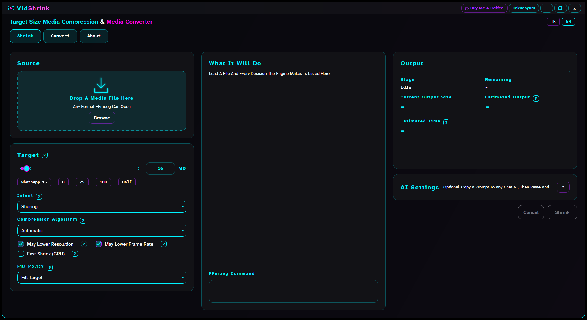
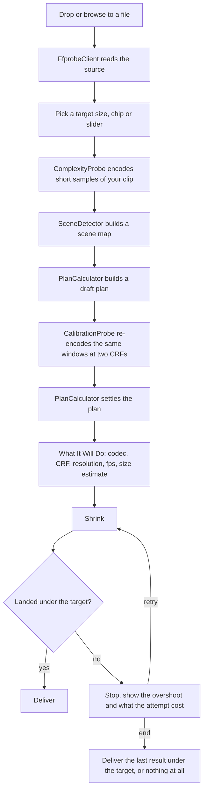
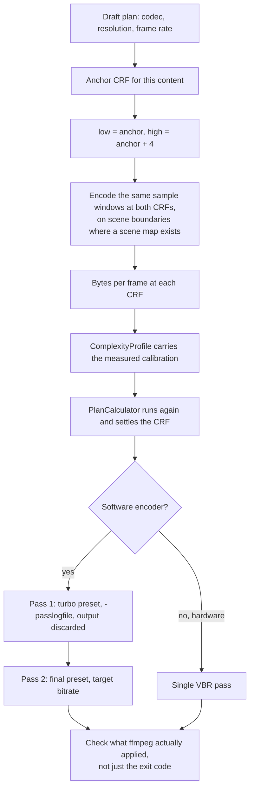
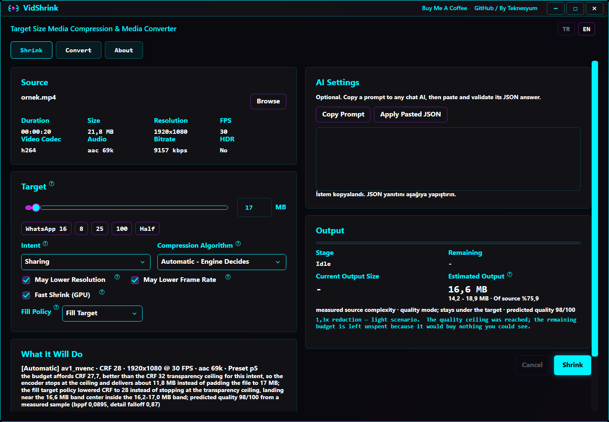
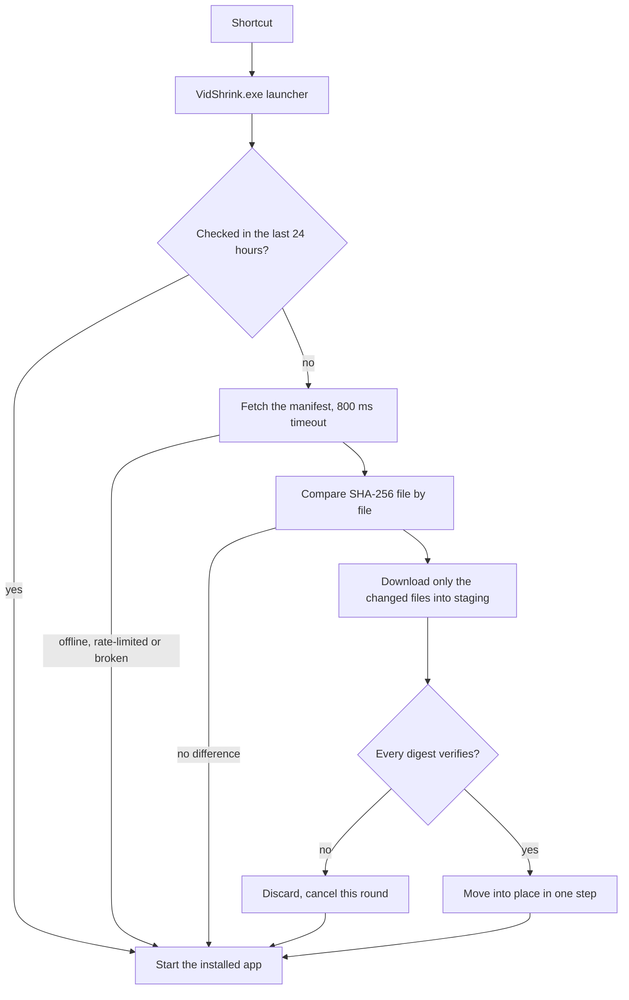

<!-- lang -->

[](README.tr.md)

# VidShrink

Target size in, video out.

Free, offline desktop app for Windows, macOS and Linux that shrinks a video to a target
file size and loses the least of what a person can actually see while doing it. Give it a
file and a ceiling in megabytes. It never returns a file larger than you asked for, and it
tells you the expected size before you press start. Turkish and English are both
first-class: the whole window switches with the `TR` / `EN` buttons in the corner.



## Doesn't ffmpeg already do this?

It does, if you already know the answer. `ffmpeg` will happily encode to any bitrate you
name. What it will not do is work out which bitrate, which resolution and which frame rate
land you *just under* 25 MB on this particular clip, and it will not tell you beforehand
what will come out.

- **It measures your file instead of guessing from its bitrate.** Short samples are
  encoded at two resolutions and at two CRFs before any decision is made.
- **It answers the resolution question per clip.** Keep the pixels and encode them worse,
  or drop the pixels and encode them well — that trade-off is measured, not assumed.
- **It shows the plan and the estimate before the run**, with the reasoning in plain
  language, in your language.
- **It never overshoots the target.** Not "usually". A result over the ceiling is not
  delivered at all.

## Features

- **Target-size shrink with a measured plan.** Chips for the sizes people actually need,
  a slider for everything else, and a size estimate with a stated range up front.
- **Convert tab.** MP4, MKV, WebM, MOV, AVI, GIF, MP3, M4A, WAV; H.264, H.265, VP9, AV1
  or stream copy; trimming and audio extraction.
- **Advanced tab.** The exact ffmpeg command, selectable and copyable, plus the optional
  AI-plan prompt. No summary, the command itself.
- **Player tab.** The window plays the source through a decoder pipe that stays open
  between seeks instead of launching ffmpeg for every scrub.
- **Twelve encoders, probed not trusted.** Software, NVENC, Quick Sync and AMF candidates
  are each tested on your machine before the engine will name one.
- **Windows right-click menu and self-update.** "Shrink with VidShrink" in the Explorer
  menu, and a launcher that patches the installation before the app loads.

## What it does not do

- **No HDR10+ or Dolby Vision passthrough.** An HDR10+ source is delivered as static HDR10.
- **No right-click menu on macOS or Linux.** Windows only, and nothing equivalent is
  installed elsewhere.
- **No FFmpeg in the box.** The installers fetch it from your package manager or tell you
  the command; releases do not carry it.
- **No perceptual planner yet.** VMAF judges the plan afterwards in the bench harness; it
  does not yet set the planner's constants. See the roadmap.
- **No hardware win at small targets yet.** `av1_amf` still needs a second attempt at
  8 MB and 25 MB. The numbers are below.
- **No telemetry, no account, no paid tier.** There is nothing to sign up for.

## Install

### Windows — one line

```powershell
irm https://raw.githubusercontent.com/Teknesyum/VidShrink/main/Install-VidShrink.ps1 | iex
```

No administrator rights and no .NET SDK. The installer asks GitHub for the latest release,
downloads the `win-x64` archive and the launcher beside it, checks both against the
release's own SHA-256 list, and refuses to continue if either digest differs.

It installs under `%LOCALAPPDATA%\Programs\VidShrink`, fetches FFmpeg and FFprobe from
WinGet, creates Desktop and Start Menu shortcuts pointing at the launcher, and adds the
right-click entry. Running the same command again replaces the app with the newest release.

Only `win-x64` is published. A machine positively identified as ARM64 or 32-bit stops the
installer rather than getting an architecture whose updates would never be found. An
architecture that cannot be *read* is different: the installer tries
`RuntimeInformation.OSArchitecture`, then `PROCESSOR_ARCHITEW6432`, then
`PROCESSOR_ARCHITECTURE`, then the OS bit width, and if none of them answers, a 64-bit
Windows continues as `win-x64` and prints one line saying so.

`irm | iex` runs from memory, so the default `Restricted` execution policy does not block
it. If an organizational policy does, download
[`Install-VidShrink.ps1`](Install-VidShrink.ps1), read it, and run it like this — as UTF-8,
not with `-File`, because Windows PowerShell 5.1 reads a mark-less script in the system
ANSI code page and turns every non-ASCII character into mojibake:

```powershell
powershell -NoProfile -ExecutionPolicy Bypass -Command "iex ([IO.File]::ReadAllText('C:\path\to\Install-VidShrink.ps1',[Text.Encoding]::UTF8))"
```

### macOS / Linux — one line

```bash
curl -fsSL https://raw.githubusercontent.com/Teknesyum/VidShrink/main/install-vidshrink.sh | sh
```

No root and no .NET SDK. The target comes from `uname` — `osx-arm64`, `osx-x64` or
`linux-x64` — the archive is verified against the release's checksum list, installed under
`~/.local/share/vidshrink` and linked as `~/.local/bin/vidshrink`. Any other architecture
stops the installer with a message naming it.

On macOS you get a real application bundle: an ad-hoc signed `~/Applications/VidShrink.app`
that opens from Finder with its own name and icon, and `--uninstall` removes the bundle,
the payload and the shortcut together. On Linux there is no bundle; the launcher link is
the whole of it.

FFmpeg is the one thing this installer will not put on your machine. If `ffmpeg` or
`ffprobe` is missing it prints your package manager's command — `brew install ffmpeg`,
`sudo apt install ffmpeg`, `sudo dnf install ffmpeg` — and stops before downloading
anything else.

### Requirements

- Windows 10 or 11, macOS 12 or newer, or a Linux desktop on X11 or Wayland
- `ffmpeg` and `ffprobe` in a `tools/ffmpeg` folder beside the application, or on `PATH`
- No .NET runtime and no .NET SDK. Releases are self-contained

Hardware encoding is optional. A missing or broken GPU encoder is reported and the engine
moves to the next candidate; it is never fatal.

## How it works

Nothing here is a lookup table. Every step that says *measure* runs ffmpeg against your
actual file before a decision is made.



### Why measurement beats a table

Most size-target compressors apply a lookup table: so many megabytes per minute becomes so
much resolution, whether you handed it a static screen recording or a handheld night shot.
That table is wrong for every clip that is not average, which is most clips.

Two numbers come off the sample encodes. The first is how many bits this content really
costs — a gradient and a confetti cannon at the same 1080p30 are not the same encoding
problem, and the source bitrate does not tell you which one you have.

The second is how much of that cost disappears when the picture is scaled down. On
measurements taken during development, one test clip lost 87% of its per-pixel cost when
halved; another lost 22%. A fixed assumption is wrong for both.

| | Typical size-target tool | VidShrink |
|---|---|---|
| Content complexity | inferred from source bitrate | measured by encoding samples of your file |
| Detail falloff on downscale | fixed assumption, or ignored | measured per clip at two resolutions |
| Resolution choice | fixed ladder, 1080 to 720 to 480 | continuous search, any scale that fits |
| Frame rate choice | applied after resolution, if at all | searched jointly with resolution |
| Codec choice | whatever you picked | can follow how hard the target actually is |
| Audio budget | fixed bitrate | share that shrinks as the target tightens |
| Size estimate | often none for quality mode | measured number with a stated range, up front |
| Overshoot handling | retry loop | plan lands in one pass; retry is the fallback |

### Calibration and the two passes

The engine does not assume how the bit cost moves when the CRF moves. It encodes the same
sample windows twice, four CRF steps apart, and reads the curve off the two results.



Two details that are easy to get wrong. The first pass runs at a turbo preset, so the
analysis does not cost as much as the encode. And ffmpeg returns `0` while silently
dropping a parameter it did not understand, so success is checked against what was applied
rather than against the exit code.

### It knows when to stop

Filling the target is not the goal, hitting the quality ceiling is. Once more bits stop
buying anything a viewer could see, VidShrink hands back a smaller file rather than padding
it out to the number you typed. Ask for 25 MB on an easy clip and you may get 9 MB that
looks identical to the source.

The reverse also holds. When the target genuinely constrains quality, the whole budget gets
spent rather than a third of it going unused.

### It adapts to how hard you are pushing

`CompressionRegime` has four values, and the reduction ratio picks one.

| Regime | Reduction | Engine behaviour |
|---|---|---|
| Light | under 1.5× | keeps resolution and frame rate, simply spends the budget |
| Balanced | 1.5–6× | allows resolution scaling |
| Aggressive | 6–30× | unlocks frame-rate reduction, moves to H.265, trims audio share |
| Extreme | over 30× | maximum compression, mono audio, and it says so |

Below a certain bit budget something has to give, and the loss goes where the eye is least
sensitive: softness before blocking, fewer pixels before broken pixels, mono audio before a
starved picture. No target, however tight, silences the audio track.

### HDR stays HDR when it can

An HDR source keeps its wide colour and its ten bits whenever the encoder that will run can
actually write them. Which encoders those are is not a list of names in the source code:
the application encodes a frame with each candidate on your machine and keeps the ones that
come back as genuine 10-bit HDR.

When nothing available can carry it, the picture is tone-mapped down to SDR rather than
failing, and the app says that this is what happened. Tone-mapping is a visible loss and is
never silent.

### Quality is measured perceptually, or not at all

Results are scored with **VMAF-NEG**, **XPSNR** and **SSIM**, and reported as four VMAF
numbers rather than one: mean, harmonic mean, 10th percentile and minimum. The average
hides the frames that actually look bad, and those are the frames a viewer notices.

Comparing two files means bringing both into one explicitly stated colour space and range
first. Where the two sides cannot honestly be brought together — an HDR original against a
tone-mapped result — the comparison returns *not comparable* instead of a number.

Be clear about where this sits today. Perceptual scoring is the measurement rig, not the
planner: the engine plans from the two bit-cost measurements above, and VMAF is what the
plan is judged by afterwards, in `tools/VidShrink.Bench`.

### Measured results

Measured end to end on real footage rather than synthetic clips. Software encoding, 400 s
of 1080p60:

| Target | Result | Attempts |
|---|---|---|
| 180 MB | 178.35 MB | 1 |
| 100 MB | 99.16 MB | 1 |
| 25 MB | 24.63 MB | 1 |
| 8 MB | 7.85 MB | 1 |

All four landed inside the fill band on the first attempt and the ceiling was never
crossed. Size estimates came out within 8%, typically within 4%, and budget fill ran
92–99% on constrained targets.

Hardware encoding (`av1_amf`) is not there yet. Large targets reach the band on the first
attempt, 100 MB in 99.01 and 50 MB in 49.97, but small ones still take a second: 25 MB in
24.43 and 8 MB in 7.80. The overshoot comes from the peak rate being pinned to a fixed
multiple of the source regardless of target size.

A result that lands over the target does not start a second run on its own. The run stops,
shows what came out, how far over it went and how long that attempt took, and asks whether
to try again or end there. Ending is not the same as accepting an oversized file: it
delivers the last result that came in under the target, and writes nothing at all if there
is none.

## What it looks like in use

Once a file is loaded, every decision is on screen with the reasoning behind it, before you
start — the codec, the CRF, the resolution, the frame rate, the estimate and its range.



Each target chip is a real limit somewhere, and its `?` badge says which.

| Chip | Why that number |
|---|---|
| **8** | Discord without Nitro, older forums, strict e-mail gateways |
| **16** *(WhatsApp recommended)* | WhatsApp re-encodes in-chat video with its own weak encoder; under 16 MB it usually passes yours through instead |
| **25** | Gmail attachments, Discord Nitro Basic, most ticket systems |
| **100** | Archiving and uploads where quality matters more than transfer time |
| **128** *(sharing maximum)* | The measured ceiling of uguu.se, the narrower of the two anonymous share targets |
| **180** *(WhatsApp Web maximum)* | WhatsApp Web takes 180 MB per file, a user-reported number rather than a published one |
| **Half** | Half the source size; a mild request, so resolution and frame rate usually survive |

Any file `ffprobe` recognizes as containing a video stream is accepted. The filename
extension is never a gate: silent video, variable frame rate, animated GIF, rotation
metadata and uncommon containers all work whenever the installed ffmpeg can decode them.

AI mode is optional and not embedded. VidShrink writes a prompt you paste into any chat AI,
then validates the JSON you paste back against the current source and options. It stays
offline, needs no API key, and falls back to the automatic plan when a response is
malformed or stale.


The Convert tab is the manual side: container, video codec, CRF or bitrate, resolution,
frame rate, audio codec and bitrate, and a start and end time. Stream copy uses real
`-c:v copy` and `-c:a copy`, and incompatible container and source-codec pairs are blocked
before execution. GIF conversion goes through `palettegen` then `paletteuse`.


The Player tab plays the source in the window, through a decoder pipe that stays open
between seeks.

| Input | Effect |
|---|---|
| Wheel | step one second |
| Ctrl + wheel | step ten seconds |
| Shift + wheel | step sixty seconds |
| Ctrl + Shift + wheel | step five minutes |
| Alt + wheel | zoom |
| Right-click, or Space | toggle playback |
| Middle-click | toggle full screen, and put the window back where it was |

The context menu carries the same three actions.

### Encoders

Twelve encoders can carry a shrink plan. Availability is not taken on trust: each candidate
is probed on your machine, the next one is tried when a probe fails, and an untested
candidate is never labelled unusable.

| Codec | Software | NVENC | Quick Sync | AMF |
|---|---|---|---|---|
| H.264 | `libx264` | `h264_nvenc` | `h264_qsv` | `h264_amf` |
| H.265 | `libx265` | `hevc_nvenc` | `hevc_qsv` | `hevc_amf` |
| AV1 | `libsvtav1` | `av1_nvenc` | `av1_qsv` | `av1_amf` |

VideoToolbox is recognized as a vendor in `CodecModel` but is not in the shrink path's
allowed list today. VP9 lives on the Convert tab.


- **H.264** plays on essentially every device ever made and is what WhatsApp expects.
- **H.265** needs roughly a third fewer bits for the same picture; every phone since about
  2016 decodes it in hardware, older handsets and some web players do not.
- **VP9** is a browser and WebM format.
- **AV1** compresses best and encodes slowest; only recent phones decode it.
- **Stream copy** is instant and lossless when the destination accepts the source streams.

### The right-click menu

Right-click a video in Explorer and **Open this video with VidShrink** is in the menu. On
Windows 11 it is in the primary menu, not behind "Show more options". That placement is
only available to a packaged application, so the installer registers a sparse package — a
manifest that carries the menu and points at the ordinary installation on disk — and writes
the classic entry alongside it. A Windows 10 machine, or a release without the package,
gets the classic entry alone and is told so during install. Uninstalling removes both.

The entry covers the same 24 extensions the application itself opens. That list lives once,
in `VidShrink.Core.ShellIntegration.MediaExtensions`, and a test fails if the installer and
the application ever disagree about it.

It is written per user under `HKCU\Software\Classes\SystemFileAssociations`, so it needs no
administrator rights, and it does not change your file associations — your default player
stays your default player. It points at `VidShrink.exe`, the launcher, for the same reason
the shortcuts do: an entry aimed straight at the application would leave a copy that never
updates.

The label follows the system interface language. Pass `-MenuLanguage tr` or
`-MenuLanguage en` to force one. `-RemoveShellMenu` deletes every VidShrink entry in one
pass, including entries from an older release with a longer extension list;
`-ShellMenuOnly` rewrites them against the installed launcher and touches nothing else;
`-SkipShortcuts` leaves the shell alone entirely.

```powershell
powershell -NoProfile -ExecutionPolicy Bypass -File C:\path\to\Install-VidShrink.ps1 -RemoveShellMenu
```

### Staying up to date

On Windows the application updates itself while it opens, without asking. The shortcuts
point at `VidShrink.exe`, a small launcher above the application. A typical release changes
about 1.7 MB of a 519 MB installation, and that is all that comes down the wire.



The check runs at most once a day; until twenty-four hours have passed the launcher does
not go to the network at all. The time of the last check sits next to the setting in
`%APPDATA%\VidShrink`. An interrupted update is exempt and is finished on the next launch.

The launcher never blocks the application from opening. No network, unresolved DNS, a rate
limit, a broken manifest, a full disk: it gives up silently and starts the installed
version as it is. FFmpeg never travels with a release and is never re-downloaded; the
launcher only checks that `ffmpeg.exe` and `ffprobe.exe` are still there.

Automatic updates are on by default and can be switched off in the settings. The switch is
stored in `%APPDATA%\VidShrink\settings.json`, next to your other settings rather than next
to the executable, so reinstalling does not reset it. With it off, Windows behaves like the
others: the application asks once at startup whether a newer version exists and tells you.

On macOS the update swaps the whole bundle. A bundle's signature covers every file inside
it, so a file-by-file update would break the signature and the application would refuse to
open. The new bundle is built beside the installed one while you work, its signature is
verified before anything moves, and only then do the two swap atomically — as the
application exits, so it is never pulled out from under a running process. Self-updating is
offered only where it is safe: a plain payload install under `~/.local/share`, or a bundle
macOS has translocated to a read-only path, keeps the switch closed and is told about new
versions instead.

On Linux the application only tells you a new version exists. Update by running the install
command again.

| | Windows | macOS | Linux |
|---|---|---|---|
| Published target | `win-x64` | `osx-arm64`, `osx-x64` | `linux-x64` |
| Installer | `Install-VidShrink.ps1` | `install-vidshrink.sh` | `install-vidshrink.sh` |
| Right-click menu | yes | no | no |
| Self-update | file-level, via the launcher | whole-bundle swap | notice only |
| FFmpeg comes from | WinGet `Gyan.FFmpeg` | your `brew` | your `apt` or `dnf` |


## Development

Building from a clone needs the .NET 8 SDK.

```sh
dotnet build VidShrink.sln -c Release
```

```sh
dotnet test VidShrink.sln
```

Four shipped projects and one shell integration. Decisions live in `Core`, processes live
in `Ffmpeg`, and the interface reads a decision rather than making one.

```mermaid
flowchart LR
    L["VidShrink.Launcher<br/>verifies the manifest,<br/>applies the update"] --> APP
    SE["VidShrink.ShellExtension<br/>right-click entry"] --> APP

    subgraph APP["VidShrink.App, Avalonia"]
        UI["Shrink · Convert · Advanced<br/>Settings · About · Player"]
        LOC["Locales/en · Locales/tr"]
    end

    subgraph CORE["VidShrink.Core, the decisions"]
        PC["PlanCalculator"]
        CM["CodecModel"]
        FA["FfmpegArguments"]
        HR["HdrResolver"]
        SM["SceneMap"]
    end

    subgraph FF["VidShrink.Ffmpeg, the processes"]
        FP["FfprobeClient"]
        CP["ComplexityProbe"]
        CAL["CalibrationProbe"]
        EC["EncoderCapabilities"]
        ER["EncodeRunner"]
        DP["Playback/DecoderPipe"]
    end

    APP --> CORE
    APP --> FF
    FF --> CORE
    FF --> BIN["ffmpeg · ffprobe<br/>external processes"]
```



```text
src/VidShrink.Core            complexity model, strategy, planning, ffmpeg argument construction
src/VidShrink.Ffmpeg          ffprobe, probes, encode execution, playback pipe
src/VidShrink.App             Avalonia interface, one source tree for all three platforms
src/VidShrink.Launcher        Windows launcher, applies the file-level update before the app loads
src/VidShrink.ShellExtension  the Explorer right-click entry
tests/VidShrink.Tests         engine and argument-generation regression tests
tools/VidShrink.Bench         the measurement harness behind every published number
docs/gorseller/               every screenshot and badge this README and its Turkish twin use
```

Design notes worth knowing before you send a patch. Colours and measurements come only from
`src/VidShrink.App/Themes/Theme.axaml`; nothing is hard-coded at the call site. Every string
on screen comes from `Locales/<language>/<area>.json` and is read by key. Any number that
reaches a document comes out of `tools/VidShrink.Bench`, not out of an estimate.

Images are all under `docs/gorseller/` and referenced with repository-relative paths. Keep
it that way: a `C:\Users\...` path or a `file://` URL exists only on the machine that made
it, and GitHub is case-sensitive about filenames.

Release history is in [`CHANGELOG.md`](CHANGELOG.md). The engine audit and the benchmark
requirements are in
[`docs/claude-engine-audit-report.md`](docs/claude-engine-audit-report.md); the measurements
behind the roadmap are in [`docs/olcumler/`](docs/olcumler/).

## Roadmap

The engine is the current job. These are measured, open, and in that order.

- **Calibrating the trade-offs against measured quality.** The penalties the planner
  applies for scaling down and for dropping frame rate are fixed constants never tied to a
  quality measurement. The rig that can replace them now exists.
- **Opening the peak-rate ceiling.** On a 17-minute 1080p60 HDR source encoded to 117 MB,
  widening the ceiling from 1.02× to 1.50× of the average gained 5.87 harmonic and 7.22 p10
  VMAF-NEG at the same delivered size. The cheapest gain measured so far.
- **Psycho-visual encoder settings.** HandBrake's x265 preset runs psy-rd, psy-rdoq and
  adaptive quantisation; VidShrink's arguments carry no equivalent yet. At an equal
  delivered size, with colour handled correctly on both sides, HandBrake is ahead by 8.79
  mean and 14.60 p10 VMAF-NEG. That gap is the target.
- **Encoding by scene instead of by clip.** The scene map already drives the per-scene bit
  budget; letting resolution and frame rate move with it is the largest structural gain
  left.
- **Longer keyframe intervals.** The current GOP spends bits on keyframes that a longer
  interval would give back to the picture.
- **The hardware overshoot at small targets**, described under *Measured results*.

## Contributing

Open an issue before writing code, so nobody spends an evening on something already in
progress. Keep the pull request to one concern — a licence fix and a feature do not belong
in the same branch — and match the surrounding code.

The repository language is English: code, commit messages, README and issues. Run
`dotnet test VidShrink.sln` before opening the pull request; nothing merges red.

Contributions are accepted under the project's own licence, AGPL-3.0-or-later. Every commit
must be signed off under the Developer Certificate of Origin 1.1, reproduced in
[`DCO`](DCO) — add it with `git commit -s`. The longer version of all this is in
[`CONTRIBUTING.md`](CONTRIBUTING.md).

If VidShrink saved you an afternoon, sponsorship is welcome and entirely optional.

## License

[AGPL-3.0-or-later](LICENSE). Copyright (C) 2026 Teknesyum.

FFmpeg is a separate program under its own license and VidShrink does not redistribute it.
On Windows the installer asks WinGet for `Gyan.FFmpeg`, whose builds are GPLv3; on macOS
and Linux the installer installs nothing and prints your package manager's command. Either
way the binary arrives on your own machine, under its own terms, at install time. VidShrink
runs `ffmpeg` and `ffprobe` as external processes and links no GPL code into the AGPL-3.0
application.

Releases do not carry FFmpeg, and the reason is size rather than licensing: FFmpeg and
FFprobe are 424 MB of a 519 MB installation and do not change when VidShrink does. Anyone
preparing a packaged release that does include FFmpeg should work the licensing through for
that specific build rather than rely on this paragraph.

<!-- signature -->
<div align="center">

<a href="https://github.com/sponsors/Teknesyum"></a>
&nbsp;
<a href="LICENSE"></a>

</div>
