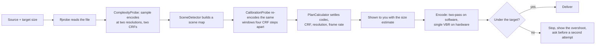
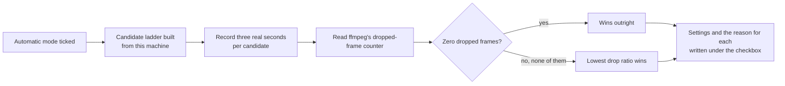

<!-- lang -->

[](README.tr.md)

# VidShrink

**Shrink a video to an exact file size, record your screen, play it back and share it —
from one free, offline window.**

[](https://github.com/Teknesyum/VidShrink/releases/latest)
[](LICENSE)
[](#install)


## You Do Not Have To Know Any Of This

Drag a video in, tap a size, press start. That is the whole job, and the automatic mode
does the rest — it picks the codec, the quality level, the resolution and the frame rate
for **your** file, and it tells you the expected size before anything runs. You never get a
file larger than the number you asked for.

The screen recorder works the same way: one checkbox, and the program works out the
encoder, the frame rate and the capture size for your machine instead of asking you to.
Everything is in Turkish and English, and the whole window switches with the `TR` / `EN`
buttons in the corner. No account, no telemetry, no paid tier, no internet needed.

## Four Tools, One Window

**Shrink** — a target size in megabytes, and a video that lands just under it. Chips for
the sizes people actually need (8 for Discord, 16 for WhatsApp, 25 for Gmail, 180 for
WhatsApp Web) and a slider for everything else. Twelve encoders — software, NVENC, Quick
Sync, AMF — each [probed on your own machine](docs/olcumler/kodek-matris.md) first.

**Record** — the whole screen, a single window or a region, through the capture backend
each platform actually has: gdigrab on Windows, avfoundation on macOS, x11grab on Linux.
Microphone and system sound chosen by name, so a reordered device list cannot quietly swap
your microphone. Stopping closes the file properly, so a stopped recording plays back.

**Play** — the source plays in the window through a decoder pipe that
[stays open between seeks](docs/olcumler/oynatici-motor-libmpv.md) instead of launching
ffmpeg for every scrub, plus a comparison panel for before-and-after.

**Share and right-click** — "Open this video with VidShrink" sits in the Windows Explorer
menu, in the primary menu on Windows 11, [written per user](docs/olcumler/kabuk-menusu.md)
with no administrator rights and no change to your file associations. Share targets and
their real size ceilings live in [`paylasim-hedefleri.json`](paylasim-hedefleri.json).

Plus a Convert tab (MP4, MKV, WebM, MOV, AVI, GIF, MP3, M4A, WAV; H.264, H.265, VP9, AV1
or stream copy; trimming and audio extraction) and a hidden Advanced tab holding the exact
ffmpeg command. Full tour: [`docs/kullanim.md`](docs/kullanim.md).

## Install

```powershell
# Windows
irm https://raw.githubusercontent.com/Teknesyum/VidShrink/main/Install-VidShrink.ps1 | iex
```

```bash
# macOS / Linux
curl -fsSL https://raw.githubusercontent.com/Teknesyum/VidShrink/main/install-vidshrink.sh | sh
```

No administrator rights, no .NET SDK. Every release publishes four targets — `win-x64`,
`osx-arm64`, `osx-x64`, `linux-x64` — from one version number. Requirements: Windows 10 or
11, macOS 15 or newer, or a Linux desktop on X11 or Wayland, plus `ffmpeg` and `ffprobe`.
FFmpeg and libmpv never travel in a release; the installer fetches them against pinned
SHA-256 digests on Windows and prints your package manager's command elsewhere. Checksum
verification, the right-click entry, the self-update flow and the uninstall switches are
all in [`docs/kurulum.md`](docs/kurulum.md).

## The Numbers

Nothing here is a lookup table. Every step that says *measure* runs ffmpeg against your
actual file first — short sample encodes at two resolutions and two CRFs, a scene map, then
a calibration pass that re-encodes the same windows four CRF steps apart and reads the
bit-cost curve off the two results.

What that buys, re-measured on today's engine over **36 cases** — three 1080p30 clips
(high detail, high motion, heavy noise) × three targets × a software and a hardware arm
× **two repeats each** — on an AMD Ryzen 7 9700X with an RTX 5070 Ti and ffmpeg 9.0-full
([`docs/olcumler/bench-2026-09-13.md`](docs/olcumler/bench-2026-09-13.md)):

| Target | Clip | Encoder | Delivered (run 1 / run 2) | Budget fill | Attempts |
|---|---|---|---|---|---|
| 100 MB | high detail | libx264 | 97.30 / 97.37 MB | 97.3% | 1 |
| 100 MB | heavy noise | h264_nvenc | 98.63 / 98.63 MB | 98.6% | 3 |
| 50 MB | high motion | h264_nvenc | 49.88 / 49.88 MB | 99.8% | 1 |
| 25 MB | high motion | libx264 | 24.24 / 24.26 MB | 97.0% | 1 |
| 25 MB | heavy noise | libsvtav1 | 24.28 / 24.28 MB | 97.1% | 1 |
| 8 MB | heavy noise | libsvtav1 | 7.67 / 7.67 MB | 95.9% | 1 |
| 8 MB | high motion | h264_nvenc | 7.71 / 7.71 MB | 96.3% | 1 |

The gates over all 36: **the target was never crossed — 0/36 over.** Calibration held
36/36. Two-pass was chosen 36/36; single-pass CRF never won. The hardware arm was
bit-identical across repeats — 0.000 MB of drift in 18/18 cases — and `libx264` drifted at
most 0.074 MB. And when more bits stop buying anything a viewer could see, the run stops
early: ask for 25 MB on an easy clip and you may get 9 MB that looks identical.

We publish where we lose, and there are two places.

**The AV1 branch undershoots.** 31 of 36 landed inside the fill band; **all five misses,
and the single hard-floor violation (6.68 MB against a 6.80 MB floor), were `libsvtav1`** —
`libx264` was 6/6 in band, `h264_nvenc` 18/18. The same branch is also where run-to-run
drift collects (up to 2.484 MB and 73.5 s), because the same input takes a different number
of correction rounds on different runs. Two repeats made that visible; one run would have
read as a stable number.

**HandBrake is still ahead on perceptual quality.** At an equal delivered size (±2%) on a
17-minute 1080p60 HDR source, HandBrake's x265 preset wins by **8.79 mean VMAF-NEG**,
**2.60 dB XPSNR** and **0.0299 SSIM**
([`docs/olcumler/handbrake-acigi.md`](docs/olcumler/handbrake-acigi.md)) — psy-rd, psy-rdoq
and adaptive quantisation, which our arguments do not carry yet. Closing that is the first
item on the roadmap.

## How We Measure

The rig took longer to build than the feature it judges, because a rig that cannot tell two
encodes apart prints numbers forever and never says it is wrong.

- **A colour gate that refuses to answer.** Every output's colour space, transfer,
  primaries and pixel format are read with ffprobe and compared to the reference. Untagged
  output, PQ against HLG, an SDR reference against an HDR result: the tool prints *no
  number at all* rather than a plausible one. An earlier, ungated table was thrown out for
  exactly this — it returned a near-constant XPSNR while the target size moved tenfold.
- **Three measures, and VMAF as four numbers.** **VMAF-NEG**, **XPSNR** and **SSIM**, with
  VMAF as mean, harmonic mean, 10th percentile and frame minimum. The average hides the
  frames that actually look bad, and those are the frames a viewer notices.
- **A frame lock**, so both sides are scored on the same frames. Numbers measured before it
  landed are stamped as suspect in their own documents and are not quoted here.
- **Verified cuts.** A 17-minute source is measured in three 60-second parts cut on real
  keyframes, each start verified against the source by frame hash — all three landed 0.4 s
  before the requested second, as a `-c copy` cut should.
- **A known defect, published.** The rig locks the two streams by frame index, so when the
  plan lowers the frame rate it compares different moments and exaggerates the loss — same
  file, `fps=30` resampling alone moved XPSNR from **1.70 dB to 21.14 dB**. Rows with no
  frame-rate drop are unaffected (34.5557 against 34.56). Findings that rested on the broken
  path are marked *unfounded* in their own documents rather than quietly restated.
- **A sensitivity proof.** The rig must separate a 60 MB encode from a 600 MB one by at
  least 1.00 VMAF-NEG point or it marks itself insensitive. Measured: **+39.26** for
  HandBrake, **+39.85** for VidShrink — forty times the threshold.

Full rig: [`docs/olcumler/ab-duzenegi.md`](docs/olcumler/ab-duzenegi.md). The recorder's
automatic mode is measured the same way — a candidate ladder built from the machine, then
[three real seconds of recording per candidate](src/VidShrink.Ffmpeg/RecorderAutoProbe.cs)
and a dropped-frame count, re-measured against the current engine in
[`docs/olcumler/auto-mod-yeni-taban.md`](docs/olcumler/auto-mod-yeni-taban.md). Over a
hundred such documents live in [`docs/olcumler/`](docs/olcumler/); every number here comes
from one of them.

## Under The Hood





Long version — calibration, the stopping rule, the four compression regimes, HDR handling,
perceptual scoring, today's limits: [`docs/motor.md`](docs/motor.md).

## Documentation

[Using VidShrink](docs/kullanim.md) · [The engine](docs/motor.md) ·
[Install and update](docs/kurulum.md) · [Measurements](docs/olcumler/) ·
[Roadmap](docs/YOL-HARITASI.md) · [Changelog](CHANGELOG.md) · [Contributing](CONTRIBUTING.md)

## Roadmap

Measured, open, in this order — detail in [`docs/YOL-HARITASI.md`](docs/YOL-HARITASI.md).

- **Psycho-visual encoder settings** — the 8.79-point gap above, and the reason for it.
- **The AV1 branch's undershoot** — five band misses out of five are `libsvtav1`, and the
  correction rounds do not close them.
- **Time-aligning the measurement rig**, so frame-rate-lowering plans can be scored at all.
- **Opening the peak-rate ceiling**, which also fixes the hardware overshoot at small targets.
- **Calibrating the scaling and frame-rate penalties against measured quality**, replacing
  the fixed constants the planner uses today.
- **Encoding by scene instead of by clip** — the largest structural gain left.

## Contributing

Open an issue first, keep a pull request to one concern, run `dotnet test VidShrink.sln` —
nothing merges red — and sign every commit off under the
[Developer Certificate of Origin](DCO) with `git commit -s`. Build instructions, project
layout and design rules: [`CONTRIBUTING.md`](CONTRIBUTING.md).

## License

[AGPL-3.0-or-later](LICENSE). Copyright (C) 2026 Teknesyum.

FFmpeg and libmpv are separate programs under their own licenses; VidShrink redistributes
neither and links no GPL code in ([`docs/kurulum.md`](docs/kurulum.md)).

<!-- signature -->
<div align="center">

<a href="https://github.com/sponsors/Teknesyum"></a>
&nbsp;
<a href="LICENSE"></a>

</div>
