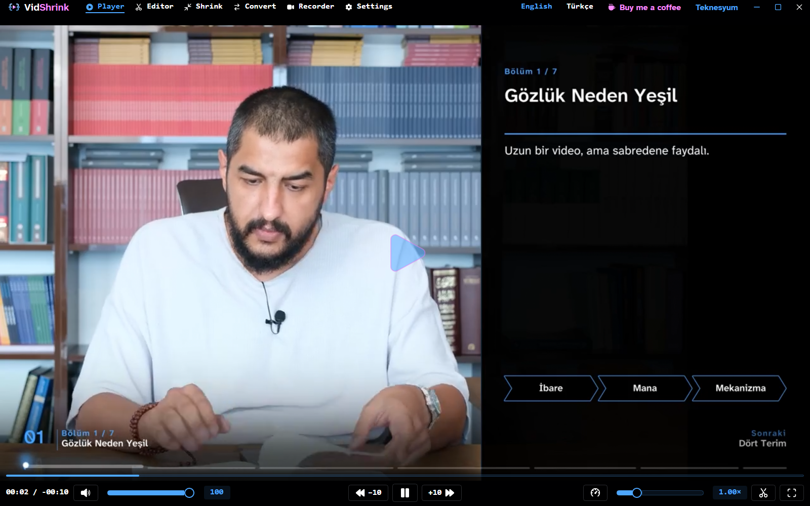
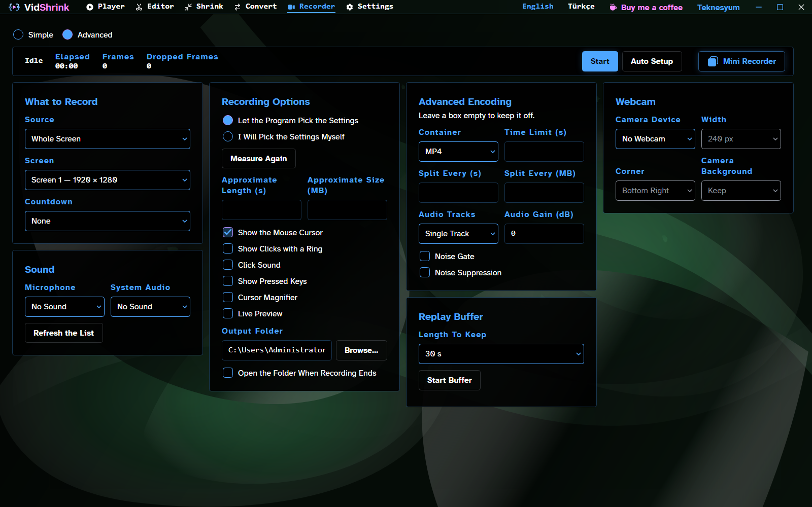
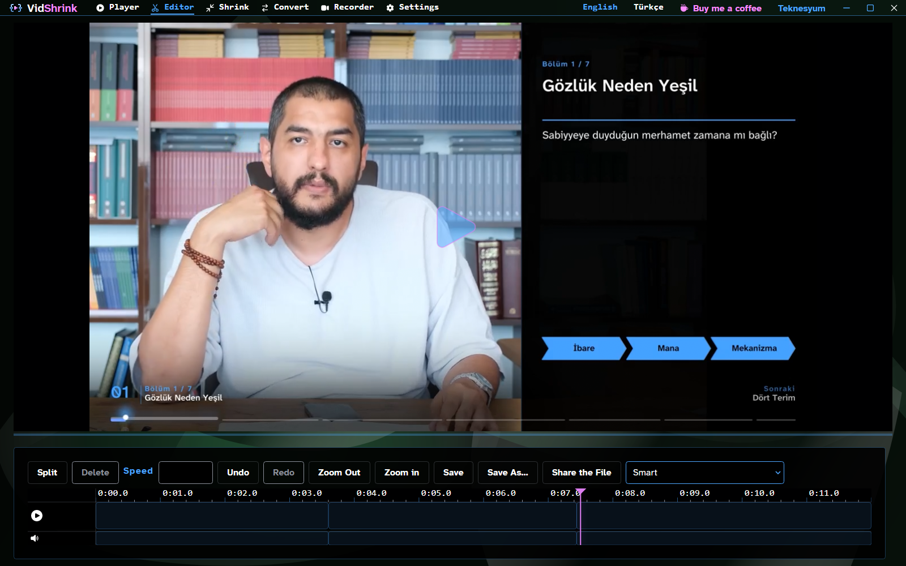
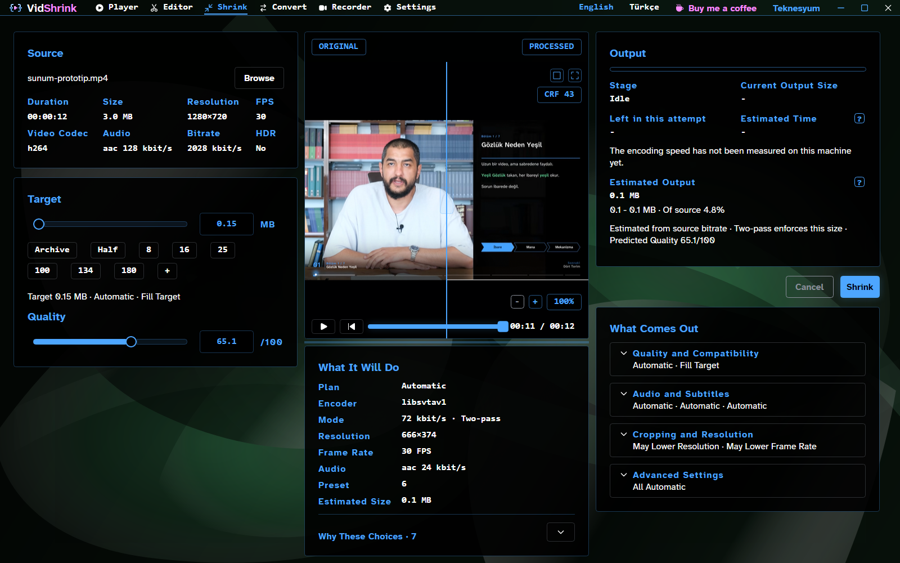
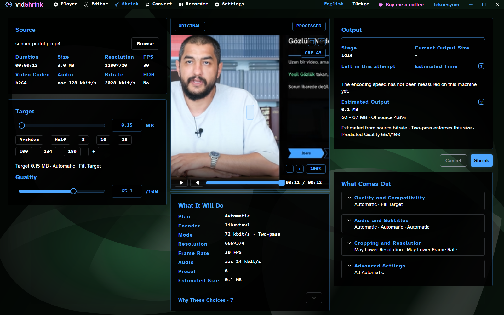
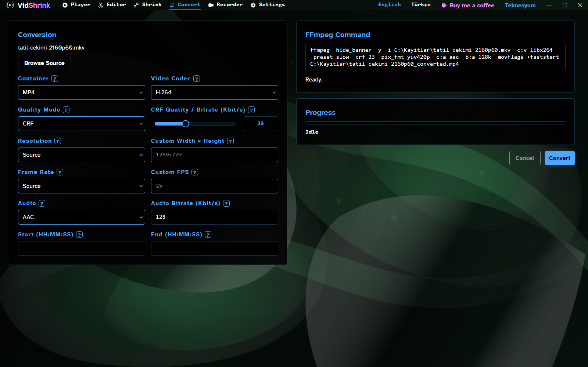
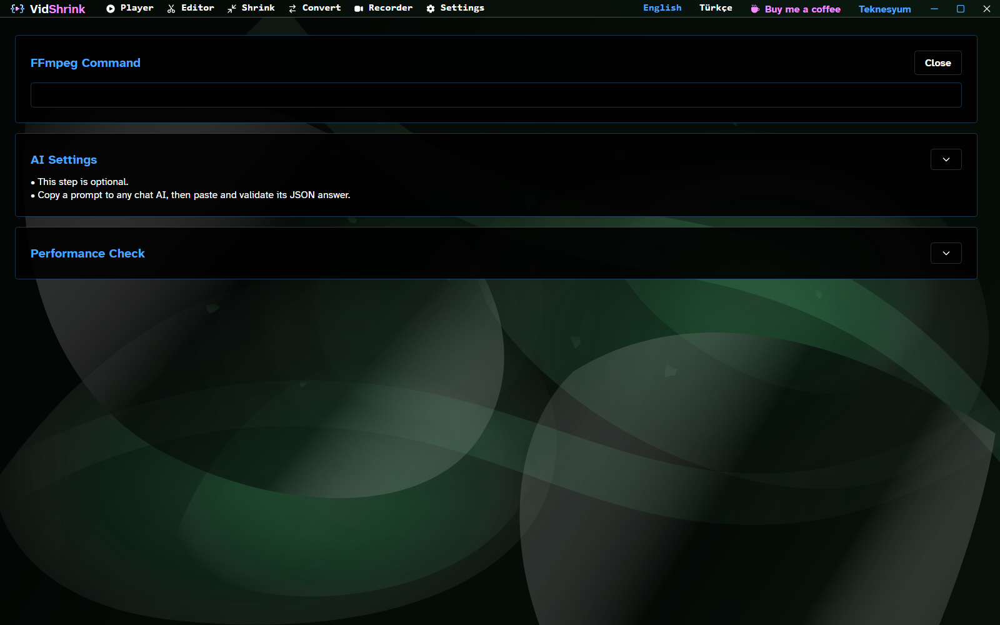
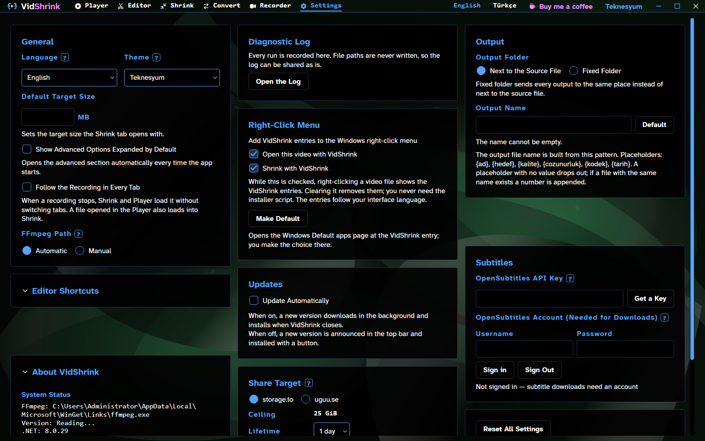
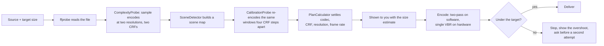
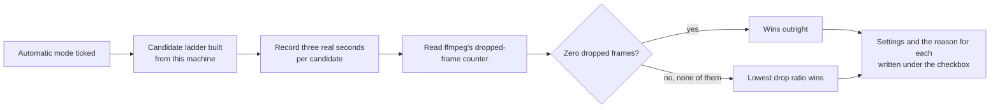

<!-- lang -->

[](README.tr.md)

# VidShrink

**A media player, a screen recorder, a video editor, a converter and a shrinker that lands
on an exact file size — one free app, one window, no ads.**

**Free forever · No ads · No watermark · No account · No subscription · No telemetry · Works
with the internet off · 42 languages · 36 themes · Open source**

[](https://github.com/Teknesyum/VidShrink/releases/latest)
[](LICENSE)
[](#install)

<a href="docs/gorseller/T201-oynatici-en.png"></a>

## One App Instead Of Five

Video usually means a shelf of programs: one to watch, one to record the screen, one to cut,
one to convert, one to squeeze the file under an upload limit. Five installers, five update
nags, five sets of ads or "Pro" upsells — and your file hopping between them.

VidShrink is the whole shelf in one window. Open a file once and every tool sees it: watch
it, cut it, convert it, shrink it to the size the chat app takes, and send the link — no
second program, no intermediate copy.

| The job | Usually a separate app, such as | In VidShrink |
|---|---|---|
| Watch anything, with subtitles | GOM Player, VLC, PotPlayer | [Player](#player) |
| Record the screen, a window or a region | Bandicam, OBS Studio | [Screen Recorder](#screen-recorder) |
| Cut, split, speed up, reverse | Lightworks, Shotcut | [Editor](#editor) |
| Change the format or the codec | HandBrake, Format Factory | [Convert](#convert) |
| Fit an upload limit exactly | online compressors | [Shrink](#shrink-to-an-exact-size) |
| Send a big file as a link | WeTransfer | [Share](#share) |

Every tool is free and stays free: no watermark on your recordings or exports, no trial
timer, no account, no feature held back for a paid tier. Nothing leaves your machine unless
you ask it to — see [Privacy](#code-signing-policy).

<sub>Product names belong to their owners; VidShrink is not affiliated with any of them.</sub>

## Player

Built on **libmpv**, the engine inside mpv, so it opens what the big players open — MKV,
MP4, WebM, AVI, MOV, TS and the rest — with hardware decoding when you want it. The controls
fade out while the film plays and come back when the mouse does.

- **Subtitles** — sidecar files load by themselves, a dropped subtitle file just works,
  timing shifts in steps, the text is styled to taste, and **OpenSubtitles search and
  download** sit right in the window.
- **Sound** — pick the audio track, shift the audio delay, shape it with a 10-band
  equaliser.
- **Picture** — brightness, contrast, saturation, gamma, hue, sharpness, crop, rotate,
  mirror, aspect ratio and zoom.
- **Control** — playback speed, frame-by-frame steps, A-B loop, bookmarks, screenshots, and
  clip or GIF export straight from the timeline.
- **Library** — playlist with shuffle and repeat, next and previous file in the folder,
  recent files and history, open a URL.
- **Window** — mini player, always on top, a shortcuts panel, and a side-by-side
  comparison panel for before and after.

## Screen Recorder

<a href="docs/gorseller/T201-kaydedici-en.png"></a>

- **What** — the whole screen, one window or a region you draw, through the capture
  backend each platform really has: gdigrab on Windows, avfoundation on macOS, x11grab on
  Linux.
- **Sound** — microphone and system sound chosen by name, so a reordered device list cannot
  quietly swap your microphone; gain, a noise gate and noise suppression.
- **Webcam** — an overlay with its own size and corner, and a green-screen option.
- **For tutorials** — cursor, click rings and click sounds, the keys you press on screen, a
  magnifier, and a live preview.
- **Control** — global hotkeys F7 to F11 on Windows, a countdown, a time limit, splitting by
  time or size, a replay buffer that keeps the last moments, tray and mini-recorder modes.
- **Encoders** — x264, x265, SVT-AV1 and VP9, plus the graphics card's own: NVIDIA NVENC,
  Intel Quick Sync, AMD AMF. **Automatic mode** records three real seconds per candidate on
  your machine and keeps the one that drops no frames — you tick one box, it does the
  homework.
- **Output** — MP4, MKV, MOV or GIF, a target size or length budget if you want one, and a
  file that is closed properly when you stop. One click sends it on to the Editor, the
  Player or Share.

## Editor

<a href="docs/gorseller/T201-duzenleyici-en.png"></a>

Open a video from any tab and cut it on a timeline: split, delete a clip or a range, move
clips, set the speed of each clip anywhere from 0.01× to 100×, play it in reverse, undo and
redo. Then **Save**, **Save As** or **Share** without leaving the tab, in one of three
export modes:

- **Fast** — cuts on keyframes and copies the streams; no re-encode, no quality lost.
- **Smart** — copies what it can and re-encodes only what the cuts need.
- **Full** — re-encodes the whole result.

## Shrink To An Exact Size

<table>
<tr>
<td><a href="docs/gorseller/T201-kucult-onizleme-en.png"></a></td>
<td><a href="docs/gorseller/T201-kucult-yakin-en.png"></a></td>
</tr>
</table>

Drag a video in, tap a size, press start. That is the whole job; the automatic mode picks
the codec, the quality level, the resolution and the frame rate for **your** file and tells
you the expected size before anything runs. Over 36 measured cases the target was crossed
**zero** times — you do not get a file larger than the number you asked for.

Chips for the sizes people actually need — 8 MB for strict e-mail gateways, 16 for
WhatsApp, 25 for Gmail, 180 for WhatsApp Web — and a slider for everything else. Twelve
encoders, software and NVENC, Quick Sync and AMF, each
[probed on your own machine](docs/olcumler/kodek-matris.md) first. The result is scored
with **VMAF-NEG** — mean, harmonic mean, 10th percentile and worst frame — and a whole
folder can go through the batch queue, which opens the folder, sleeps or shuts the computer
down when it finishes.

## Convert

<table>
<tr>
<td><a href="docs/gorseller/T201-donustur-en.png"></a></td>
<td><a href="docs/gorseller/T201-gelismis-en.png"></a></td>
</tr>
</table>

MP4, MKV, WebM, MOV, AVI, GIF, animated WebP and animated AVIF; MP3, M4A, WAV and FLAC for
sound alone. H.264, H.265,
VP9, AV1 or a straight stream copy, trimming, and audio extraction. **Eighteen ready-made
targets** — WhatsApp, Discord, Telegram, Gmail, Outlook, Chromecast, Nest Hub, Apple TV and
more — set every field for you.

## Share

Press **Share** in Shrink, the Recorder or the Editor and the file goes up as a link:
**storage.to** for files up to 25 GB, kept one to seven days, or **uguu.se** for files up to
128 MB, kept three hours. The link comes with a QR code for your phone, and a dropped
upload can be retried. Share targets and their measured size ceilings live in
[`paylasim-hedefleri.json`](paylasim-hedefleri.json).

## Made For Everyone

<a href="docs/gorseller/T201-ayarlar-en.png"></a>

**The whole window speaks 42 languages** — every button, every warning, every tooltip, from
Arabic to Vietnamese — and **36 colour themes** ship with it: Catppuccin, Dracula, Gruvbox,
Nord, Rose Pine, Solarized, Tokyo Night and twenty-nine more, light and dark. Pick both in
Settings; nothing restarts. Your language missing, or a translation reading badly in yours?
[Open an issue](https://github.com/Teknesyum/VidShrink/issues/new) and it goes into the next
release.

**What it changes on your system, and nothing more.** On Windows the installer adds Start
menu and desktop shortcuts, an "Open this video with VidShrink" entry in the Explorer
right-click menu (in the primary menu on Windows 11), and VidShrink in the **Open with**
list for video files — [written per user](docs/olcumler/kabuk-menusu.md), no administrator
rights, and your default player stays your default. The app checks GitHub for a new release
and offers the update; that check is on by default on Windows and switches off in Settings.
Everything above comes off again with one command — see [Install](#install).

Full tour of every tab: [`docs/kullanim.md`](docs/kullanim.md).

## Command Line

The same package carries a headless CLI beside the app: `vidshrink` on Windows and Linux,
`vidshrink-cli` on macOS. It calls the same decision engine as the window, so the same
input gives the same ffmpeg arguments; a test holds the two against each other.

```bash
vidshrink kucult clip.mp4 --hedef 25MB              # shrink to a size
vidshrink kucult clip.mp4 --kalite 80 --kodek av1   # shrink to a quality score
vidshrink plan clip.mp4 --hedef 8MB --json          # plan and arguments only, no encode
```

<details>
<summary>Every option, the English aliases and the exit codes</summary>

Options: `--kodek auto|h264|hevc|av1`, `--cikti <path>`, `--json`, `--olcumsuz` (skip the
probe encodes), `--vmaf` (measure the result when ffmpeg has libvmaf), `--hizli`. Progress
goes to stderr; size, duration, attempts and VMAF go to stdout. Help follows the system
language, Turkish or English. `--dil en` (`--lang en`) overrides it for one run; the
known codes are `en` and `tr`, and an unknown code is a usage error rather than a silent
fall back to English.

`--crf N` and `--on-ayar NAME` lock what the Advanced panel locks in the window: the
quality value (0-63) and the encoder preset. The preset name has to belong to the codec
the plan picks — `slow` for x264/x265, `p5` for NVENC, `8` for SVT-AV1 — and a name that
does not belong is dropped with a line in the plan reason, not an error.

`--modul N` (`--modulus N`) rounds the scaled edges down to a multiple of 2, 4, 8 or 16.
The default is 2, because an encoder cannot take an odd edge; a larger modulus is what old
hardware encoders want and crops the edge a little more. Any other number is a usage error.

An anamorphic source — a DVD whose stored pixels are not square — is de-anamorphosed
before scaling: the height is kept, the width becomes the width the frame is displayed
at, and the output carries square pixels. Nothing changes for a square-pixel source.

`--kes <start>-<end>` trims before the encode, so the target size is spent on the part you
keep: `--kes 10-40`, `--kes 0:10-0:40`, `--kes 1:02:03-1:02:04`, or `--kes 90-` to the end.

Either end may be a frame number instead of a clock: `--kes 300f-900f` is frames 300 to 900,
converted with the source frame rate. `--bolum 2` and `--bolum 2-4` build the same window from the
source's chapter marks; the two options cannot be given together.

The long options below each answer to an English alias; the two spellings are the same
option, and a script may use either. `--crf` and `--json` and `--vmaf` are the exceptions: they have a
single spelling.

| Turkish | English |
|---|---|
| `--yardim` | `--help` |
| `--surum` | `--version` |
| `--hedef` | `--target` |
| `--kalite` | `--quality` |
| `--kodek` | `--codec` |
| `--on-ayar` | `--preset` |
| `--modul` | `--modulus` |
| `--bolum` | `--chapters` |
| `--cikti` | `--output` |
| `--kes` | `--cut` |
| `--aralik` | `--interval` |
| `--bir-kez` | `--once` |
| `--gunluk` | `--log` |
| `--tarama` | `--scan` |
| `--baslik` | `--title` |
| `--ana-icerik` | `--main-feature` |
| `--asgari-sure` | `--min-duration` |
| `--azami-sure` | `--max-duration` |
| `--suzgec` | `--filters` |
| `--kirp` | `--crop` |
| `--profil` | `--profile` |
| `--profil-dosyasi` | `--preset-file` |
| `--ses-kodek` | `--audio-codec` |
| `--ses-normal` | `--loudnorm` |
| `--ses-kazanc` | `--gain` |
| `--altyazi` | `--subtitle` |
| `--yan-altyazi` | `--sidecar-subtitles` |
| `--yak` | `--burn` |
| `--meta-yok` | `--no-metadata` |
| `--altyazi-dil` | `--subtitle-lang` |
| `--ilk-altyazi` | `--first-subtitle` |
| `--sabit-kare` | `--cfr` |
| `--tavan-kare` | `--pfr` |
| `--kare-hizi` | `--fps` |
| `--profiller` | `--presets` |
| `--olcumsuz` | `--no-measure` |
| `--hizli` | `--fast` |
| `--dil` | `--lang` |

Exit codes: `0` in band, `2` under the band (quality saturated, the smaller file kept), `3`
size ceiling exceeded (the smallest result is still written; JSON carries `output` and `overTarget: true`), `1` error, `64` wrong usage, `130` cancelled.

</details>

### Watch Folder

```bash
vidshrink izle ~/Gelen --cikti ~/Giden --hedef 25MB             # run until Ctrl+C
vidshrink izle ~/Gelen --cikti ~/Giden --hedef 25MB --bir-kez   # drain the folder, then exit
```

`izle` shrinks every video that lands in the folder. `--cikti` is the output folder and is
required; it cannot be the watched folder.

<details>
<summary>When a file is taken, where progress is kept, letter case and exit codes</summary>

`--aralik <seconds>` sets the scan interval
(default, unmeasured): 2, `--bir-kez` exits once nothing is left to wait for, and the other `kucult`
options apply to each file. With `--json`, stdout is NDJSON: one compact JSON object per file.

A file is taken only when its size and modification time stay the same over two consecutive scan
intervals - the third scan takes it - and no writer holds it. If the source changes while it is being encoded, the output is
deleted and the file is picked up again once it settles.

Progress is kept in `.vidshrink-izle.json` inside the watched folder, by name and size; a
renamed or resized file counts as new. If that folder is read-only the state goes to the
output folder as `.vidshrink-izle-<hash>.json`, and failing that to the settings folder as
`izle-<hash>.json`. A file that failed is retried once on the next start. To process
everything again, delete the state file.

`<hash>` is the first 16 hex characters, lowercase, of the SHA-256 of the watched folder's
path. The path enters the hash under the same rule as the two comparisons below: upper-cased
first where the running system ignores case (Windows and macOS), taken as it stands on
Linux. So `/gelen` and `/Gelen` get one shared state file on Windows and macOS and two
separate ones on Linux, and the same folder always produces the same name.

Exactly two comparisons follow the rule of the running system: the watched folder against
the output folder, and a candidate against the output names this run has written. Those are
`Ordinal` on Linux and `OrdinalIgnoreCase` on Windows and macOS.

The macOS half of that rule assumes the default APFS volume, which is case-insensitive but
case-preserving. APFS can also be formatted case-sensitive, and on such a volume — or on a
case-sensitive external volume — the assumption does not hold.

Every other use of a file's name ignores case **on every platform, Linux included**: the
pending, retry and skip tables, the scan order, and the record of what has been processed.
So `Klip.mp4` and `klip.mp4` in one watched folder collide even where the filesystem keeps
them apart as two separate files.

A collision is resolved in the scan, not left to rot. Of the colliding names the ordinally
smallest wins and is shrunk as usual; the others are skipped with one warning line each,
`Skipped: klip.mp4 — its name collides with Klip.mp4 (letter case only). Rename one of
them.`, written once per file and not repeated on later scans. The winner is the same on
every scan, so the run is deterministic. Rename the skipped file and the watcher picks it
up as a new file.

Exit codes: `0` finished, `4` `--bir-kez` finished but at least one file failed or was
skipped for a name collision, `1` error, `64` wrong usage, `130` stopped with Ctrl+C. After
`--bir-kez` a summary line reports how many files were skipped.

</details>

## The Numbers

Over 36 measured cases the target size was never crossed — **0/36 over** — and the two places
where we lose are published beside it.

<details>
<summary>The table, the gates and where we lose</summary>

Nothing here is a lookup table. Every step that says *measure* runs ffmpeg against your
actual file first — short sample encodes at two resolutions and two CRFs, a scene map, then
a calibration pass that re-encodes the same windows four CRF steps apart and reads the
bit-cost curve off the two results.

What that buys, re-measured on today's engine over **36 cases** — three 1080p30 clips
(high detail, high motion, heavy noise) × three targets × a software and a hardware arm
× **two repeats each** — on an AMD Ryzen 7 9700X with an RTX 5070 Ti and ffmpeg 9.0-full
([`docs/olcumler/bench-2026-09-13.md`](docs/olcumler/bench-2026-09-13.md)):

| Target | Clip | Encoder | Delivered (run 1 / run 2) | Budget fill | Attempts |
|---|---|---|---|---|---|
| 100 MB | high detail | libx264 | 97.30 / 97.37 MB | 97.3% | 1 |
| 100 MB | heavy noise | h264_nvenc | 98.63 / 98.63 MB | 98.6% | 3 |
| 50 MB | high motion | h264_nvenc | 49.88 / 49.88 MB | 99.8% | 1 |
| 25 MB | high motion | libx264 | 24.24 / 24.26 MB | 97.0% | 1 |
| 25 MB | heavy noise | libsvtav1 | 24.28 / 24.28 MB | 97.1% | 1 |
| 8 MB | heavy noise | libsvtav1 | 7.67 / 7.67 MB | 95.9% | 1 |
| 8 MB | high motion | h264_nvenc | 7.71 / 7.71 MB | 96.3% | 1 |

The gates over all 36: **the target was never crossed — 0/36 over.** Calibration held
36/36. Two-pass was chosen 36/36; single-pass CRF never won. The hardware arm was
bit-identical across repeats — 0.000 MB of drift in 18/18 cases — and `libx264` drifted at
most 0.074 MB. And when more bits stop buying anything a viewer could see, the run stops
early: ask for 25 MB on an easy clip and you may get 9 MB that looks identical.

We publish where we lose, and there are two places.

**The AV1 branch undershoots.** 31 of 36 landed inside the fill band; **all five misses,
and the single hard-floor violation (6.68 MB against a 6.80 MB floor), were `libsvtav1`** —
`libx264` was 6/6 in band, `h264_nvenc` 18/18. The same branch is also where run-to-run
drift collects (up to 2.484 MB and 73.5 s), because the same input takes a different number
of correction rounds on different runs. Two repeats made that visible; one run would have
read as a stable number.

**HandBrake: ahead at equal size, behind on dark banding.** Against HandBrakeCLI 1.11.2's
x265 `slow` preset at the same delivered bytes, we lead all 8 SDR rows
([`handbrake-kiyas-b1-sdr.md`](docs/olcumler/handbrake-kiyas-b1-sdr.md)) and 3 of 4 HDR10
rows ([`handbrake-kiyas-b4-hdr.md`](docs/olcumler/handbrake-kiyas-b4-hdr.md)). Dark scenes
still band more: on the dark cut our AV1 output scores CAMBI 9.31 and 9.39 against
HandBrake's 6.48 and 6.49, where lower is better
([`handbrake-kiyas-b7-aciklar.md`](docs/olcumler/handbrake-kiyas-b7-aciklar.md)). That gap is
open, and it is the first item on the roadmap.

</details>

## How We Measure

The rig took longer to build than the feature it judges, because a rig that cannot tell two
encodes apart prints numbers forever and never says it is wrong.

<details>
<summary>The six things the rig does so a number can be trusted, and where the rig lives</summary>

- **A colour gate that refuses to answer.** Every output's colour space, transfer,
  primaries and pixel format are read with ffprobe and compared to the reference. Untagged
  output, PQ against HLG, an SDR reference against an HDR result: the tool prints *no
  number at all* rather than a plausible one. An earlier, ungated table was thrown out for
  exactly this — it returned a near-constant XPSNR while the target size moved tenfold.
- **Three measures, and VMAF as four numbers.** **VMAF-NEG**, **XPSNR** and **SSIM**, with
  VMAF as mean, harmonic mean, 10th percentile and frame minimum. The average hides the
  frames that actually look bad, and those are the frames a viewer notices.
- **A frame lock**, so both sides are scored on the same frames. Numbers measured before it
  landed are stamped as suspect in their own documents and are not quoted here.
- **Verified cuts.** A 17-minute source is measured in three 60-second parts cut on real
  keyframes, each start verified against the source by frame hash — all three landed 0.4 s
  before the requested second, as a `-c copy` cut should.
- **A known defect, published.** The rig locks the two streams by frame index, so when the
  plan lowers the frame rate it compares different moments and exaggerates the loss — same
  file, `fps=30` resampling alone moved XPSNR from **1.70 dB to 21.14 dB**. Rows with no
  frame-rate drop are unaffected (34.5557 against 34.56). Findings that rested on the broken
  path are marked *unfounded* in their own documents rather than quietly restated.
- **A sensitivity proof.** The rig must separate a 60 MB encode from a 600 MB one by at
  least 1.00 VMAF-NEG point or it marks itself insensitive. Measured: **+39.26** for
  HandBrake, **+39.85** for VidShrink — forty times the threshold.

Full rig: [`docs/olcumler/ab-duzenegi.md`](docs/olcumler/ab-duzenegi.md). The recorder's
automatic mode is measured the same way — a candidate ladder built from the machine, then
[three real seconds of recording per candidate](src/VidShrink.Ffmpeg/RecorderAutoProbe.cs)
and a dropped-frame count, re-measured against the current engine in
[`docs/olcumler/auto-mod-yeni-taban.md`](docs/olcumler/auto-mod-yeni-taban.md). Over a
hundred such documents live in [`docs/olcumler/`](docs/olcumler/); every number here comes
from one of them.

</details>

## Under The Hood

<details>
<summary>What runs between dropping a file in and getting one out</summary>


```mermaid
flowchart LR
    A["Source + target size"] --> B["ffprobe reads the file"]
    B --> C["ComplexityProbe: sample encodes<br/>at two resolutions, two CRFs"]
    C --> D["SceneDetector builds a scene map"]
    D --> E["CalibrationProbe re-encodes the same<br/>windows four CRF steps apart"]
    E --> F["PlanCalculator settles codec,<br/>CRF, resolution, frame rate"]
    F --> G["Shown to you with the size estimate"]
    G --> H["Encode: two-pass on software,<br/>single VBR on hardware"]
    H --> I{"Under the target?"}
    I -->|yes| J["Deliver"]
    I -->|no| K["Stop, show the overshoot,<br/>ask before a second attempt"]
```


```mermaid
flowchart LR
    A["Automatic mode ticked"] --> B["Candidate ladder built<br/>from this machine"]
    B --> C["Record three real seconds<br/>per candidate"]
    C --> D["Read ffmpeg's dropped-frame counter"]
    D --> E{"Zero dropped frames?"}
    E -->|yes| F["Wins outright"]
    E -->|"no, none of them"| G["Lowest drop ratio wins"]
    F --> H["Settings and the reason for each<br/>written under the checkbox"]
    G --> H
```

</details>

Long version — calibration, the stopping rule, the four compression regimes, HDR handling,
perceptual scoring, today's limits: [`docs/motor.md`](docs/motor.md).

## Documentation

[Using VidShrink](docs/kullanim.md) · [The engine](docs/motor.md) ·
[Install and update](docs/kurulum.md) · [Measurements](docs/olcumler/) ·
[Roadmap](docs/YOL-HARITASI.md) · [Changelog](CHANGELOG.md) · [Contributing](CONTRIBUTING.md)

## Roadmap

Measured, open, in this order — detail in [`docs/YOL-HARITASI.md`](docs/YOL-HARITASI.md).

- **Closing the last HandBrake gap: dark-scene banding.** At equal size we already lead
  HandBrake on SDR and HDR10; on dark content our AV1 output still bands more (CAMBI 9.31 and
  9.39 against 6.48 and 6.49). The bar is the same rig, the same source, the gap at zero —
  not a claim, a measurement.
- **The AV1 branch's undershoot** — five band misses out of five are `libsvtav1`, and the
  correction rounds do not close them.
- **Time-aligning the measurement rig**, so frame-rate-lowering plans can be scored at all.
- **Opening the peak-rate ceiling**, which also fixes the hardware overshoot at small targets.
- **Calibrating the scaling and frame-rate penalties against measured quality**, replacing
  the fixed constants the planner uses today.
- **Encoding by scene instead of by clip** — measured, not shipped: splitting the budget by
  scene did not pass the quality gate, and the default AV1 encoder does not read per-scene
  zones ([`sahne-butcesi.md`](docs/olcumler/sahne-butcesi.md)).

## Contributing

Open an issue first, keep a pull request to one concern, run `dotnet test VidShrink.sln` —
nothing merges red — and sign every commit off under the
[Developer Certificate of Origin](DCO) with `git commit -s`. Build instructions, project
layout and design rules: [`CONTRIBUTING.md`](CONTRIBUTING.md).

## License

[AGPL-3.0-or-later](LICENSE). Copyright (C) 2026 Teknesyum.

FFmpeg and libmpv are separate programs under their own licenses; VidShrink redistributes
neither and links no GPL code in ([`docs/kurulum.md`](docs/kurulum.md)).

Third-party material that ships inside the source tree — the Fluent UI System Icons (MIT)
the icon set is cut from — is listed in
[`THIRD-PARTY-NOTICES.md`](THIRD-PARTY-NOTICES.md).

## Code Signing Policy

Free code signing provided by [SignPath.io](https://about.signpath.io), certificate by
[SignPath Foundation](https://signpath.org). The application is pending; until it is
approved, Windows releases ship unsigned.

**Privacy.** This program will not transfer any information to other networked systems
unless specifically requested by the user or the person installing or operating it.

<details>
<summary>Who approves the signing, and every request the app can make</summary>

- Committers, reviewers and approvers: [Teknesyum](https://github.com/Teknesyum)

Only artifacts built by GitHub Actions from this repository are signed, and every signing
request is approved by hand. Every team member signs in with multi-factor authentication.

The requests it can make, what starts each one, and whose privacy policy then applies:

- **Update check** — asks GitHub for the latest release. On by default on Windows; switch it
  off in Settings. [GitHub Privacy Statement](https://docs.github.com/en/site-policy/privacy-policies/github-general-privacy-statement)
- **Installer** — downloads FFmpeg and libmpv from GitHub releases, pinned by SHA-256.
  [GitHub Privacy Statement](https://docs.github.com/en/site-policy/privacy-policies/github-general-privacy-statement)
- **Share** — uploads a file only when you press Share, to the host you pick.
  [storage.to privacy](https://storage.to/privacy) · [uguu.se FAQ](https://uguu.se/faq)
- **OpenSubtitles** — signs in and searches only when you use it.
  [OpenSubtitles privacy policy](https://www.opensubtitles.com/en/privacy/)

</details>

## Install

Three ways on Windows 10 or 11, in this order. None of them needs administrator rights.

1. **Teknesyum Base — the recommended way.** Download
   [`Teknesyum-Base.exe`](https://github.com/Teknesyum/Teknesyum-Base/releases/latest/download/Teknesyum-Base.exe)
   ([`.sha256`](https://github.com/Teknesyum/Teknesyum-Base/releases/latest/download/Teknesyum-Base.exe.sha256)),
   run it, find **VidShrink** in the list and install it. Base also updates and removes it
   later. Base is not code-signed yet, so Windows SmartScreen may warn on first launch:
   choose *More info*, then *Run anyway*. More: [Teknesyum Base](https://github.com/Teknesyum/Teknesyum-Base).
2. **VidShrink-Setup.exe.** Download and run
   [`VidShrink-Setup.exe`](https://github.com/Teknesyum/VidShrink/releases/latest/download/VidShrink-Setup.exe).
   It is a small self-contained program: no PowerShell, no WinGet.
3. **One line of code.** Paste into PowerShell or Command Prompt. It downloads the latest
   `VidShrink-Setup.exe` into your temp folder and runs it — the same installer as way 2.

   ```powershell
   powershell -NoProfile -Command "[Net.ServicePointManager]::SecurityProtocol=3072; Set-Variable ProgressPreference SilentlyContinue; Set-Location ([IO.Path]::GetTempPath()); irm https://github.com/Teknesyum/VidShrink/releases/latest/download/VidShrink-Setup.exe -OutFile VidShrink-Setup.exe; .\VidShrink-Setup.exe"
   ```

Until releases are signed, a PC with Smart App Control turned on blocks VidShrink whichever
way it is installed.

**Uninstall.** `VidShrink-Setup.exe --uninstall` removes the shortcuts, the right-click
entries, the Open With registration and the install folder.

### macOS And Linux

```bash
curl -fsSL https://raw.githubusercontent.com/Teknesyum/VidShrink/main/install-vidshrink.sh | sh
```

To remove it, run the same installer with `--uninstall`:

```bash
curl -fsSL https://raw.githubusercontent.com/Teknesyum/VidShrink/main/install-vidshrink.sh | sh -s -- --uninstall
```

<details>
<summary>Requirements, what the installer fetches, and the PowerShell script</summary>

No administrator rights, no .NET SDK. Every release publishes four targets — `win-x64`,
`osx-arm64`, `osx-x64`, `linux-x64` — from one version number. Requirements: Windows 10 or
11, macOS 14 or newer, or a Linux desktop on X11 or Wayland, plus `ffmpeg` and `ffprobe`.
FFmpeg and libmpv never travel in a release; the installer fetches them against pinned
SHA-256 digests on Windows and prints your package manager's command elsewhere. Windows
releases are signed under the [Code Signing Policy](#code-signing-policy) once the
certificate is granted.

On Windows the `Install-VidShrink.ps1` script does the same install; without
WinGet it fetches FFmpeg from a pinned archive instead:

```powershell
powershell -NoProfile -Command "[Net.ServicePointManager]::SecurityProtocol=3072; iex (irm https://raw.githubusercontent.com/Teknesyum/VidShrink/main/Install-VidShrink.ps1)"
```

Checksum verification, the right-click entry, the self-update flow and every switch are in
[`docs/kurulum.md`](docs/kurulum.md).

</details>

<!-- signature -->
<div align="center">

<a href="https://github.com/sponsors/Teknesyum"></a>
&nbsp;
<a href="LICENSE"></a>

</div>
