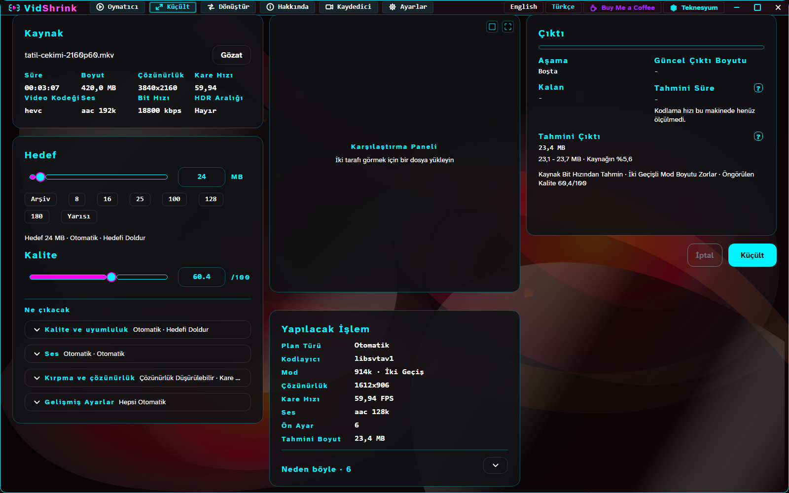
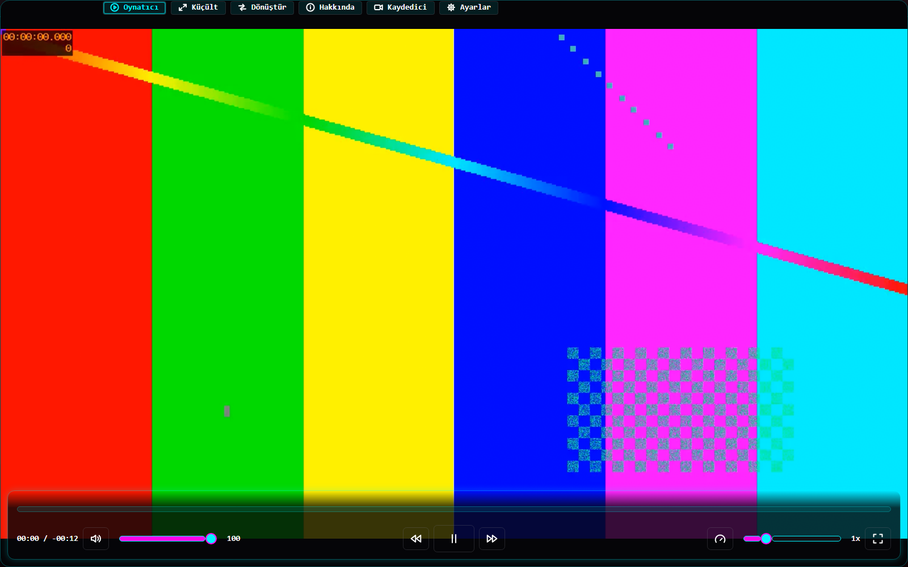
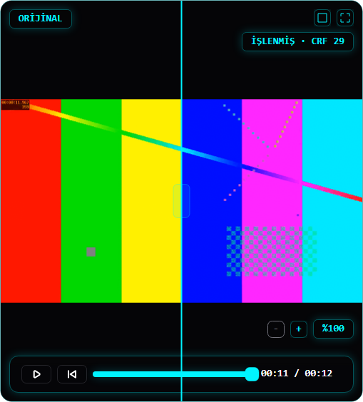
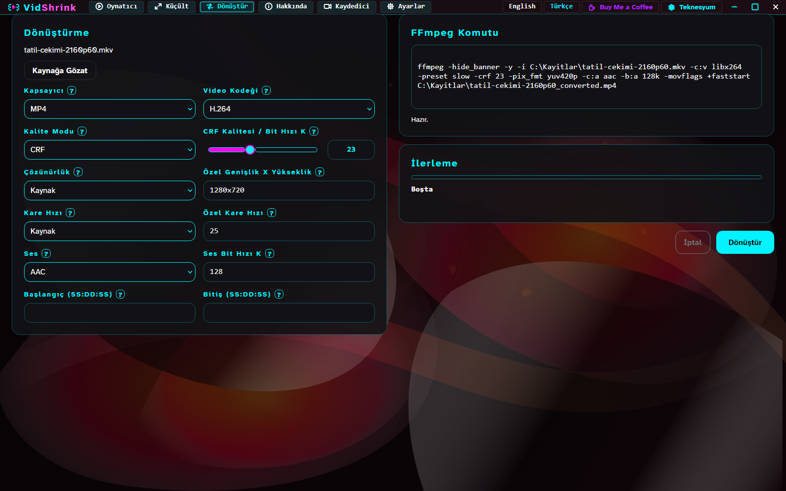
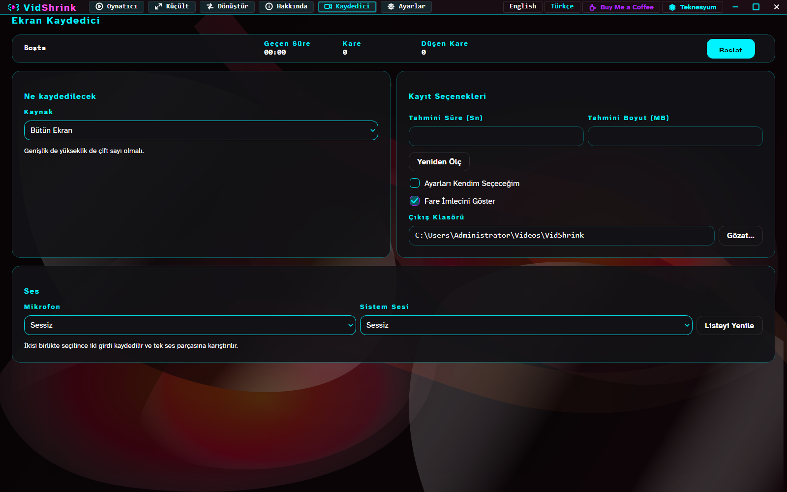
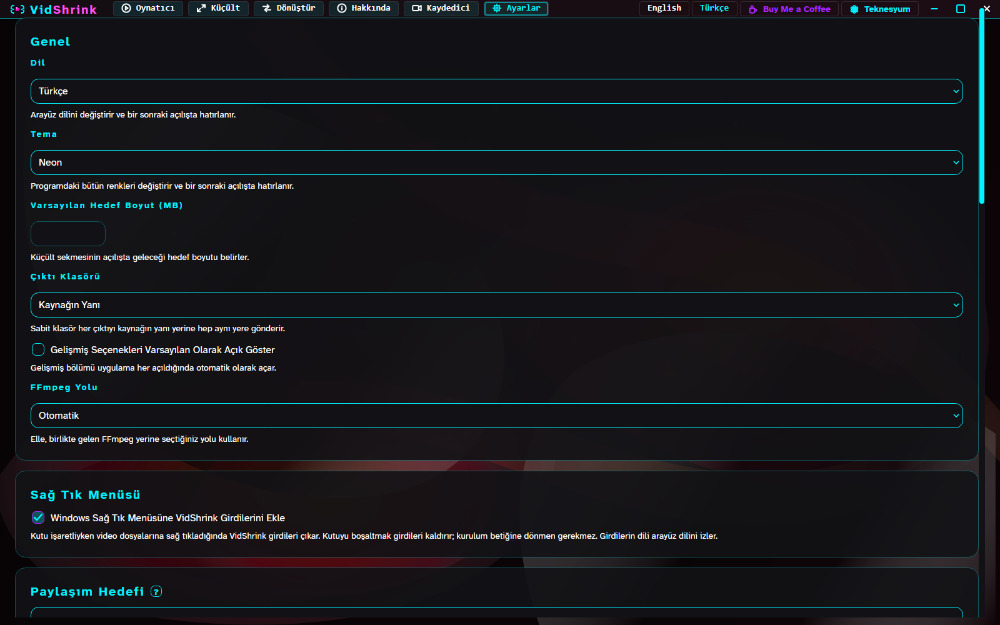
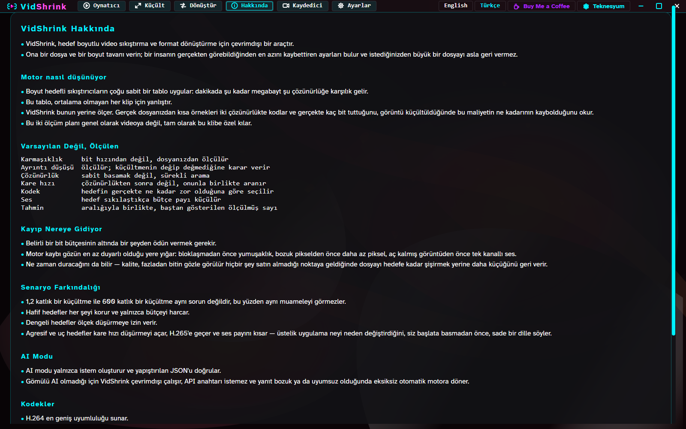
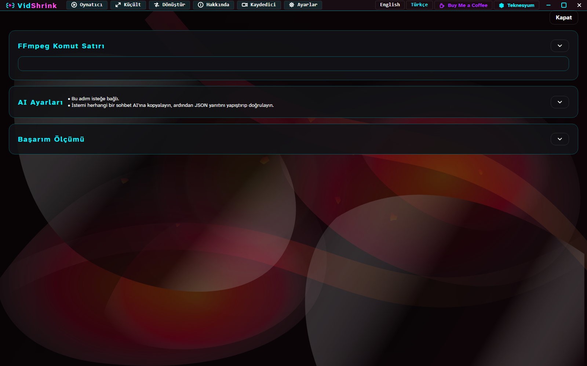
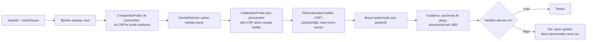
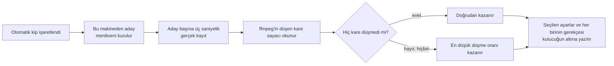

<!-- lang -->

[](README.md)

# VidShrink

**Videoyu istediğiniz dosya boyutuna indirin, ekranınızı kaydedin, oynatın ve paylaşın —
tek bir ücretsiz, çevrimdışı pencereden.**

**Ömür boyu ücretsiz · Reklam yok · Hesap yok · Abonelik yok · Telemetri yok · İnternet
kapalıyken de çalışır · 42 dil · 26 tema · Açık kaynak**

[](https://github.com/Teknesyum/VidShrink/releases/latest)
[](LICENSE)
[](#kurulum)



## Bunların hiçbirini bilmenize gerek yok

Videoyu sürükleyin, bir boyuta dokunun, başlat deyin. İşin tamamı bu; gerisini otomatik kip
yapıyor — kodeki, kalite düzeyini, çözünürlüğü ve kare hızını **sizin** dosyanız için
seçiyor ve beklenen boyutu daha hiçbir şey koşmadan söylüyor. İstediğiniz sayıdan büyük bir
dosya asla almıyorsunuz.

Ekran kaydedici de aynı şekilde: tek bir kutucuk, ve program kodlayıcıyı, kare hızını ve
kayıt boyutunu size sormak yerine kendi makinenizde ölçüp buluyor.

**Pencerenin tamamı 42 dil konuşuyor** — her düğme, her uyarı, her ipucu; Arapçadan
Vietnamcaya — ve yanında **26 renk teması** geliyor (Catppuccin, Dracula, Gruvbox, Nord,
Rose Pine, Solarized, Tokyo Night ve yirmi tanesi daha, açık ve koyu). İkisini de Ayarlar'dan
seçiyorsunuz, hiçbir şey yeniden başlamıyor. Diliniz yok mu, ya da çeviri sizin dilinizde
kötü mü duruyor? [Issue açın](https://github.com/Teknesyum/VidShrink/issues/new), bir sonraki
sürüme giriyor — süreç bundan ibaret.

## Tek pencerede dört araç

**Küçült** — megabayt cinsinden bir hedef, ve onun hemen altına oturan bir video. İnsanların
gerçekten ihtiyaç duyduğu boyutlar için yongalar (Discord'a 8, WhatsApp'a 16, Gmail'e 25,
WhatsApp Web'e 180), gerisi için kaydırıcı. On iki kodlayıcı — yazılım, NVENC, Quick Sync,
AMF — her biri önce [kendi makinenizde yoklanıyor](docs/olcumler/kodek-matris.md).

**Kaydet** — tüm ekran, tek bir pencere ya da bir bölge; her platformun gerçekten sahip
olduğu yakalama arka ucuyla: Windows'ta gdigrab, macOS'ta avfoundation, Linux'ta x11grab.
Mikrofon ve sistem sesi adıyla seçiliyor, böylece sırası değişen bir aygıt listesi
mikrofonunuzu sessizce değiştiremiyor. Durdurmak dosyayı düzgün kapatıyor; duran kayıt oynuyor.

**Oynat** — kaynak pencerede oynuyor; her ileri-geri için ffmpeg başlatmak yerine
[aramalar arasında açık kalan](docs/olcumler/oynatici-motor-libmpv.md) bir çözücü borusuyla,
yanında öncesi-sonrası için karşılaştırma paneliyle.

**Paylaş ve sağ tık** — "Bu videoyu VidShrink ile aç" Explorer menüsünde duruyor, Windows
11'de birincil menüde, [kullanıcı başına yazılıyor](docs/olcumler/kabuk-menusu.md); yönetici
hakkı istemiyor ve dosya ilişkilendirmelerinize dokunmuyor. Paylaşım hedefleri ve ölçülmüş
boyut tavanları [`paylasim-hedefleri.json`](paylasim-hedefleri.json) içinde.

Ayrıca bir Dönüştür sekmesi (MP4, MKV, WebM, MOV, AVI, GIF, MP3, M4A, WAV; H.264, H.265,
VP9, AV1 ya da akış kopyası; kırpma ve ses çıkarma) ve tam ffmpeg komutunu tutan gizli bir
Gelişmiş sekmesi var. Tam tur: [`docs/kullanim.tr.md`](docs/kullanim.tr.md).

## Her sekme

<details>
<summary>Altı sekmenin, önizlemenin ve gizli Gelişmiş sekmesinin ekran görüntüleri</summary>

**Oynatıcı** — kaynak pencerede oynuyor, karşılaştırma paneli yanında duruyor.



**Küçült** — solda kaynak, ortada hedef boyut ve kalite, sağda kestirim.


**Önizleme** — plan koşmadan önce ne üreteceği.



**Dönüştür** — kap, kodek, kırpma ve ses çıkarma.



**Kaydedici** — otomatik kip işaretli; seçilen kodlayıcı, kare hızı ve kayıt boyutu kutucuğun altında yazıyor.



**Ayarlar** — dil, tema, sağ tık menüsü, güncelleme davranışı.



**Hakkında** — sürüm, lisans, VidShrink'in üstünde durduğu projeler.



**Gelişmiş** (açana kadar gizli) — koşacak tam ffmpeg komutu.



</details>

## Kurulum

Windows'ta [`VidShrink-Setup.exe`](https://github.com/Teknesyum/VidShrink/releases/latest/download/VidShrink-Setup.exe)
dosyasını indirip çalıştırın (0.8.3'ten itibaren yayında). Kendi başına çalışan küçük bir
program: PowerShell de yönetici hakkı da gerekmez, aşağıdaki betiğin yaklaşık yarı süresinde
biter. Betik de çalışmaya devam ediyor ve aynı kurulumu yapıyor.

```powershell
# Windows
irm https://raw.githubusercontent.com/Teknesyum/VidShrink/main/Install-VidShrink.ps1 | iex
```

```bash
# macOS / Linux
curl -fsSL https://raw.githubusercontent.com/Teknesyum/VidShrink/main/install-vidshrink.sh | sh
```

Yönetici hakkı yok, .NET SDK yok. Her sürüm tek bir sürüm numarasından dört hedef üretiyor:
`win-x64`, `osx-arm64`, `osx-x64`, `linux-x64`. Gerekenler: Windows 10 ya da 11, macOS 14 ve
üstü, ya da X11/Wayland koşan bir Linux masaüstü, artı `ffmpeg` ve `ffprobe`. FFmpeg ve
libmpv sürümle birlikte gelmiyor; kurucu bunları Windows'ta pinlenmiş SHA-256 özetlerine
karşı indiriyor, diğerlerinde paket yöneticinizin komutunu yazıyor. Sağlama doğrulaması,
sağ tık girdisi, kendi kendini güncelleme akışı ve kaldırma anahtarları
[`docs/kurulum.tr.md`](docs/kurulum.tr.md) içinde.

## Komut satırı

Aynı paket, pencerenin yanında başsız bir komut satırı aracı da taşıyor: Windows ve
Linux'ta `vidshrink`, macOS'ta `vidshrink-cli`. Pencerenin çağırdığı karar motorunu
çağırıyor, yani aynı girdi aynı ffmpeg argümanlarını veriyor; bir test ikisini
karşılaştırıyor.

```bash
vidshrink kucult clip.mp4 --hedef 25MB              # boyuta küçült
vidshrink kucult clip.mp4 --kalite 80 --kodek av1   # kalite puanına küçült
vidshrink plan clip.mp4 --hedef 8MB --json          # yalnız plan ve argümanlar, kodlama yok
```

Anahtarlar: `--kodek auto|h264|hevc|av1`, `--cikti <yol>`, `--json`, `--olcumsuz` (yoklama
kodlamalarını atlar), `--vmaf` (ffmpeg'de libvmaf varsa sonucu ölçer), `--hizli`. İlerleme
stderr'e, boyut, süre, deneme sayısı ve VMAF stdout'a gidiyor. Yardım metni sistem dilini
izliyor, Türkçe ya da İngilizce.

Çıkış kodları: bantta `0`, bandın altında `2` (kalite doyduğu için daha küçük dosya
saklandı), boy tavanı aşıldığında `3` (en küçük sonuç yine yazılıyor; JSON `output` ve
`overTarget: true` taşıyor), hatada `1`, yanlış kullanımda `64`, iptalde `130`.

### İzlenen klasör

```bash
vidshrink izle ~/Gelen --cikti ~/Giden --hedef 25MB             # Ctrl+C'ye kadar koşar
vidshrink izle ~/Gelen --cikti ~/Giden --hedef 25MB --bir-kez   # klasörü boşaltır, çıkar
```

`izle`, klasöre düşen her videoyu küçültüyor. `--cikti` çıktı klasörüdür ve zorunludur;
izlenen klasörün kendisi olamaz. `--aralik <saniye>` tarama aralığını belirliyor
(varsayılan 2), `--bir-kez` beklenecek bir şey kalmayınca çıkıyor, `kucult`'un öbür
anahtarları her dosyaya uygulanıyor. `--json` ile stdout NDJSON oluyor: dosya başına tek
satır JSON nesnesi.

Bir dosya, boyu ve değişiklik saati üst üste iki tarama aralığı boyunca aynı kaldığında ve
onu tutan bir yazıcı olmadığında alınıyor — üçüncü tarama alıyor. Kodlanırken kaynak
değişirse çıktı siliniyor ve dosya durulunca yeniden ele alınıyor.

İlerleme, izlenen klasörün içindeki `.vidshrink-izle.json` dosyasında ada ve boya göre
tutuluyor; adı ya da boyu değişen dosya yeni sayılıyor. O klasör salt okunursa durum çıktı
klasörüne `.vidshrink-izle-<ozet>.json` olarak, o da tutmazsa ayar klasörüne yazılıyor.
Başarısız olan dosya, bir sonraki açılışta bir kez yeniden denenir. Her şeyi yeniden
işlemek için durum dosyasını silin.

Klasör ve dosya adları koşan sistemin kuralıyla karşılaştırılıyor: Linux'ta `Ordinal`,
Windows ile macOS'ta `OrdinalIgnoreCase`. Kuralın macOS tarafı varsayılan APFS bölümünü
varsayıyor; o bölüm harf duyarsız ama harf koruyordur.

APFS harf DUYARLI da biçimlendirilebilir ve böyle bir bölümde kural yanlış tarafa düşüyor:
aynı adın iki harf varyantı, `Klip.mp4` ile `klip.mp4`, tek dosya sayılıyor, yani ikisinden
biri hiç işlenmiyor; iki yol yalnız harf durumunda ayrılsa bile izlenen klasör çıktı
klasörü olarak reddediliyor. Varsayılan bir makineye bağlanan harf duyarlı dış bölüm için
de aynısı geçerli. Bu durum ölçülmedi.

Çıkış kodları: bittiğinde `0`, `--bir-kez` bitip en az bir dosya başarısız olduğunda `4`,
hatada `1`, yanlış kullanımda `64`, Ctrl+C ile durdurulduğunda `130`.

## Sayılar

Burada arama tablosu yok. *Ölç* diyen her adım, karar verilmeden önce ffmpeg'i gerçek
dosyanıza karşı koşturuyor — iki çözünürlük ve iki CRF'te kısa örnek kodlamalar, bir sahne
haritası, sonra aynı pencereleri dört CRF adımı arayla yeniden kodlayıp iki sonuçtan bit
maliyeti eğrisini okuyan bir kalibrasyon geçişi.

Bunun getirisi bugünkü motorla **36 vakada** yeniden ölçüldü — üç 1080p30 klip (yüksek
detay, yüksek hareket, ağır gürültü) × üç hedef × yazılım ve donanım kolu × **ikişer
tekrar** — AMD Ryzen 7 9700X, RTX 5070 Ti, ffmpeg 9.0-full
([`docs/olcumler/bench-2026-09-13.md`](docs/olcumler/bench-2026-09-13.md)):

| Hedef | Klip | Kodlayıcı | Çıkan (1. / 2. koşum) | Bütçe doluluğu | Deneme |
|---|---|---|---|---|---|
| 100 MB | yüksek detay | libx264 | 97,30 / 97,37 MB | %97,3 | 1 |
| 100 MB | ağır gürültü | h264_nvenc | 98,63 / 98,63 MB | %98,6 | 3 |
| 50 MB | yüksek hareket | h264_nvenc | 49,88 / 49,88 MB | %99,8 | 1 |
| 25 MB | yüksek hareket | libx264 | 24,24 / 24,26 MB | %97,0 | 1 |
| 25 MB | ağır gürültü | libsvtav1 | 24,28 / 24,28 MB | %97,1 | 1 |
| 8 MB | ağır gürültü | libsvtav1 | 7,67 / 7,67 MB | %95,9 | 1 |
| 8 MB | yüksek hareket | h264_nvenc | 7,71 / 7,71 MB | %96,3 | 1 |

36 vakanın kapıları: **hedef bir kez bile aşılmadı — 0/36.** Kalibrasyon 36/36 tuttu.
36/36 iki geçişli seçildi, tek geçişli CRF hiç kazanmadı. Donanım kolu tekrarlar arasında
bit düzeyinde aynı — 18/18 vakada 0,000 MB sapma — `libx264` en fazla 0,074 MB kaydı.
Fazladan bit izleyicinin görebileceği bir şey satın almaz olunca koşu erken duruyor: kolay
bir klipte 25 MB isteyin, kaynaktan ayırt edilemeyen 9 MB alabilirsiniz.

Geride kaldığımız iki yeri de yayımlıyoruz.

**AV1 dalı hedefin altına düşüyor.** 36 vakanın 31'i bant içinde kaldı; **beş kaçağın
beşi de, tek sert taban ihlali de (6,80 MB tabana karşı 6,68 MB) `libsvtav1`** — `libx264`
6/6, `h264_nvenc` 18/18 bant içi. Tekrarlar arası sapma da orada toplanıyor (2,484 MB'a ve
73,5 saniyeye kadar), çünkü aynı girdiye farklı koşumda farklı sayıda düzeltme turu
koşuluyor. İki tekrar bunu görünür kıldı; tek koşum olsaydı sabit bir sayı sanılacaktı.

**HandBrake algısal kalitede hâlâ önde.** 17 dakikalık 1080p60 HDR kaynakta, teslim edilen
boyut eşitken (±%2), HandBrake'in x265 preset'i **ortalama 8,79 VMAF-NEG**, **2,60 dB
XPSNR** ve **0,0299 SSIM** önde
([`docs/olcumler/handbrake-acigi.md`](docs/olcumler/handbrake-acigi.md)) — psy-rd, psy-rdoq
ve uyarlamalı nicemleme, ki argümanlarımız bunları henüz taşımıyor. Bu açığı kapatmak yol
haritasının ilk maddesi.

## Nasıl ölçüyoruz

Düzenek, yargıladığı özellikten uzun sürdü; çünkü iki kodlamayı ayırt edemeyen bir düzenek
sonsuza kadar sayı basar ve yanlışlığını kendi söylemez.

<details>
<summary>Bir sayıya güvenilebilmesi için düzeneğin yaptığı altı şey</summary>

- **Cevap vermeyi reddeden bir renk kapısı.** Her çıktının renk uzayı, transferi,
  primaries'i ve piksel biçimi ffprobe ile okunup referansla karşılaştırılıyor. Etiketsiz
  çıktı, PQ'ya karşı HLG, SDR referansa karşı HDR sonuç: araç makul bir sayı yerine *hiç
  sayı basmıyor*. Kapısız bir önceki tablo tam da bu yüzden çöpe gitti — hedef boyut on kat
  değişirken neredeyse sabit bir XPSNR döndürüyordu.
- **Üç ölçüt, ve dört sayı olarak VMAF.** **VMAF-NEG**, **XPSNR** ve **SSIM**; VMAF
  ortalama, harmonik ortalama, 10. yüzdelik ve kare minimumu olarak. Ortalama, gerçekten
  kötü görünen kareleri saklar; izleyicinin fark ettiği kareler de onlardır.
- **Kare kilidi**, böylece iki taraf aynı kareler üzerinden puanlanıyor. Kilit üretime
  girmeden önce ölçülen sayılar kendi belgelerinde şüpheli damgalı ve buraya alınmadı.
- **Doğrulanmış kesimler.** 17 dakikalık kaynak, gerçek anahtar karelerde kesilmiş üç adet
  60 saniyelik parçayla ölçülüyor; her parçanın başlangıcı kaynağa karşı kare karmasıyla
  doğrulandı — üçü de `-c copy` kesiminin gerektirdiği gibi istenen saniyeden 0,4 sn önceye
  oturdu.
- **Bilinen bir kusur, yayımlanmış hâliyle.** Düzenek iki akışı kare indeksine kilitliyor;
  plan kare hızını düşürdüğünde farklı anları karşılaştırıp kaybı şişiriyor — aynı dosyada
  yalnız `fps=30` yeniden örneklemesi XPSNR'ı **1,70 dB'den 21,14 dB'ye** taşıdı. Kare hızı
  düşmeyen satırlar etkilenmiyor (34,5557'ye karşı 34,56). Kırık yola dayanan hükümler kendi
  belgelerinde *temelsiz* diye işaretlendi, sessizce tekrarlanmadı.
- **Duyarlılık kanıtı.** Düzenek, 60 MB'lık bir kodlamayı 600 MB'lıktan en az 1,00 VMAF-NEG
  puanıyla ayırmak zorunda; ayıramazsa kendini duyarsız işaretliyor. Ölçülen: HandBrake için
  **+39,26**, VidShrink için **+39,85** — eşiğin kırk katı.

</details>

Düzeneğin tamamı: [`docs/olcumler/ab-duzenegi.md`](docs/olcumler/ab-duzenegi.md).
Kaydedicinin otomatik kipi de aynı yolla ölçülüyor — makineden kurulan bir aday merdiveni,
sonra [aday başına üç saniyelik gerçek kayıt](src/VidShrink.Ffmpeg/RecorderAutoProbe.cs) ve
düşen kare sayımı; bugünkü motorla yeniden ölçümü
[`docs/olcumler/auto-mod-yeni-taban.md`](docs/olcumler/auto-mod-yeni-taban.md) içinde. Yüzü
aşkın böyle belge [`docs/olcumler/`](docs/olcumler/) altında; buradaki her sayı birinden
geliyor.

## Kaputun altında

<details>
<summary>Dosyayı bıraktığınızla çıktıyı aldığınız an arasında ne koşuyor</summary>





</details>

Uzun hâli — kalibrasyon, durma ölçütü, dört sıkıştırma rejimi, HDR, algısal puanlama,
bugünkü sınırlar: [`docs/motor.tr.md`](docs/motor.tr.md).

## Belgeler

[Kullanım](docs/kullanim.tr.md) · [Motor](docs/motor.tr.md) ·
[Kurulum ve güncelleme](docs/kurulum.tr.md) · [Ölçümler](docs/olcumler/) ·
[Yol haritası](docs/YOL-HARITASI.md) · [Sürüm notları](CHANGELOG.md) · [Katkı](CONTRIBUTING.md)

## Yol haritası

Ölçülmüş, açık, bu sırayla — ayrıntı [`docs/YOL-HARITASI.md`](docs/YOL-HARITASI.md) içinde.

- **HandBrake'i algı tarafında da geçmek.** Hedef boyuta oturtmayı zaten biz kazanıyoruz;
  yukarıdaki 8,79 VMAF-NEG açığı psy-rd, psy-rdoq ve uyarlamalı nicelemeden geliyor ve bu
  anahtarlar bizim argümanlarımızda henüz yok. Ölçüt aynı düzenek, aynı kaynak, açık önce
  sıfıra sonra bizim tarafa — iddia değil, ölçüm.
- **AV1 dalının hedef altına düşmesi** — beş bant kaçağının beşi `libsvtav1`, düzeltme
  turları kapatamıyor.
- **Ölçüm düzeneğinin zamanda hizalanması**, ki kare hızı düşüren planlar ölçülebilsin.
- **Tepe hızı tavanını açmak**, ki bu küçük hedeflerdeki donanım aşımını da düzeltiyor.
- **Ölçek ve kare hızı cezalarını ölçülmüş kaliteye göre kalibre etmek**; planlayıcının
  bugün kullandığı sabitlerin yerine.
- **Klip yerine sahne başına kodlama** — geriye kalan en büyük yapısal kazanç.

## Katkı

Önce bir konu açın, değişikliği tek derde tutun, `dotnet test VidShrink.sln` koşun —
kırmızı hiçbir şey birleşmez — ve her commit'i [Developer Certificate of Origin](DCO)
uyarınca `git commit -s` ile imzalayın. Derleme talimatı, proje yerleşimi ve tasarım
kuralları: [`CONTRIBUTING.md`](CONTRIBUTING.md).

## Lisans

[AGPL-3.0-or-later](LICENSE). Telif hakkı (C) 2026 Teknesyum.

FFmpeg ve libmpv kendi lisansları altında ayrı programlardır; VidShrink ikisini de yeniden
dağıtmaz ve içine GPL kodu bağlamaz ([`docs/kurulum.tr.md`](docs/kurulum.tr.md)).

<!-- signature -->
<div align="center">

<a href="https://github.com/sponsors/Teknesyum"></a>
&nbsp;
<a href="LICENSE"></a>

</div>
