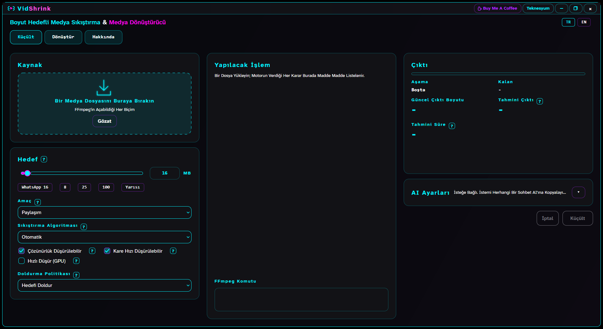
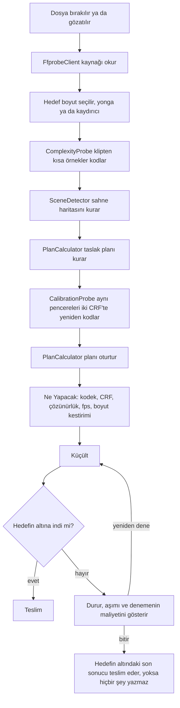
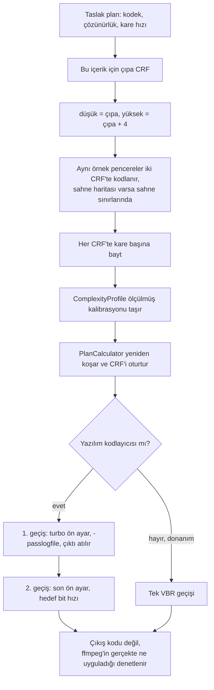
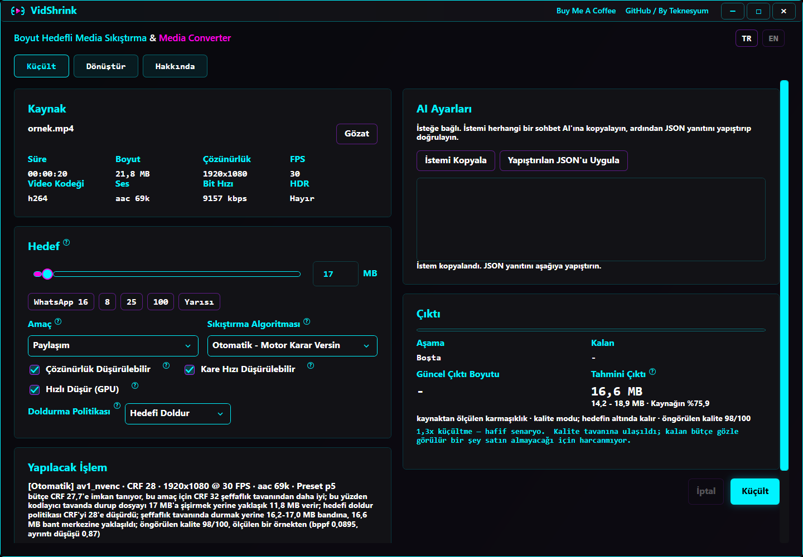
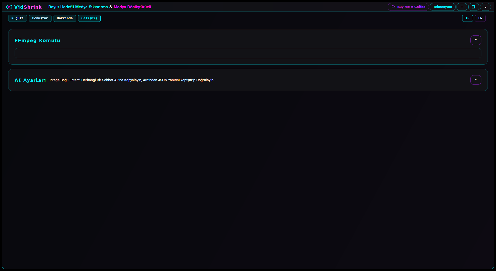
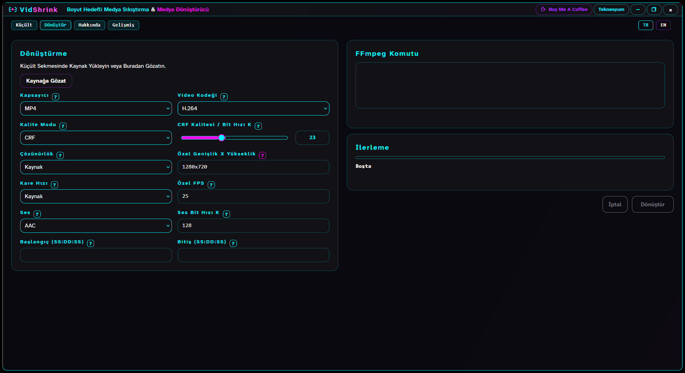
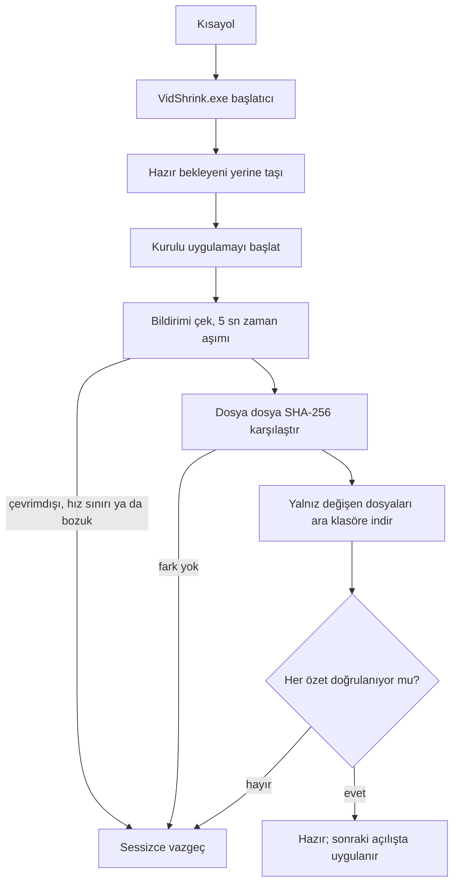
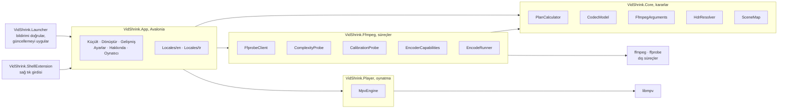

<!-- lang -->

[](README.md)

# VidShrink

Hedef boyut girer, video çıkar.

Windows, macOS ve Linux için ücretsiz, çevrimdışı bir masaüstü uygulaması. Videoyu
istediğiniz dosya boyutuna indirir ve bunu yaparken gözün gerçekten gördüğü şeyden en azını
kaybeder. Bir dosya ve megabayt cinsinden bir tavan verirsiniz. İstediğinizden büyük bir
dosya asla döndürmez, beklenen boyutu da başlat demeden önce söyler. Türkçe ve İngilizce
eşit durumda: köşedeki `TR` / `EN` düğmeleri bütün pencereyi çevirir.



## Bunu ffmpeg zaten yapmıyor mu?

Cevabı önceden biliyorsanız yapıyor. `ffmpeg` söylediğiniz bit hızında seve seve kodlar.
Yapmadığı şey şu: bu klipte tam olarak hangi bit hızının, hangi çözünürlüğün ve hangi kare
hızının sizi 25 MB'ın *hemen altına* indireceğini hesaplamaz, ne çıkacağını da önceden
söylemez.

- **Dosyanızın bit hızından tahmin etmez, dosyanızı ölçer.** Karar verilmeden önce kısa
  örnekler iki çözünürlükte ve iki CRF'te kodlanır.
- **Çözünürlük sorusunu klip başına yanıtlar.** Pikselleri koruyup kötü kodlamak mı, yoksa
  pikselden vazgeçip iyi kodlamak mı — bu denge varsayılmaz, ölçülür.
- **Planı ve kestirimi koşumdan önce gösterir**, gerekçesiyle birlikte, sade dille, sizin
  dilinizde.
- **Hedefi asla aşmaz.** "Genelde aşmaz" değil: tavanın üstünde kalan sonuç hiç teslim
  edilmez.

## Öne çıkanlar

- **Ölçülmüş planla hedef boyuta küçültme.** İnsanların gerçekten ihtiyaç duyduğu boyutlar
  için yongalar, gerisi için kaydırıcı ve baştan verilen, aralığı da yazan bir kestirim.
- **Dönüştür sekmesi.** MP4, MKV, WebM, MOV, AVI, GIF, MP3, M4A, WAV; H.264, H.265, VP9,
  AV1 ya da akış kopyası; kırpma ve ses çıkarma.
- **Gelişmiş sekmesi.** Motorun koşacağı FFmpeg komutunun kendisi — seçilebilir,
  kopyalanabilir — ve isteğe bağlı AI plan istemi. Özet değil, komutun kendisi.
- **Oynatıcı sekmesi.** Pencere kaynağı kendi oynatır; kod çözücü borusu her sürüklemede
  yeni ffmpeg başlatmak yerine aramalar arasında açık kalır.
- **On iki kodlayıcı, güvenilmez, sınanır.** Yazılım, NVENC, Quick Sync ve AMF adayları
  motor birini seçmeden önce sizin makinenizde tek tek denenir.
- **Windows'ta sağ tık menüsü ve kendini güncelleme.** Gezgin menüsünde "VidShrink ile
  küçült" ve uygulama açılmadan kurulumu yamalayan bir başlatıcı.

## Yapmadıkları

- **HDR10+ ve Dolby Vision taşınmıyor.** HDR10+ kaynak duruk HDR10 olarak teslim edilir.
- **macOS ve Linux'ta sağ tık menüsü yok.** Yalnız Windows'ta var, ötekilere benzeri bir
  şey kurulmuyor.
- **FFmpeg kutunun içinde gelmiyor.** Kurucular onu paket yöneticinizden çeker ya da
  komutu yazar; sürümlerin içinde taşınmaz.
- **Algısal planlayıcı henüz yok.** VMAF planı sonradan, ölçüm düzeneğinde yargılıyor;
  planlayıcının sabitlerini henüz o belirlemiyor. Yol haritasına bakın.
- **Küçük hedeflerde donanım henüz kazanmıyor.** `av1_amf` 8 MB ve 25 MB'ta hâlâ ikinci bir
  denemeye ihtiyaç duyuyor. Sayılar aşağıda.
- **Telemetri, hesap, ücretli sürüm yok.** Kaydolunacak bir şey bulunmuyor.

## Kurulum

### Windows — tek satır

```powershell
irm https://raw.githubusercontent.com/Teknesyum/VidShrink/main/Install-VidShrink.ps1 | iex
```

Yönetici hakkı da .NET SDK'sı da gerekmez. Kurucu GitHub'dan son sürümü ister, `win-x64`
arşivini ve yanındaki başlatıcıyı indirir, ikisini de sürümün kendi SHA-256 listesine karşı
sınar ve özetlerden biri tutmuyorsa devam etmez.

Kurulum `%LOCALAPPDATA%\Programs\VidShrink` altına yapılır; FFmpeg ve FFprobe WinGet'ten
çekilir; Masaüstü ve Başlat Menüsü kısayolları başlatıcıyı gösterir; sağ tık girdisi de
eklenir. Aynı komutu yeniden koşmak kurulu uygulamayı en yeni sürümle değiştirir.

Windows için yalnız `win-x64` yayımlanıyor. ARM64 ya da 32 bit olduğu kesin olarak
anlaşılan makinede kurucu durur; güncellemeleri hiç bulunamayacak bir mimariyi kurmaktansa
durmak doğrudur. *Okunamayan* mimari ayrı bir durum: kurucu sırayla
`RuntimeInformation.OSArchitecture`, `PROCESSOR_ARCHITEW6432`, `PROCESSOR_ARCHITECTURE` ve
işletim sisteminin bit genişliğine bakar; hiçbiri ad vermezse 64 bitlik Windows `win-x64`
olarak devam eder ve bunu varsaydığını tek satırla yazar.

`irm | iex` betiği dosyadan değil bellekten koşturur, bu yüzden öntanımlı `Restricted`
ilkesi engel olmaz. Kurumsal bir ilke engelliyorsa
[`Install-VidShrink.ps1`](Install-VidShrink.ps1) dosyasını indirin, okuyun ve aşağıdaki gibi
koşturun. `-File` yerine dosyayı açıkça UTF-8 okutun: betik imzasız UTF-8 saklanıyor,
Windows PowerShell 5.1 ise imzasız betiği sistem ANSI kod sayfasıyla okuyup ASCII dışı her
karakteri bozuyor.

```powershell
powershell -NoProfile -ExecutionPolicy Bypass -Command "iex ([IO.File]::ReadAllText('C:\path\to\Install-VidShrink.ps1',[Text.Encoding]::UTF8))"
```

### macOS / Linux — tek satır

```bash
curl -fsSL https://raw.githubusercontent.com/Teknesyum/VidShrink/main/install-vidshrink.sh | sh
```

Kök yetkisi de .NET SDK'sı da gerekmez. Hedef `uname` çıktısından seçilir — `osx-arm64`,
`osx-x64` ya da `linux-x64` — arşiv sürümün sağlama listesine karşı doğrulanır,
`~/.local/share/vidshrink` altına kurulur ve `~/.local/bin/vidshrink` olarak bağlanır. Başka
her mimaride kurucu adını söyleyerek durur.

macOS'ta elinizde gerçek bir uygulama paketi kalır: Finder'da kendi adı ve simgesiyle açılan,
kendi kendine imzalanmış bir `~/Applications/VidShrink.app`. `--uninstall` paketi, yükü ve
kısayolu birlikte kaldırır. Linux'ta paket yok; başlatıcı bağlantısı her şeydir.

FFmpeg, bu kurucunun makinenize koymayacağı tek şey. `ffmpeg` ya da `ffprobe` yoksa paket
yöneticinizin komutunu yazar — `brew install ffmpeg`, `sudo apt install ffmpeg`,
`sudo dnf install ffmpeg` — ve başka hiçbir şey indirmeden durur.

### Gerekenler

- Windows 10 ya da 11, macOS 12 ve üstü, ya da X11/Wayland koşan bir Linux masaüstü
- Uygulamanın yanındaki `tools/ffmpeg` klasöründe ya da `PATH` üzerinde `ffmpeg` ve `ffprobe`
- .NET çalışma zamanı ve SDK gerekmez. Sürümler kendi kendine yeterli

Donanım kodlaması isteğe bağlıdır. Eksik ya da bozuk bir GPU kodlayıcısı bildirilir ve motor
sıradaki adaya geçer; ölümcül değildir.

## Nasıl çalışıyor

Burada arama tablosu yok. *Ölçüm* diyen her adım, karar verilmeden önce sizin dosyanıza
ffmpeg koşturur.



### Ölçüm neden tablodan iyi

Hedef boyutlu sıkıştırıcıların çoğu arama tablosu uygular: dakikada şu kadar megabayt şu
çözünürlük demektir, elinizdeki duruk bir ekran kaydı da olsa elde çekilmiş gece görüntüsü
de. O tablo, ortalama olmayan her klip için yanlıştır — yani kliplerin çoğu için.

Örnek kodlamalardan iki sayı çıkar. Birincisi bu içeriğin gerçekten kaç bite mal olduğu.
Aynı 1080p30'daki bir renk geçişi ile bir konfeti patlaması aynı kodlama sorunu değildir ve
kaynağın bit hızı hangisiyle karşı karşıya olduğunuzu söylemez.

İkincisi, resim küçültüldüğünde bu maliyetin ne kadarının kaybolduğu. Geliştirme sırasında
alınan ölçümlerde bir deneme klibi yarıya indirilince piksel başına maliyetinin %87'sini
kaybetti; bir başkası %22'sini. Sabit bir varsayım ikisi için de yanlış.

| | Sıradan hedef boyut aracı | VidShrink |
|---|---|---|
| İçerik karmaşıklığı | kaynağın bit hızından çıkarılır | dosyanızdan örnek kodlanarak ölçülür |
| Küçültmede ayrıntı kaybı | sabit varsayım, ya da hiç | klip başına iki çözünürlükte ölçülür |
| Çözünürlük seçimi | sabit merdiven: 1080, 720, 480 | sürekli arama, sığan her ölçek |
| Kare hızı seçimi | varsa çözünürlükten sonra | çözünürlükle birlikte aranır |
| Kodek seçimi | ne seçtiyseniz o | hedefin gerçekte ne kadar zor olduğuna göre |
| Ses bütçesi | sabit bit hızı | hedef daraldıkça küçülen pay |
| Boyut kestirimi | kalite kipinde çoğu zaman yok | aralığıyla birlikte, baştan verilen ölçülmüş sayı |
| Aşım | yeniden deneme döngüsü | plan tek geçişte oturur; deneme yedek çözümdür |

### Kalibrasyon ve iki geçiş

Motor, CRF değişince bit maliyetinin nasıl değiştiğini varsaymaz. Aynı örnek pencereleri
dört CRF adımı arayla iki kez kodlar ve eğriyi bu iki sonuçtan okur.



Yanlış yapılması kolay iki ayrıntı. Birinci geçiş turbo ön ayarda koşar, böylece çözümleme
kodlama kadar pahalıya gelmez. Ve ffmpeg anlamadığı bir parametreyi sessizce yutup yine de
`0` döndürür; bu yüzden başarı, çıkış koduna değil gerçekte uygulanana bakılarak denetlenir.

### Ne zaman duracağını bilir

Amaç hedefi doldurmak değil, kalite tavanına ulaşmak. Fazladan bit izleyicinin görebileceği
bir şey satın almamaya başladığı anda VidShrink dosyayı yazdığınız sayıya kadar şişirmek
yerine daha küçük teslim eder. Kolay bir klipte 25 MB isteyip kaynaktan ayırt edilemeyen
9 MB alabilirsiniz.

Tersi de geçerli. Hedef kaliteyi gerçekten kısıtlıyorsa bütçenin üçte biri boşta kalmaz,
tamamı harcanır.

### Ne kadar zorladığınıza göre davranır

`CompressionRegime` dört değer taşır; küçültme oranı birini seçer.

| Kip | Küçültme | Motorun davranışı |
|---|---|---|
| Hafif | 1,5× altı | çözünürlüğü ve kare hızını korur, yalnızca bütçeyi harcar |
| Dengeli | 1,5–6× | çözünürlük ölçeklemesine izin verir |
| Sert | 6–30× | kare hızı düşürmeyi açar, H.265'e geçer, ses payını kısar |
| Uç | 30× üstü | en yüksek sıkıştırma, tek kanal ses, ve bunu söyler |

Belli bir bit bütçesinin altında bir şeyden vazgeçmek gerekir; kayıp gözün en az duyarlı
olduğu yere yazılır: bozulmadan önce yumuşama, kırık pikselden önce az piksel, aç kalmış
resimden önce tek kanal ses. Hiçbir hedef, ne kadar dar olursa olsun, ses izini susturmaz.

### HDR olabildiğince HDR kalır

HDR kaynak, koşacak kodlayıcı gerçekten yazabiliyorsa geniş rengini ve on bitini korur.
Bunu yapabilen kodlayıcılar kaynak kodda bir ad listesi değildir: uygulama sizin
makinenizde her adayla bir kare kodlar ve gerçekten 10 bit HDR dönenleri tutar.

Elde bunu taşıyabilen hiçbir şey yoksa resim başarısız olmak yerine SDR'ye ton eşlenir ve
uygulama bunun olduğunu söyler. Ton eşleme görünür bir kayıptır ve asla sessiz kalmaz.

### Kalite algısal olarak ölçülür, ya da hiç ölçülmez

Sonuçlar **VMAF-NEG**, **XPSNR** ve **SSIM** ile puanlanır ve tek sayı yerine dört VMAF
sayısıyla bildirilir: ortalama, harmonik ortalama, 10. yüzdelik ve en düşük. Ortalama
gerçekten kötü görünen kareleri gizler; izleyicinin fark ettiği kareler ise tam onlardır.

İki dosyayı karşılaştırmak, ikisini de açıkça belirtilmiş tek bir renk uzayına ve aralığına
getirmek demektir. İki tarafın dürüstçe bir araya getirilemediği yerde — HDR bir özgün
karşısında ton eşlenmiş bir sonuç gibi — karşılaştırma sayı yerine *karşılaştırılamaz*
döner.

Bugün nerede durduğu açık olsun. Algısal puanlama planlayıcı değil, ölçüm düzeneğidir:
motor yukarıdaki iki bit maliyeti ölçümünden plan yapar, VMAF ise planı sonradan
`tools/VidShrink.Bench` içinde yargılar.

### Ölçülen sonuçlar

Yapay kliplerle değil, gerçek görüntüyle uçtan uca ölçüldü. Yazılım kodlaması, 400 saniye
1080p60:

| Hedef | Sonuç | Deneme |
|---|---|---|
| 180 MB | 178,35 MB | 1 |
| 100 MB | 99,16 MB | 1 |
| 25 MB | 24,63 MB | 1 |
| 8 MB | 7,85 MB | 1 |

Dördü de ilk denemede doluluk bandına indi ve tavan hiç aşılmadı. Boyut kestirimleri %8
içinde, tipik olarak %4 içinde çıktı; kısıtlı hedeflerde bütçe doluluğu %92–99 oldu.

Donanım kodlaması (`av1_amf`) henüz bu noktada değil. Büyük hedefler ilk denemede banda
giriyor — 100 MB 99,01'de, 50 MB 49,97'de — ama küçükler hâlâ ikinci deneme istiyor: 25 MB
24,43'te, 8 MB 7,80'de. Aşım, tepe hızının hedef boyuttan bağımsız olarak kaynağın sabit
bir katına çakılmasından geliyor.

Hedefin üstüne çıkan sonuç kendiliğinden ikinci bir koşum başlatmaz. Koşum durur; ne
çıktığını, ne kadar aştığını ve denemenin ne kadar sürdüğünü gösterir, sonra yeniden
denemek mi yoksa burada bitirmek mi istediğinizi sorar. Bitirmek, büyük dosyayı kabul etmek
değildir: hedefin altında kalan son sonucu teslim eder, öyle bir sonuç yoksa hiçbir şey
yazmaz.

## Kullanırken nasıl görünüyor

Dosya yüklendikten sonra her karar, gerekçesiyle birlikte, siz başlamadan önce ekrandadır —
kodek, CRF, çözünürlük, kare hızı, kestirim ve aralığı.



Her hedef yongası bir yerde gerçek bir sınırdır; `?` rozeti hangisi olduğunu söyler.

| Yonga | O sayı neden |
|---|---|
| **8** | Nitro'suz Discord, eski forumlar, katı e-posta ağ geçitleri |
| **16** *(WhatsApp için önerilen)* | WhatsApp sohbetteki videoyu kendi zayıf kodlayıcısıyla yeniden kodlar; 16 MB altında sizinkini genelde olduğu gibi geçirir |
| **25** | Gmail ekleri, Discord Nitro Basic, çoğu talep sistemi |
| **100** | Kalitenin aktarım süresinden önemli olduğu arşiv ve yüklemeler |
| **128** *(paylaşım için en fazla)* | İki anonim paylaşım hedefinin dar olanı uguu.se'nin ölçülmüş tavanı |
| **180** *(WhatsApp Web için en fazla)* | WhatsApp Web dosya başına 180 MB alıyor; sayı kullanıcı bildirimi, WhatsApp yayımlamıyor |
| **Yarısı** | Kaynağın yarısı; yumuşak bir istek olduğu için çözünürlük ve kare hızı genelde korunur |

`ffprobe`'un içinde video akışı gördüğü her dosya kabul edilir. Dosya uzantısı hiçbir zaman
kapı değildir: sessiz video, değişken kare hızı, hareketli GIF, döndürme üstverisi ve az
rastlanan kapsayıcılar, kurulu ffmpeg çözebildiği sürece çalışır.

AI kipi isteğe bağlıdır ve gömülü değildir. VidShrink bir istem yazar, siz onu herhangi bir
sohbet yapay zekâsına yapıştırırsınız; dönen JSON'u geri yapıştırdığınızda uygulama onu
şimdiki kaynağa ve seçeneklere karşı doğrular. Çevrimdışı kalır, API anahtarı istemez ve
yanıt bozuk ya da bayatsa otomatik plana döner.



Dönüştür sekmesi işin elle yapılan tarafı: kapsayıcı, video kodeği, CRF ya da bit hızı,
çözünürlük, kare hızı, ses kodeği ve bit hızı, bir de başlangıç ve bitiş zamanı. Akış
kopyası gerçek `-c:v copy` ve `-c:a copy` kullanır; uyumsuz kapsayıcı ve kaynak kodek
eşleşmeleri koşumdan önce engellenir. GIF dönüşümü `palettegen` ardından `paletteuse` ile
yapılır.



Oynatıcı sekmesi kaynağı pencerenin içinde oynatır; kod çözücü borusu aramalar arasında
açık kalır. Sekmede videodan başka bir şey yok: başlık satırı, parça düğmeleri ve üç nokta
kalktı. Denetim şeridi görüntünün üstünde duruyor ve fare alt kenara yaklaşınca beliriyor;
üstünde saat, sayıları yanında duran ses ve hız kaydırıcıları ve ortada -10 / oynat / +10
var, üçünün en büyüğü oynat. Geri kalan her şey sağ tık menüsünde. Programın uyarısı
oynatıcıyı aşağı itmiyor, üstünde beliriyor.

| Girdi | Etkisi |
|---|---|
| Tekerlek | bir saniye adımlar |
| Ctrl + tekerlek | on saniye adımlar |
| Shift + tekerlek | altmış saniye adımlar |
| Ctrl + Shift + tekerlek | beş dakika adımlar |
| Alt + tekerlek | yakınlaştırır |
| Sağ tık ya da boşluk | oynatmayı açıp kapatır |
| Orta tık | tam ekranı açıp kapatır, pencereyi eski yerine koyar |

Bağlam menüsü de aynı üç eylemi taşır.

### Kodlayıcılar

Küçültme planını on iki kodlayıcı taşıyabilir. Varlık güvene alınmaz: her aday sizin
makinenizde denenir, deneme başarısız olursa sıradakine geçilir ve denenmemiş bir aday asla
"bu makinede kullanılamaz" diye işaretlenmez.

| Kodek | Yazılım | NVENC | Quick Sync | AMF |
|---|---|---|---|---|
| H.264 | `libx264` | `h264_nvenc` | `h264_qsv` | `h264_amf` |
| H.265 | `libx265` | `hevc_nvenc` | `hevc_qsv` | `hevc_amf` |
| AV1 | `libsvtav1` | `av1_nvenc` | `av1_qsv` | `av1_amf` |

VideoToolbox `CodecModel` içinde bir sağlayıcı olarak tanınıyor ama bugün küçültme yolunun
izin listesinde değil. VP9 Dönüştür sekmesinde.


- **H.264** neredeyse yapılmış her aygıtta oynar ve WhatsApp'ın beklediği kodektir.
- **H.265** aynı resim için kabaca üçte bir daha az bit ister; 2016 sonrası her telefon onu
  donanımda çözer, eski cihazlar ve bazı web oynatıcılar çözemez.
- **VP9** bir tarayıcı ve WebM biçimidir.
- **AV1** en iyi sıkıştırır, en yavaş kodlar; yalnız yeni telefonlar çözer.
- **Akış kopyası** hedef kaynağın akışlarını kabul ettiğinde anlıktır ve kayıpsızdır.

### Sağ tık menüsü

Gezgin'de bir videoya sağ tıklayın, menüde **Bu videoyu VidShrink ile aç** durur. Windows
11'de bu girdi "Diğer seçenekleri göster"in arkasında değil, birincil menüdedir. Bu
yerleşim yalnız paketlenmiş uygulamalara açık olduğu için kurucu seyrek bir paket kaydeder
— menüyü taşıyan, diskteki sıradan kurulumu gösteren bir bildirim — ve klasik girdiyi de
yanına yazar. Windows 10 makinesi ya da paketi taşımayan bir sürüm yalnız klasik girdiyi
alır ve kurulum sırasında bunu söyler. Kaldırma ikisini birden siler.

Girdi, uygulamanın kendi açtığı 24 uzantıda görünür. O liste tek bir yerde,
`VidShrink.Core.ShellIntegration.MediaExtensions` içinde durur ve kurucu ile uygulama bu
konuda anlaşmazlığa düşerse bir test kırılır.

Girdi kullanıcı başına, `HKCU\Software\Classes\SystemFileAssociations` altına yazılır; bu
yüzden yönetici hakkı istemez ve dosya ilişkilendirmelerinizi değiştirmez — öntanımlı
oynatıcınız öntanımlı oynatıcınız olarak kalır. Gösterdiği şey `VidShrink.exe`, yani
başlatıcı; kısayolların gösterdiğiyle aynı nedenle: doğrudan uygulamayı gösteren bir girdi
hiç güncellenmeyen bir kopya bırakırdı.

Etiket sistem arayüz dilini izler. `-MenuLanguage tr` ya da `-MenuLanguage en` ile birini
dayatabilirsiniz. `-RemoveShellMenu` her VidShrink girdisini tek geçişte siler, uzantı
listesi daha uzun olan eski sürümlerin girdileri dahil; `-ShellMenuOnly` girdileri kurulu
başlatıcıya göre yeniden yazar ve başka hiçbir şeye dokunmaz; `-SkipShortcuts` kabuğa hiç
dokunmaz.

```powershell
powershell -NoProfile -ExecutionPolicy Bypass -File C:\path\to\Install-VidShrink.ps1 -RemoveShellMenu
```

### Güncel kalmak

Windows'ta uygulama kendini sormadan günceller. Kısayollar uygulamanın üstünde duran küçük
bir başlatıcıyı, `VidShrink.exe`'yi gösterir. Tipik bir sürüm 519 MB'lık kurulumun yaklaşık
1,7 MB'ını değiştirir; telden inen de yalnız o kadardır.

Açılış yolunda ağa çıkan hiçbir iş yok. Uygulama açılmadan önce başlatıcı yalnız yerel işi
yapar: yarım kalmış başlatıcı değişimini toplar ve hazır bekleyen güncellemeyi yerine taşır.
Bildirim çekmek ve indirmek uygulama ekrana geldikten **sonra** koşar; topladığı iş bir
sonraki açılışta uygulanır — doğrulanmış dosyaları taşımak milisaniyeler sürer.



Ara klasör başarısız turdan sağ çıkar. Kopan hat ya da zaman aşımı inen dosyaları yerinde
bırakır, sonraki tur onları özetinden tanıyıp atlar; böylece yavaş hat sıfırdan başlamak
yerine birkaç açılışta yakınsar. Ara klasör yalnız başka bir sürüm için toplanmışsa atılır.
Doğrulanmamış bayt hiç yazılmadığı için yarım bir klasör yanlış dosya taşıyamaz. Aynı anda
tek başlatıcı toplar; ikincisi işin zaten yürüdüğünü görüp hiç başlamaz.

Sürümler hata ayıklama simgesi taşımaz. `.pdb` dosyaları yapıyı ayıklamayan hiç kimseye
yaramaz; onlara hiç sahip olmamış bir kurulum ise her birini eksik dosya sayıp her açılışta
yeniden indiriyordu.

Başlatıcı uygulamanın açılmasını hiçbir zaman engellemez. Ağ yok, DNS çözülmüyor, hız
sınırı, bozuk bildirim, dolu disk: hepsinde sessizce vazgeçer, kurulu sürüm olduğu gibi
kalır. FFmpeg sürümlerle taşınmaz ve bir daha indirilmez; başlatıcı yalnız `ffmpeg.exe`
ile `ffprobe.exe` yerinde mi diye bakar.

Otomatik güncelleme öntanımlı olarak açıktır ve ayarlardan kapatılabilir. Anahtar
`%APPDATA%\VidShrink\settings.json` içinde, çalıştırılabilirin yanında değil öteki
ayarlarınızın yanında durur; bu yüzden yeniden kurmak onu sıfırlamaz. Kapalıyken Windows da
ötekiler gibi davranır: uygulama açılışta bir kez yeni sürüm var mı diye sorar ve size
söyler.

Başlatıcısı olan her kurulumda o uyarı bir **Yükle** düğmesi taşır. Uygulama kendini
güncelleyemez — kendi dll'lerini tutan süreç odur — bu yüzden düğme başlatıcıyı elle yükleme
kipinde açar ve uygulamayı kapatır; başlatıcı onun çıkışını bekler, güncellemeyi açılış
panelinin arkasında indirip uygular ve yeni sürümü açar. Tek tık, sonrasında ekrandaki sürüm
yeni olandır. Düğme kendiliğinden güncelleme anahtarını okumaz ve hiç yazmaz: elle bir kez
yüklemek tercihinizi olduğu gibi bırakır. Başlatıcı olmayan yerde — Linux kurulumu, düz bir
macOS kopyası — uyarı onun yerine kurulum komutunu gösterir, çünkü orada sürülecek bir şey
yok.

macOS'ta güncelleme paketin tamamını takas eder. Bir paketin imzası içindeki her dosyayı
kapsar; dosya dosya güncelleme imzayı bozar ve uygulama açılmayı reddeder. Yeni paket siz
çalışırken kurulu olanın yanında kurulur, imzası herhangi bir şey yer değiştirmeden *önce*
doğrulanır ve ancak ondan sonra ikisi atomik olarak yer değiştirir — üstelik uygulama
çıkarken, yani koşan bir sürecin altından çekilmeden. Kendini güncelleme yalnız güvenle
yapılabildiği yerde açıktır: `~/.local/share` altındaki düz yük kurulumu ya da macOS'un salt
okunur bir yola taşıdığı paket, anahtarı kapalı tutar ve yeni sürümü yalnız haber alır.

Linux'ta uygulama yalnız yeni sürüm olduğunu söyler. Kurulum komutunu yeniden koşarak
güncellersiniz.

| | Windows | macOS | Linux |
|---|---|---|---|
| Yayımlanan hedef | `win-x64` | `osx-arm64`, `osx-x64` | `linux-x64` |
| Kurucu | `Install-VidShrink.ps1` | `install-vidshrink.sh` | `install-vidshrink.sh` |
| Sağ tık menüsü | var | yok | yok |
| Kendini güncelleme | dosya düzeyinde, başlatıcıyla | paketin tamamını takas | yalnız haber |
| FFmpeg nereden | WinGet `Gyan.FFmpeg` | sizin `brew` | sizin `apt` ya da `dnf` |


## Geliştirme

Klondan derlemek için .NET 8 SDK gerekir.

```sh
dotnet build VidShrink.sln -c Release
```

```sh
dotnet test VidShrink.sln
```

Dört yayımlanan proje ve bir kabuk bütünleşmesi. Kararlar `Core` içinde, süreçler `Ffmpeg`
içinde durur; arayüz karar vermez, verilmiş kararı okur.



```text
src/VidShrink.Core            karmaşıklık modeli, strateji, plan hesabı, ffmpeg argümanları
src/VidShrink.Ffmpeg          ffprobe, yoklamalar, kodlama koşumu
src/VidShrink.Player          oynatıcı sekmesinin ve karşılaştırma panelinin libmpv motoru
src/VidShrink.App             Avalonia arayüzü, üç platform için tek kaynak ağacı
src/VidShrink.Launcher        Windows başlatıcısı, dosya düzeyinde güncellemeyi uygular
src/VidShrink.ShellExtension  Gezgin sağ tık girdisi
tests/VidShrink.Tests         motor ve argüman üretimi gerileme testleri
tools/VidShrink.Bench         yayımlanan her sayının arkasındaki ölçüm düzeneği
docs/gorseller/               bu dosyanın ve İngilizce ikizinin kullandığı her görsel
```

Yama göndermeden önce bilmeye değer tasarım notları. Renkler ve ölçüler yalnız
`src/VidShrink.App/Themes/Theme.axaml` belirteçlerinden gelir; çağrı yerinde sabit yazılmaz.
Ekrandaki her metin `Locales/<dil>/<alan>.json` içinden anahtarla okunur. Bir belgeye giren
her sayı kestirimden değil, `tools/VidShrink.Bench` çıktısından gelir.

Görsellerin hepsi `docs/gorseller/` altında ve depoya göreli yolla veriliyor. Öyle kalsın:
`C:\Users\...` yolu ya da `file://` adresi yalnız onu üreten makinede vardır, GitHub da
dosya adlarında büyük-küçük harfe duyarlıdır.

Sürüm geçmişi [`CHANGELOG.md`](CHANGELOG.md) içinde. Motor denetimi ve sonda gereksinimleri
[`docs/claude-engine-audit-report.md`](docs/claude-engine-audit-report.md), yol haritasının
arkasındaki ölçümler [`docs/olcumler/`](docs/olcumler/) altında.

## Yol haritası

Sıradaki iş motor. Bunlar ölçülmüş, açık ve bu sırada.

- **Ödünleşimleri ölçülmüş kaliteye göre ayarlamak.** Planlayıcının küçültme ve kare hızı
  düşürme için uyguladığı cezalar, hiçbir kalite ölçümüne bağlanmamış sabitler. Onların
  yerini alabilecek düzenek artık var.
- **Tepe hızı tavanını açmak.** 117 MB'a kodlanan 17 dakikalık 1080p60 HDR bir kaynakta
  tavanı ortalamanın 1,02 katından 1,50 katına genişletmek, teslim edilen boyut aynı
  kalırken 5,87 harmonik ve 7,22 p10 VMAF-NEG kazandırdı. Şimdiye dek ölçülen en ucuz kazanç.
- **Psiko-görsel kodlayıcı ayarları.** HandBrake'in x265 ön ayarı psy-rd, psy-rdoq ve uyarlı
  nicemleme koşuyor; VidShrink'in argümanları bunların karşılığını henüz taşımıyor. Eşit
  teslim boyutunda, iki tarafta da renk doğru ele alınarak ölçüldüğünde HandBrake 8,79
  ortalama ve 14,60 p10 VMAF-NEG önde. Hedef bu farkı kapatmak.
- **Klip yerine sahne başına kodlama.** Sahne haritası zaten sahne başına bit bütçesini
  sürüyor; çözünürlüğün ve kare hızının da onunla birlikte hareket etmesi geriye kalan en
  büyük yapısal kazanç.
- **Daha uzun anahtar kare aralığı.** Şimdiki GOP, daha uzun bir aralığın resme geri
  vereceği bitleri anahtar karelere harcıyor.
- **Küçük hedeflerdeki donanım aşımı**, *Ölçülen sonuçlar* altında anlatıldığı gibi.

## Katkı

Kod yazmadan önce bir konu açın; kimse zaten sürmekte olan bir işe akşamını harcamasın.
Değişikliği tek derde tutun — lisans düzeltmesiyle yeni özellik aynı dalda durmaz — ve
çevresindeki koda uyun.

Deponun dili İngilizce: kod, commit iletileri, README ve konular. Değişikliği açmadan önce
`dotnet test VidShrink.sln` koşun; kırmızı hiçbir şey birleşmez.

Katkılar projenin kendi lisansı olan AGPL-3.0-or-later ile kabul edilir. Her commit,
[`DCO`](DCO) dosyasında bulunan Developer Certificate of Origin 1.1 uyarınca imzalanmalıdır
— `git commit -s` ile eklenir. Bunların uzun hali [`CONTRIBUTING.md`](CONTRIBUTING.md)
içinde.

VidShrink size bir akşam kazandırdıysa destek olmak hoş karşılanır, tamamen isteğe bağlıdır.

## Lisans

[AGPL-3.0-or-later](LICENSE). Telif hakkı (C) 2026 Teknesyum.

FFmpeg kendi lisansı altında ayrı bir programdır ve VidShrink onu yeniden dağıtmaz.
Windows'ta kurucu WinGet'ten GPLv3 yapıları olan `Gyan.FFmpeg`'i ister; macOS ve Linux'ta
kurucu hiçbir şey kurmaz, paket yöneticinizin komutunu yazar. İki durumda da ikili kendi
makinenize, kendi koşullarıyla, kurulum anında iner. VidShrink `ffmpeg` ve `ffprobe`'u dış
süreç olarak koşturur ve AGPL-3.0 uygulamasının içine hiçbir GPL kodu bağlamaz.

Sürümler FFmpeg taşımaz; bunun nedeni lisans değil boyut: FFmpeg ve FFprobe 519 MB'lık
kurulumun 424 MB'ı ve VidShrink değişince onlar değişmiyor. FFmpeg içeren paketli bir sürüm
hazırlayan biri, lisansı bu paragrafa güvenerek değil o yapı için baştan çalışmalıdır.

<!-- signature -->
<div align="center">

<a href="https://github.com/sponsors/Teknesyum"></a>
&nbsp;
<a href="LICENSE"></a>

</div>
