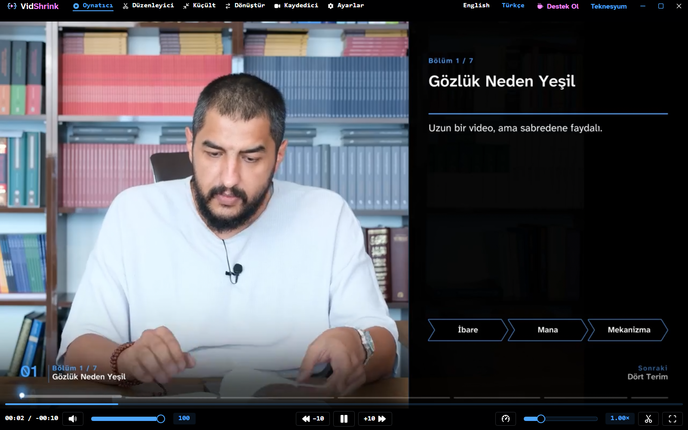
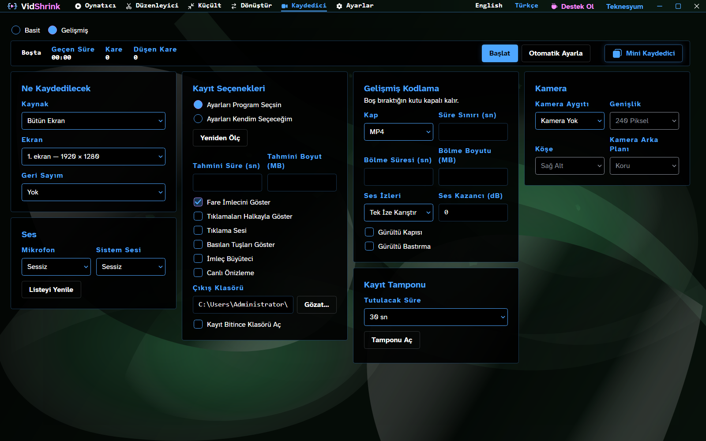
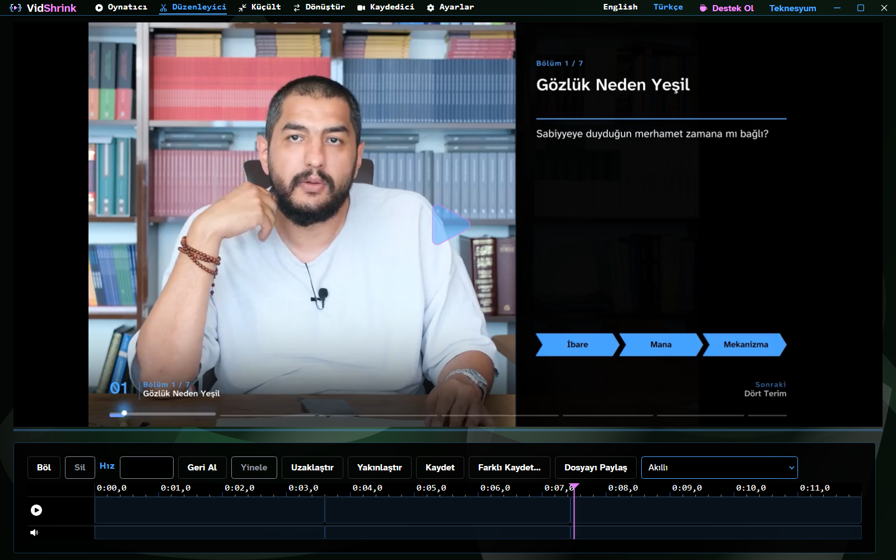
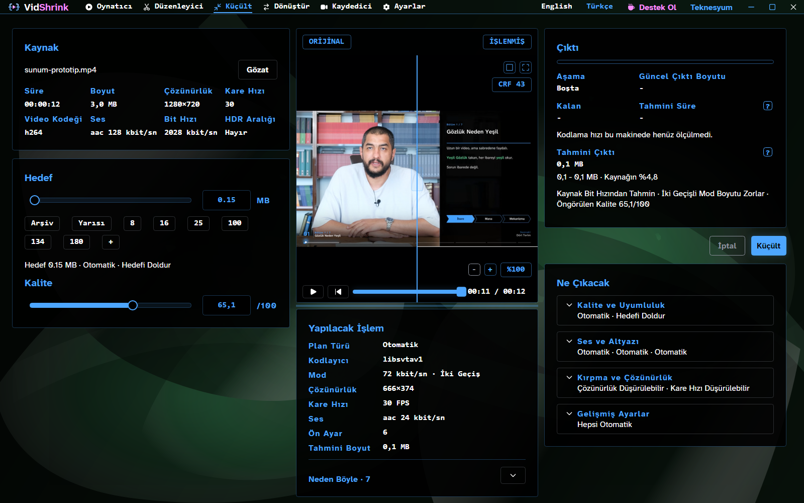
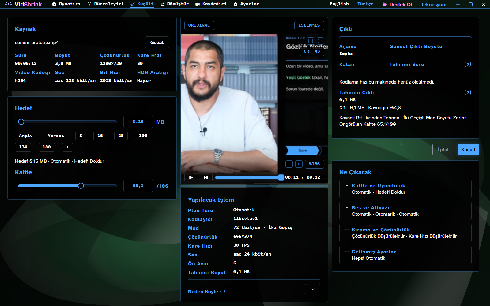
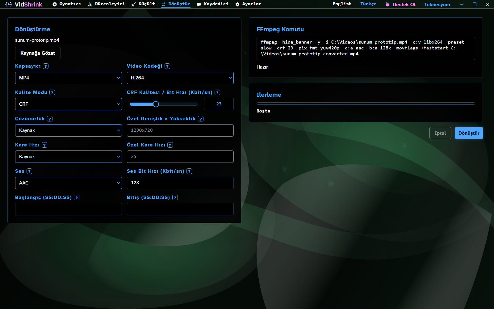
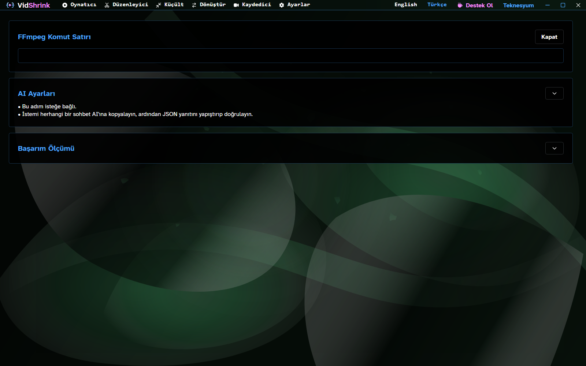
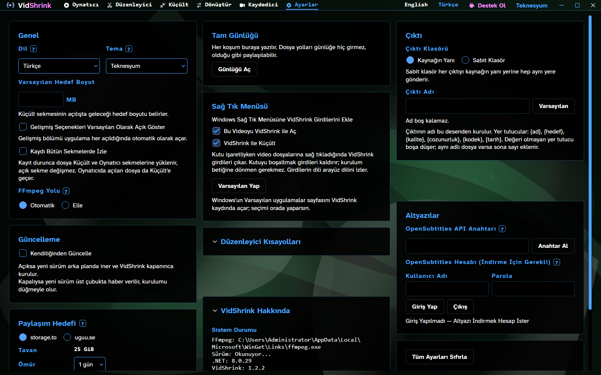
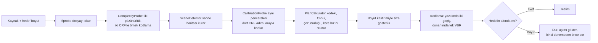
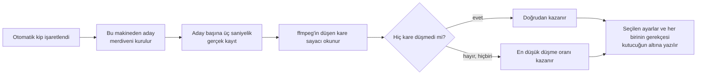

<!-- lang -->

[](README.md)

# VidShrink

**Medya oynatıcı, ekran kaydedici, video düzenleyici, dönüştürücü ve videoyu tam
istediğiniz dosya boyutuna indiren küçültücü — tek ücretsiz uygulama, tek pencere, reklam
yok.**

**Ömür boyu ücretsiz · Reklam yok · Filigran yok · Hesap yok · Abonelik yok · Telemetri yok ·
İnternet kapalıyken de çalışır · 42 dil · 36 tema · Açık kaynak**

[](https://github.com/Teknesyum/VidShrink/releases/latest)
[](LICENSE)
[](#kurulum)

<a href="docs/gorseller/T201-oynatici-tr.png"></a>

## Beş Uygulama Yerine Tek Uygulama

Video işi genelde bir raf dolusu program demek: biri izlemek için, biri ekranı kaydetmek
için, biri kesmek için, biri dönüştürmek için, biri de dosyayı yükleme sınırının altına
sıkıştırmak için. Beş kurulum, beş güncelleme uyarısı, beş ayrı reklam ya da "Pro" teklifi —
ve dosyanız aralarında gidip geliyor.

VidShrink rafın tamamı, tek pencerede. Dosyayı bir kez açın, her araç onu görür: izleyin,
kesin, dönüştürün, sohbet uygulamasının kabul ettiği boyuta küçültün ve bağlantıyı
gönderin — ikinci program yok, ara kopya yok.

| İş | Genelde ayrı bir uygulama, örneğin | VidShrink'te |
|---|---|---|
| Her şeyi altyazıyla izlemek | GOM Player, VLC, PotPlayer | [Oynatıcı](#oynatici) |
| Ekranı, bir pencereyi ya da bir bölgeyi kaydetmek | Bandicam, OBS Studio | [Ekran Kaydedici](#ekran-kaydedici) |
| Kesmek, bölmek, hızlandırmak, tersine çevirmek | Lightworks, Shotcut | [Düzenleyici](#duzenleyici) |
| Biçimi ya da kodeki değiştirmek | HandBrake, Format Factory | [Dönüştür](#donustur) |
| Yükleme sınırına tam oturtmak | çevrimiçi sıkıştırıcılar | [Küçült](#tam-boyuta-kucult) |
| Büyük dosyayı bağlantı olarak göndermek | WeTransfer | [Paylaş](#paylas) |

Her araç ücretsiz ve ücretsiz kalıyor: kayıtlarınıza ve çıktılarınıza filigran yok, deneme
süresi yok, hesap yok, ücretli sürüme saklanmış özellik yok. Siz istemedikçe makinenizden
hiçbir şey çıkmıyor — bkz. [Gizlilik](#kod-imzalama-politikasi).

<sub>Ürün adları sahiplerine aittir; VidShrink'in hiçbiriyle bağı yoktur.</sub>

<a id="oynatici"></a>

## Oynatıcı

mpv'nin içindeki motor olan **libmpv** üzerine kurulu; büyük oynatıcıların açtığını açıyor —
MKV, MP4, WebM, AVI, MOV, TS ve gerisi — istediğinizde donanım çözmeyle. Film oynarken
kontroller kayboluyor, fare gelince geri geliyor.

- **Altyazı** — yan dosyalar kendiliğinden yükleniyor, sürüklenen altyazı dosyası doğrudan
  çalışıyor, zamanlama adım adım kaydırılıyor, yazı zevkinize göre biçimleniyor ve
  **OpenSubtitles araması ve indirmesi** pencerenin içinde.
- **Ses** — ses izini seçin, ses gecikmesini kaydırın, 10 bantlı ekolayzerle şekillendirin.
- **Görüntü** — parlaklık, karşıtlık, doygunluk, gama, renk tonu, keskinlik, kırpma,
  döndürme, aynalama, en-boy oranı ve yakınlaştırma.
- **Denetim** — oynatma hızı, kare kare ilerleme, A-B tekrarı, yer imleri, ekran görüntüsü,
  zaman çizelgesinden doğrudan klip ya da GIF çıkarma.
- **Kitaplık** — karıştırma ve tekrarlı çalma listesi, klasördeki sonraki ve önceki dosya,
  son dosyalar ve geçmiş, URL açma.
- **Pencere** — mini oynatıcı, her zaman üstte, kısayollar paneli ve öncesi-sonrası için
  yan yana karşılaştırma paneli.

<a id="ekran-kaydedici"></a>

## Ekran Kaydedici

<a href="docs/gorseller/T201-kaydedici-tr.png"></a>

- **Ne** — tüm ekran, tek pencere ya da çizdiğiniz bir bölge; her platformun gerçekten sahip
  olduğu yakalama arka ucuyla: Windows'ta gdigrab, macOS'ta avfoundation, Linux'ta x11grab.
- **Ses** — mikrofon ve sistem sesi adıyla seçiliyor, böylece sırası değişen bir aygıt
  listesi mikrofonunuzu sessizce değiştiremiyor; kazanç, gürültü kapısı ve gürültü bastırma.
- **Kamera** — kendi boyutu ve köşesi olan bir kamera katmanı, yeşil perde seçeneğiyle.
- **Anlatım videoları için** — imleç, tıklama halkaları ve tıklama sesi, bastığınız tuşlar
  ekranda, büyüteç ve canlı önizleme.
- **Denetim** — Windows'ta F7-F11 genel kısayolları, geri sayım, süre sınırı, süreye ya da
  boyuta göre bölme, son anları tutan tekrar arabelleği, tepsi ve mini kaydedici kipleri.
- **Kodlayıcılar** — x264, x265, SVT-AV1 ve VP9, artı ekran kartının kendi kodlayıcıları:
  NVIDIA NVENC, Intel Quick Sync, AMD AMF. **Otomatik kip** makinenizde her aday için üç
  gerçek saniye kaydediyor ve kare düşürmeyeni tutuyor — siz bir kutucuk işaretliyorsunuz,
  ödevi o yapıyor.
- **Çıktı** — MP4, MKV, MOV ya da GIF; isterseniz hedef boyut ya da süre bütçesi; durdurunca
  düzgün kapanan bir dosya. Tek tıkla Düzenleyici'ye, Oynatıcı'ya ya da Paylaş'a gidiyor.

<a id="duzenleyici"></a>

## Düzenleyici

<a href="docs/gorseller/T201-duzenleyici-tr.png"></a>

Herhangi bir sekmeden bir videoyu açın ve zaman çizelgesinde kesin: bölün, bir klibi ya da
bir aralığı silin, klipleri taşıyın, her klibin hızını 0,01× ile 100× arasında ayarlayın,
tersine oynatın, geri alın ve yineleyin. Sonra sekmeden çıkmadan **Kaydet**, **Farklı
Kaydet** ya da **Paylaş** — üç dışa aktarma kipinden biriyle:

- **Hızlı** — anahtar karelerden keser, akışları kopyalar; yeniden kodlama yok, kalite kaybı
  yok.
- **Akıllı** — kopyalayabildiğini kopyalar, yalnız kesimlerin gerektirdiğini yeniden kodlar.
- **Tam** — sonucun tamamını yeniden kodlar.

<a id="tam-boyuta-kucult"></a>

## Tam Boyuta Küçült

<table>
<tr>
<td><a href="docs/gorseller/T201-kucult-onizleme-tr.png"></a></td>
<td><a href="docs/gorseller/T201-kucult-yakin-tr.png"></a></td>
</tr>
</table>

Videoyu sürükleyin, bir boyuta dokunun, başlat deyin. İşin tamamı bu; otomatik kip kodeki,
kalite düzeyini, çözünürlüğü ve kare hızını **sizin** dosyanız için seçiyor ve beklenen
boyutu daha hiçbir şey koşmadan söylüyor. Ölçülen 36 durumda hedef **sıfır** kez aşıldı —
istediğiniz sayıdan büyük bir dosya almıyorsunuz.

İnsanların gerçekten ihtiyaç duyduğu boyutlar için yongalar — katı e-posta geçitlerine 8 MB,
WhatsApp'a 16, Gmail'e 25, WhatsApp Web'e 180 — gerisi için kaydırıcı. On iki kodlayıcı,
yazılım ile NVENC, Quick Sync ve AMF; her biri önce
[kendi makinenizde yoklanıyor](docs/olcumler/kodek-matris.md). Sonuç **VMAF-NEG** ile
puanlanıyor — ortalama, harmonik ortalama, 10. yüzdelik ve en kötü kare — ve bir klasörün
tamamı toplu kuyruktan geçebiliyor; kuyruk bitince klasörü açıyor, bilgisayarı uyutuyor ya
da kapatıyor.

<a id="donustur"></a>

## Dönüştür

<table>
<tr>
<td><a href="docs/gorseller/T201-donustur-tr.png"></a></td>
<td><a href="docs/gorseller/T201-gelismis-tr.png"></a></td>
</tr>
</table>

MP4, MKV, WebM, MOV, AVI, GIF, hareketli WebP ve hareketli AVIF; yalnız ses için MP3, M4A,
WAV ve FLAC. H.264, H.265, VP9, AV1
ya da doğrudan akış kopyası, kırpma ve ses çıkarma. **On sekiz hazır hedef** — WhatsApp,
Discord, Telegram, Gmail, Outlook, Chromecast, Nest Hub, Apple TV ve fazlası — her alanı
sizin yerinize dolduruyor.

<a id="paylas"></a>

## Paylaş

Küçült'te, Kaydedici'de ya da Düzenleyici'de **Paylaş**'a basın, dosya bağlantı olarak
yüklensin: 25 GB'a kadar dosyalar için bir ile yedi gün tutan **storage.to**, ya da 128 MB'a
kadar dosyalar için üç saat tutan **uguu.se**. Bağlantı telefonunuz için bir QR koduyla
geliyor, yarıda kopan yükleme yeniden denenebiliyor. Paylaşım hedefleri ve ölçülmüş boyut
tavanları [`paylasim-hedefleri.json`](paylasim-hedefleri.json) içinde.

## Herkes İçin

<a href="docs/gorseller/T201-ayarlar-tr.png"></a>

**Pencerenin tamamı 42 dil konuşuyor** — her düğme, her uyarı, her ipucu; Arapçadan
Vietnamcaya — ve yanında **36 renk teması** geliyor: Catppuccin, Dracula, Gruvbox, Nord, Rose
Pine, Solarized, Tokyo Night ve yirmi dokuz tane daha, açık ve koyu. İkisini de Ayarlar'dan
seçiyorsunuz, hiçbir şey yeniden başlamıyor. Diliniz yok mu, ya da çeviri sizin dilinizde
kötü mü duruyor? [Issue açın](https://github.com/Teknesyum/VidShrink/issues/new), bir sonraki
sürüme giriyor.

**Sisteminizde neyi değiştirdiği, ve fazlası değil.** Windows'ta kurucu Başlat menüsüne ve
masaüstüne kısayol, Explorer sağ tık menüsüne "Bu videoyu VidShrink ile aç" girdisi (Windows
11'de birincil menüde) ve video dosyalarının **Birlikte aç** listesine VidShrink ekliyor —
[kullanıcı başına yazılıyor](docs/olcumler/kabuk-menusu.md), yönetici hakkı istemiyor ve
varsayılan oynatıcınız varsayılan kalıyor. Uygulama yeni sürüm için GitHub'a bakıp
güncellemeyi öneriyor; bu denetim Windows'ta varsayılan açık, Ayarlar'dan kapatılıyor.
Yukarıdakilerin hepsi tek komutla geri alınıyor — bkz. [Kurulum](#kurulum).

Her sekmenin tam turu: [`docs/kullanim.tr.md`](docs/kullanim.tr.md).

## Komut satırı

Aynı paket, pencerenin yanında başsız bir komut satırı aracı da taşıyor: Windows ve
Linux'ta `vidshrink`, macOS'ta `vidshrink-cli`. Pencerenin çağırdığı karar motorunu
çağırıyor, yani aynı girdi aynı ffmpeg argümanlarını veriyor; bir test ikisini
karşılaştırıyor.

```bash
vidshrink kucult clip.mp4 --hedef 25MB              # boyuta küçült
vidshrink kucult clip.mp4 --kalite 80 --kodek av1   # kalite puanına küçült
vidshrink plan clip.mp4 --hedef 8MB --json          # yalnız plan ve argümanlar, kodlama yok
```

<details>
<summary>Bütün anahtarlar, İngilizce takma adlar ve çıkış kodları</summary>

Anahtarlar: `--kodek auto|h264|hevc|av1`, `--cikti <yol>`, `--json`, `--olcumsuz` (yoklama
kodlamalarını atlar), `--vmaf` (ffmpeg'de libvmaf varsa sonucu ölçer), `--hizli`. İlerleme
stderr'e, boyut, süre, deneme sayısı ve VMAF stdout'a gidiyor. Yardım metni sistem dilini
izliyor, Türkçe ya da İngilizce. `--dil en` (`--lang en`) tek koşumluk olarak bunu eziyor;
bilinen kodlar `en` ve `tr`, tanınmayan kod sessizce İngilizce'ye düşmek yerine kullanım hatası
veriyor.

`--crf N` ve `--on-ayar AD`, pencerede Gelişmiş panelinin kilitlediğini kilitliyor: kalite
değeri (0-63) ve kodlayıcı ön ayarı. Ön ayar adı planın seçtiği kodeğe ait olmalı —
x264/x265 için `slow`, NVENC için `p5`, SVT-AV1 için `8` — ait olmayan ad hata vermiyor,
plan gerekçesine bir satır düşülerek düşüyor.

`--modul N` (`--modulus N`) ölçeklenen kenarları 2, 4, 8 ya da 16'nın katına aşağı
yuvarlıyor. Varsayılan 2, çünkü kodlayıcı tek sayılı kenar kabul etmiyor; büyük çarpan eski
donanım kodlayıcılarının istediği şey ve kenardan biraz daha kırpıyor. Başka bir sayı
kullanım hatası.

Anamorfik kaynak — depolanan pikselleri kare olmayan bir DVD — ölçeklenmeden önce
düzleştiriliyor: yükseklik korunuyor, genişlik karenin ekranda göründüğü genişliğe
çevriliyor ve çıktı kare pikselli oluyor. Kare pikselli kaynakta hiçbir şey değişmiyor.

`--kes <baslangic>-<bitis>` kodlamadan önce kesiyor, böylece hedef boyut elde kalan parçaya
harcanıyor: `--kes 10-40`, `--kes 0:10-0:40`, `--kes 1:02:03-1:02:04`, sona kadar `--kes 90-`.

Uçlardan biri saat yerine kare numarası olabilir: `--kes 300f-900f` 300. kareden 900. kareye,
çevirim kaynağın kare hızıyla. `--bolum 2` ve `--bolum 2-4` aynı pencereyi kaynağın bölüm
işaretlerinden kurar; iki seçenek birlikte verilemez.

Aşağıdaki uzun anahtarların her birinin bir de İngilizce takma adı var; iki yazım aynı
anahtar, betik hangisini isterse onu kullanabiliyor. Tek istisna `--crf` ve `--json` ve `--vmaf`:
bunların tek yazımı var.

| Türkçe | İngilizce |
|---|---|
| `--yardim` | `--help` |
| `--surum` | `--version` |
| `--hedef` | `--target` |
| `--kalite` | `--quality` |
| `--kodek` | `--codec` |
| `--on-ayar` | `--preset` |
| `--modul` | `--modulus` |
| `--bolum` | `--chapters` |
| `--cikti` | `--output` |
| `--kes` | `--cut` |
| `--aralik` | `--interval` |
| `--bir-kez` | `--once` |
| `--gunluk` | `--log` |
| `--tarama` | `--scan` |
| `--baslik` | `--title` |
| `--ana-icerik` | `--main-feature` |
| `--asgari-sure` | `--min-duration` |
| `--azami-sure` | `--max-duration` |
| `--suzgec` | `--filters` |
| `--kirp` | `--crop` |
| `--profil` | `--profile` |
| `--profil-dosyasi` | `--preset-file` |
| `--ses-kodek` | `--audio-codec` |
| `--ses-normal` | `--loudnorm` |
| `--ses-kazanc` | `--gain` |
| `--altyazi` | `--subtitle` |
| `--yan-altyazi` | `--sidecar-subtitles` |
| `--yak` | `--burn` |
| `--yak-srt` | `--srt-burn` |
| `--yak-ass` | `--ssa-burn` |
| `--meta-yok` | `--no-metadata` |
| `--altyazi-dil` | `--subtitle-lang` |
| `--ilk-altyazi` | `--first-subtitle` |
| `--sabit-kare` | `--cfr` |
| `--tavan-kare` | `--pfr` |
| `--kare-hizi` | `--fps` |
| `--ses-hizi` | `--arate` |
| `--ses-drc` | `--drc` |
| `--profiller` | `--presets` |
| `--olcumsuz` | `--no-measure` |
| `--hizli` | `--fast` |
| `--dil` | `--lang` |

Çıkış kodları: bantta `0`, bandın altında `2` (kalite doyduğu için daha küçük dosya
saklandı), boy tavanı aşıldığında `3` (en küçük sonuç yine yazılıyor; JSON `output` ve
`overTarget: true` taşıyor), hatada `1`, yanlış kullanımda `64`, iptalde `130`.

</details>

### İzlenen klasör

```bash
vidshrink izle ~/Gelen --cikti ~/Giden --hedef 25MB             # Ctrl+C'ye kadar koşar
vidshrink izle ~/Gelen --cikti ~/Giden --hedef 25MB --bir-kez   # klasörü boşaltır, çıkar
```

`izle`, klasöre düşen her videoyu küçültüyor. `--cikti` çıktı klasörüdür ve zorunludur;
izlenen klasörün kendisi olamaz.

<details>
<summary>Dosya ne zaman alınır, ilerleme nerede tutulur, harf büyüklüğü ve çıkış kodları</summary>

`--aralik <saniye>` tarama aralığını belirliyor (varsayılan 2), `--bir-kez` beklenecek bir
şey kalmayınca çıkıyor, `kucult`'un öbür anahtarları her dosyaya uygulanıyor. `--json` ile
stdout NDJSON oluyor: dosya başına tek satır JSON nesnesi.

Bir dosya, boyu ve değişiklik saati üst üste iki tarama aralığı boyunca aynı kaldığında ve
onu tutan bir yazıcı olmadığında alınıyor — üçüncü tarama alıyor. Kodlanırken kaynak
değişirse çıktı siliniyor ve dosya durulunca yeniden ele alınıyor.

İlerleme, izlenen klasörün içindeki `.vidshrink-izle.json` dosyasında ada ve boya göre
tutuluyor; adı ya da boyu değişen dosya yeni sayılıyor. O klasör salt okunursa durum çıktı
klasörüne `.vidshrink-izle-<ozet>.json` olarak, o da tutmazsa ayar klasörüne
`izle-<ozet>.json` olarak yazılıyor.

`<ozet>`, izlenen klasörün yolunun SHA-256'sının ilk 16 onaltılık karakteri, küçük harfle.
Yol özete aşağıdaki iki kıyasla aynı kurala göre giriyor: koşan sistem harfi yok sayıyorsa
(Windows ve macOS) önce büyük harfe çevriliyor, Linux'ta olduğu gibi alınıyor. Yani `/gelen`
ile `/Gelen` Windows ve macOS'ta tek bir durum dosyasını paylaşıyor, Linux'ta iki ayrı dosya
alıyor; aynı klasör her koşumda aynı adı veriyor.

Başarısız olan dosya, bir sonraki açılışta bir kez yeniden denenir. Her şeyi yeniden
işlemek için durum dosyasını silin.

Koşan sistemin kuralına uyan tam iki kıyas var: izlenen klasörün çıktı klasörüyle
kıyası, ve bir adayın bu koşumun yazdığı çıktı adlarıyla kıyası. Bu ikisi Linux'ta
`Ordinal`, Windows ile macOS'ta `OrdinalIgnoreCase`.

Kuralın macOS yarısı varsayılan APFS bölümünü varsayıyor; o bölüm harf duyarsız ama harf
koruyordur. APFS harf DUYARLI da biçimlendirilebilir ve böyle bir bölümde — ya da harf
duyarlı bir dış bölümde — bu varsayım tutmuyor.

Dosya adının geri kalan her kullanımı **her platformda, Linux dahil** harfi yok sayıyor:
bekleyen, yeniden denenecek ve atlanan tabloları, tarama sırası ve işlenenlerin kaydı. Yani
`Klip.mp4` ile `klip.mp4` aynı izlenen klasörde, dosya sistemi ikisini iki ayrı dosya
olarak tutsa bile çakışıyor.

Çakışma taramanın içinde çözülüyor. Çakışan adlardan sıralı (ordinal) küçük olan kazanıyor
ve olağan akışta küçülüyor; öbürleri atlanıyor ve her biri için bir uyarı satırı yazılıyor:
`Atlandı: klip.mp4 — Klip.mp4 ile ad çakışıyor (harf farkı). Birini yeniden adlandırın.`
Satır dosya başına bir kez yazılıyor, sonraki taramalarda tekrarlanmıyor. Kazanan her
taramada aynı, yani koşum belirlenimli. Atlanan dosyayı yeniden adlandırınca izleyici onu
yeni dosya olarak görüp küçültüyor.

Çıkış kodları: bittiğinde `0`, `--bir-kez` bitip en az bir dosya başarısız olduğunda ya da
ad çakışması yüzünden atlandığında `4`, hatada `1`, yanlış kullanımda `64`, Ctrl+C ile
durdurulduğunda `130`. `--bir-kez` sonunda kaç dosyanın atlandığı bir özet satırında yazıyor.

</details>

## Sayılar

Ölçülen 36 vakada hedef boyut bir kez bile aşılmadı — **0/36 aşım** — ve geride kaldığımız iki
yer de yanında yayımlı.

<details>
<summary>Tablo, kapılar ve geride kaldığımız yerler</summary>

Burada arama tablosu yok. *Ölç* diyen her adım, karar verilmeden önce ffmpeg'i gerçek
dosyanıza karşı koşturuyor — iki çözünürlük ve iki CRF'te kısa örnek kodlamalar, bir sahne
haritası, sonra aynı pencereleri dört CRF adımı arayla yeniden kodlayıp iki sonuçtan bit
maliyeti eğrisini okuyan bir kalibrasyon geçişi.

Bunun getirisi bugünkü motorla **36 vakada** yeniden ölçüldü — üç 1080p30 klip (yüksek
detay, yüksek hareket, ağır gürültü) × üç hedef × yazılım ve donanım kolu × **ikişer
tekrar** — AMD Ryzen 7 9700X, RTX 5070 Ti, ffmpeg 9.0-full
([`docs/olcumler/bench-2026-09-13.md`](docs/olcumler/bench-2026-09-13.md)):

| Hedef | Klip | Kodlayıcı | Çıkan (1. / 2. koşum) | Bütçe doluluğu | Deneme |
|---|---|---|---|---|---|
| 100 MB | yüksek detay | libx264 | 97,30 / 97,37 MB | %97,3 | 1 |
| 100 MB | ağır gürültü | h264_nvenc | 98,63 / 98,63 MB | %98,6 | 3 |
| 50 MB | yüksek hareket | h264_nvenc | 49,88 / 49,88 MB | %99,8 | 1 |
| 25 MB | yüksek hareket | libx264 | 24,24 / 24,26 MB | %97,0 | 1 |
| 25 MB | ağır gürültü | libsvtav1 | 24,28 / 24,28 MB | %97,1 | 1 |
| 8 MB | ağır gürültü | libsvtav1 | 7,67 / 7,67 MB | %95,9 | 1 |
| 8 MB | yüksek hareket | h264_nvenc | 7,71 / 7,71 MB | %96,3 | 1 |

36 vakanın kapıları: **hedef bir kez bile aşılmadı — 0/36.** Kalibrasyon 36/36 tuttu.
36/36 iki geçişli seçildi, tek geçişli CRF hiç kazanmadı. Donanım kolu tekrarlar arasında
bit düzeyinde aynı — 18/18 vakada 0,000 MB sapma — `libx264` en fazla 0,074 MB kaydı.
Fazladan bit izleyicinin görebileceği bir şey satın almaz olunca koşu erken duruyor: kolay
bir klipte 25 MB isteyin, kaynaktan ayırt edilemeyen 9 MB alabilirsiniz.

Geride kaldığımız iki yeri de yayımlıyoruz.

**AV1 dalı hedefin altına düşüyor.** 36 vakanın 31'i bant içinde kaldı; **beş kaçağın
beşi de, tek sert taban ihlali de (6,80 MB tabana karşı 6,68 MB) `libsvtav1`** — `libx264`
6/6, `h264_nvenc` 18/18 bant içi. Tekrarlar arası sapma da orada toplanıyor (2,484 MB'a ve
73,5 saniyeye kadar), çünkü aynı girdiye farklı koşumda farklı sayıda düzeltme turu
koşuluyor. İki tekrar bunu görünür kıldı; tek koşum olsaydı sabit bir sayı sanılacaktı.

**HandBrake: eş boyutta öndeyiz, karanlık bantlaşmada gerideyiz.** HandBrakeCLI 1.11.2'nin
x265 `slow` ön ayarına karşı, teslim edilen bayt eşitken 8 SDR satırının 8'inde
([`handbrake-kiyas-b1-sdr.md`](docs/olcumler/handbrake-kiyas-b1-sdr.md)) ve 4 HDR10 satırının
3'ünde ([`handbrake-kiyas-b4-hdr.md`](docs/olcumler/handbrake-kiyas-b4-hdr.md)) öndeyiz.
Karanlık sahneler hâlâ daha çok bantlaşıyor: karanlık kesitte AV1 çıktımız CAMBI 9,31 ve
9,39, HandBrake 6,48 ve 6,49 alıyor; düşük olan iyi
([`handbrake-kiyas-b7-aciklar.md`](docs/olcumler/handbrake-kiyas-b7-aciklar.md)). Bu açık
duruyor ve yol haritasının ilk maddesi.

</details>

## Nasıl ölçüyoruz

Düzenek, yargıladığı özellikten uzun sürdü; çünkü iki kodlamayı ayırt edemeyen bir düzenek
sonsuza kadar sayı basar ve yanlışlığını kendi söylemez.

<details>
<summary>Bir sayıya güvenilebilmesi için düzeneğin yaptığı altı şey ve düzeneğin yeri</summary>

- **Cevap vermeyi reddeden bir renk kapısı.** Her çıktının renk uzayı, transferi,
  primaries'i ve piksel biçimi ffprobe ile okunup referansla karşılaştırılıyor. Etiketsiz
  çıktı, PQ'ya karşı HLG, SDR referansa karşı HDR sonuç: araç makul bir sayı yerine *hiç
  sayı basmıyor*. Kapısız bir önceki tablo tam da bu yüzden çöpe gitti — hedef boyut on kat
  değişirken neredeyse sabit bir XPSNR döndürüyordu.
- **Üç ölçüt, ve dört sayı olarak VMAF.** **VMAF-NEG**, **XPSNR** ve **SSIM**; VMAF
  ortalama, harmonik ortalama, 10. yüzdelik ve kare minimumu olarak. Ortalama, gerçekten
  kötü görünen kareleri saklar; izleyicinin fark ettiği kareler de onlardır.
- **Kare kilidi**, böylece iki taraf aynı kareler üzerinden puanlanıyor. Kilit üretime
  girmeden önce ölçülen sayılar kendi belgelerinde şüpheli damgalı ve buraya alınmadı.
- **Doğrulanmış kesimler.** 17 dakikalık kaynak, gerçek anahtar karelerde kesilmiş üç adet
  60 saniyelik parçayla ölçülüyor; her parçanın başlangıcı kaynağa karşı kare karmasıyla
  doğrulandı — üçü de `-c copy` kesiminin gerektirdiği gibi istenen saniyeden 0,4 sn önceye
  oturdu.
- **Bilinen bir kusur, yayımlanmış hâliyle.** Düzenek iki akışı kare indeksine kilitliyor;
  plan kare hızını düşürdüğünde farklı anları karşılaştırıp kaybı şişiriyor — aynı dosyada
  yalnız `fps=30` yeniden örneklemesi XPSNR'ı **1,70 dB'den 21,14 dB'ye** taşıdı. Kare hızı
  düşmeyen satırlar etkilenmiyor (34,5557'ye karşı 34,56). Kırık yola dayanan hükümler kendi
  belgelerinde *temelsiz* diye işaretlendi, sessizce tekrarlanmadı.
- **Duyarlılık kanıtı.** Düzenek, 60 MB'lık bir kodlamayı 600 MB'lıktan en az 1,00 VMAF-NEG
  puanıyla ayırmak zorunda; ayıramazsa kendini duyarsız işaretliyor. Ölçülen: HandBrake için
  **+39,26**, VidShrink için **+39,85** — eşiğin kırk katı.

Düzeneğin tamamı: [`docs/olcumler/ab-duzenegi.md`](docs/olcumler/ab-duzenegi.md).
Kaydedicinin otomatik kipi de aynı yolla ölçülüyor — makineden kurulan bir aday merdiveni,
sonra [aday başına üç saniyelik gerçek kayıt](src/VidShrink.Ffmpeg/RecorderAutoProbe.cs) ve
düşen kare sayımı; bugünkü motorla yeniden ölçümü
[`docs/olcumler/auto-mod-yeni-taban.md`](docs/olcumler/auto-mod-yeni-taban.md) içinde. Yüzü
aşkın böyle belge [`docs/olcumler/`](docs/olcumler/) altında; buradaki her sayı birinden
geliyor.

</details>

## Kaputun altında

<details>
<summary>Dosyayı bıraktığınızla çıktıyı aldığınız an arasında ne koşuyor</summary>


```mermaid
flowchart LR
    A["Kaynak + hedef boyut"] --> B["ffprobe dosyayı okur"]
    B --> C["ComplexityProbe: iki çözünürlük,<br/>iki CRF'te örnek kodlama"]
    C --> D["SceneDetector sahne haritası kurar"]
    D --> E["CalibrationProbe aynı pencereleri<br/>dört CRF adımı arayla kodlar"]
    E --> F["PlanCalculator kodeki, CRF'i,<br/>çözünürlüğü, kare hızını oturtur"]
    F --> G["Boyut kestirimiyle size gösterilir"]
    G --> H["Kodlama: yazılımda iki geçiş,<br/>donanımda tek VBR"]
    H --> I{"Hedefin altında mı?"}
    I -->|evet| J["Teslim"]
    I -->|hayır| K["Dur, aşımı göster,<br/>ikinci denemeden önce sor"]
```


```mermaid
flowchart LR
    A["Otomatik kip işaretlendi"] --> B["Bu makineden aday<br/>merdiveni kurulur"]
    B --> C["Aday başına üç saniyelik<br/>gerçek kayıt"]
    C --> D["ffmpeg'in düşen kare sayacı okunur"]
    D --> E{"Hiç kare düşmedi mi?"}
    E -->|evet| F["Doğrudan kazanır"]
    E -->|"hayır, hiçbiri"| G["En düşük düşme oranı kazanır"]
    F --> H["Seçilen ayarlar ve her birinin gerekçesi<br/>kutucuğun altına yazılır"]
    G --> H
```

</details>

Uzun hâli — kalibrasyon, durma ölçütü, dört sıkıştırma rejimi, HDR, algısal puanlama,
bugünkü sınırlar: [`docs/motor.tr.md`](docs/motor.tr.md).

## Belgeler

[Kullanım](docs/kullanim.tr.md) · [Motor](docs/motor.tr.md) ·
[Kurulum ve güncelleme](docs/kurulum.tr.md) · [Ölçümler](docs/olcumler/) ·
[Yol haritası](docs/YOL-HARITASI.md) · [Sürüm notları](CHANGELOG.md) · [Katkı](CONTRIBUTING.md)

## Yol haritası

Ölçülmüş, açık, bu sırayla — ayrıntı [`docs/YOL-HARITASI.md`](docs/YOL-HARITASI.md) içinde.

- **HandBrake'le kalan son açığı kapatmak: karanlık sahnede bantlaşma.** Eş boyutta SDR'de
  ve HDR10'da HandBrake'in zaten önündeyiz; karanlık içerikte AV1 çıktımız hâlâ daha çok
  bantlaşıyor (CAMBI 9,31 ve 9,39'a karşı 6,48 ve 6,49). Ölçüt aynı düzenek, aynı kaynak,
  açık sıfırda — iddia değil, ölçüm.
- **AV1 dalının hedef altına düşmesi** — beş bant kaçağının beşi `libsvtav1`, düzeltme
  turları kapatamıyor.
- **Ölçüm düzeneğinin zamanda hizalanması**, ki kare hızı düşüren planlar ölçülebilsin.
- **Tepe hızı tavanını açmak**, ki bu küçük hedeflerdeki donanım aşımını da düzeltiyor.
- **Ölçek ve kare hızı cezalarını ölçülmüş kaliteye göre kalibre etmek**; planlayıcının
  bugün kullandığı sabitlerin yerine.
- **Klip yerine sahne başına kodlama** — ölçüldü, ürüne girmedi: bütçeyi sahneye bölmek
  kalite kapısını geçmedi ve varsayılan AV1 kodlayıcısı sahne başına bölgeleri okumuyor
  ([`sahne-butcesi.md`](docs/olcumler/sahne-butcesi.md)).

## Katkı

Önce bir konu açın, değişikliği tek derde tutun, `dotnet test VidShrink.sln` koşun —
kırmızı hiçbir şey birleşmez — ve her commit'i [Developer Certificate of Origin](DCO)
uyarınca `git commit -s` ile imzalayın. Derleme talimatı, proje yerleşimi ve tasarım
kuralları: [`CONTRIBUTING.md`](CONTRIBUTING.md).

## Lisans

[AGPL-3.0-or-later](LICENSE). Telif hakkı (C) 2026 Teknesyum.

FFmpeg ve libmpv kendi lisansları altında ayrı programlardır; VidShrink ikisini de yeniden
dağıtmaz ve içine GPL kodu bağlamaz ([`docs/kurulum.tr.md`](docs/kurulum.tr.md)).

Kaynak ağacının içinde dağıtılan üçüncü taraf malzeme — simge takımının kesildiği Fluent UI
System Icons (MIT) — [`THIRD-PARTY-NOTICES.md`](THIRD-PARTY-NOTICES.md) dosyasında.

<a id="kod-imzalama-politikasi"></a>

## Kod İmzalama Politikası

Ücretsiz kod imzalama [SignPath.io](https://about.signpath.io) tarafından, sertifika
[SignPath Foundation](https://signpath.org) tarafından sağlanır. Başvuru değerlendirmede;
onaylanana kadar Windows sürümleri imzasız çıkar.

**Gizlilik.** Bu program, kullanıcı ya da onu kuran veya çalıştıran kişi özellikle
istemedikçe başka ağ sistemlerine bilgi aktarmaz.

<details>
<summary>İmzayı kim onaylar, uygulamanın yapabildiği her istek</summary>

- Kod yazan, gözden geçiren ve onaylayan: [Teknesyum](https://github.com/Teknesyum)

Yalnız bu depodan GitHub Actions'ın derlediği dosyalar imzalanır; her imza isteği elle
onaylanır. Ekipteki herkes çok aşamalı doğrulamayla oturum açar.

Yapabildiği istekler, her birini neyin başlattığı ve o anda kimin gizlilik politikasının
geçerli olduğu:

- **Güncelleme denetimi** — GitHub'a son sürümü sorar. Windows'ta varsayılan açık;
  Ayarlar'dan kapatılır. [GitHub Gizlilik Bildirimi](https://docs.github.com/en/site-policy/privacy-policies/github-general-privacy-statement)
- **Kurucu** — FFmpeg ve libmpv'yi GitHub sürümlerinden, SHA-256'ya sabitlenmiş olarak indirir.
  [GitHub Gizlilik Bildirimi](https://docs.github.com/en/site-policy/privacy-policies/github-general-privacy-statement)
- **Paylaş** — dosyayı yalnız Paylaş'a bastığınızda, seçtiğiniz sunucuya yükler.
  [storage.to gizlilik](https://storage.to/privacy) · [uguu.se SSS](https://uguu.se/faq)
- **OpenSubtitles** — yalnız siz kullandığınızda oturum açar ve arar.
  [OpenSubtitles gizlilik politikası](https://www.opensubtitles.com/en/privacy/)

</details>

## Kurulum

Windows 10 ya da 11'de üç yol, bu sırayla. Hiçbiri yönetici hakkı istemez.

1. **Teknesyum Base — önerilen yol.**
   [`Teknesyum-Base.exe`](https://github.com/Teknesyum/Teknesyum-Base/releases/latest/download/Teknesyum-Base.exe)
   dosyasını ([`.sha256`](https://github.com/Teknesyum/Teknesyum-Base/releases/latest/download/Teknesyum-Base.exe.sha256))
   indirip çalıştırın, listeden **VidShrink**'i bulup kurun. Base sonradan güncellemeyi ve
   kaldırmayı da yapar. Base henüz imzalı değil; Windows SmartScreen ilk açılışta uyarabilir:
   *Ek bilgi*'yi, sonra *Yine de çalıştır*'ı seçin. Ayrıntı: [Teknesyum Base](https://github.com/Teknesyum/Teknesyum-Base).
2. **VidShrink-Setup.exe.**
   [`VidShrink-Setup.exe`](https://github.com/Teknesyum/VidShrink/releases/latest/download/VidShrink-Setup.exe)
   dosyasını indirip çalıştırın. Kendi başına çalışan küçük bir program: PowerShell de WinGet
   de gerekmez.
3. **Tek satır kod.** PowerShell'e ya da Komut İstemi'ne yapıştırın. Son
   `VidShrink-Setup.exe`'yi geçici klasöre indirip çalıştırır — 2. yoldaki kurucunun aynısı.

   ```powershell
   powershell -NoProfile -Command "[Net.ServicePointManager]::SecurityProtocol=3072; Set-Variable ProgressPreference SilentlyContinue; Set-Location ([IO.Path]::GetTempPath()); irm https://github.com/Teknesyum/VidShrink/releases/latest/download/VidShrink-Setup.exe -OutFile VidShrink-Setup.exe; .\VidShrink-Setup.exe"
   ```

Sürümler imzalanana kadar Akıllı Uygulama Denetimi açık olan bir bilgisayar VidShrink'i
hangi yolla kurulursa kurulsun engeller.

**Kaldırma.** `VidShrink-Setup.exe --uninstall` kısayolları, sağ tık girdilerini, Birlikte aç
kaydını ve kurulum klasörünü siliyor.

### macOS ve Linux

```bash
curl -fsSL https://raw.githubusercontent.com/Teknesyum/VidShrink/main/install-vidshrink.sh | sh
```

Kaldırmak için aynı kurucuyu `--uninstall` ile çalıştırın:

```bash
curl -fsSL https://raw.githubusercontent.com/Teknesyum/VidShrink/main/install-vidshrink.sh | sh -s -- --uninstall
```

<details>
<summary>Gerekenler, kurucunun indirdikleri ve PowerShell betiği</summary>

Yönetici hakkı yok, .NET SDK yok. Her sürüm tek bir sürüm numarasından dört hedef üretiyor:
`win-x64`, `osx-arm64`, `osx-x64`, `linux-x64`. Gerekenler: Windows 10 ya da 11, macOS 14 ve
üstü, ya da X11/Wayland koşan bir Linux masaüstü, artı `ffmpeg` ve `ffprobe`. FFmpeg ve
libmpv sürümle birlikte gelmiyor; kurucu bunları Windows'ta pinlenmiş SHA-256 özetlerine
karşı indiriyor, diğerlerinde paket yöneticinizin komutunu yazıyor. Windows sürümleri,
sertifika verildiğinde [Kod İmzalama Politikası](#kod-imzalama-politikasi) altında
imzalanıyor.

Windows'ta `Install-VidShrink.ps1` betiği aynı kurulumu yapar; WinGet yoksa
FFmpeg'i pinlenmiş arşivden indirir:

```powershell
powershell -NoProfile -Command "[Net.ServicePointManager]::SecurityProtocol=3072; iex (irm https://raw.githubusercontent.com/Teknesyum/VidShrink/main/Install-VidShrink.ps1)"
```

Sağlama doğrulaması, sağ tık girdisi, kendi kendini güncelleme akışı ve bütün anahtarlar
[`docs/kurulum.tr.md`](docs/kurulum.tr.md) içinde.

</details>

<!-- signature -->
<div align="center">

<a href="https://github.com/sponsors/Teknesyum"></a>
&nbsp;
<a href="LICENSE"></a>

</div>
