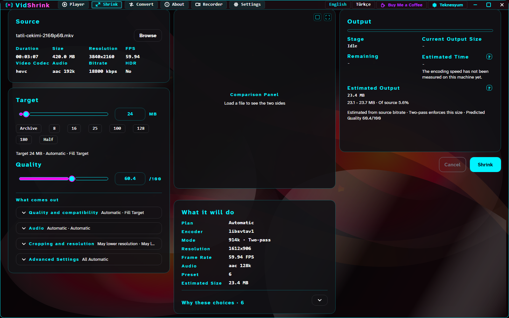
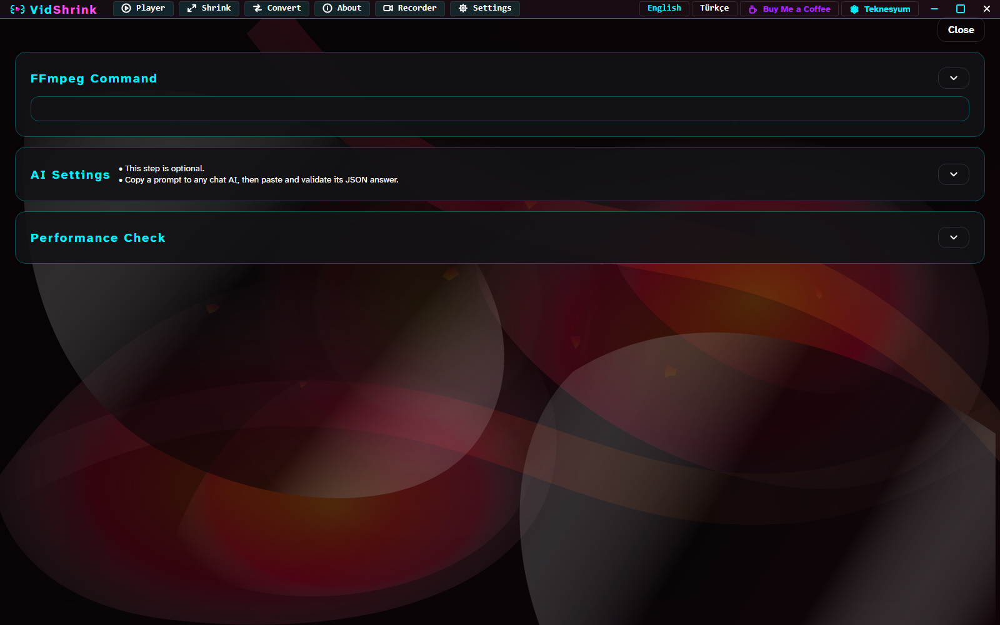
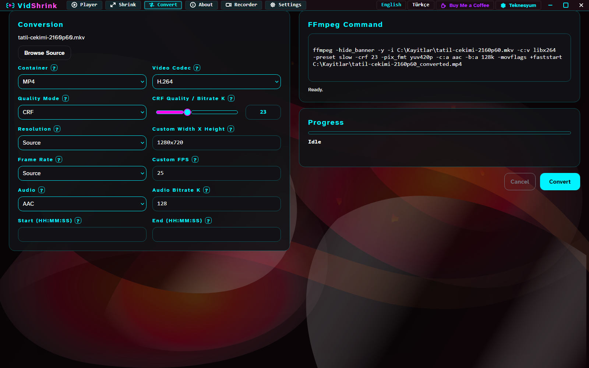
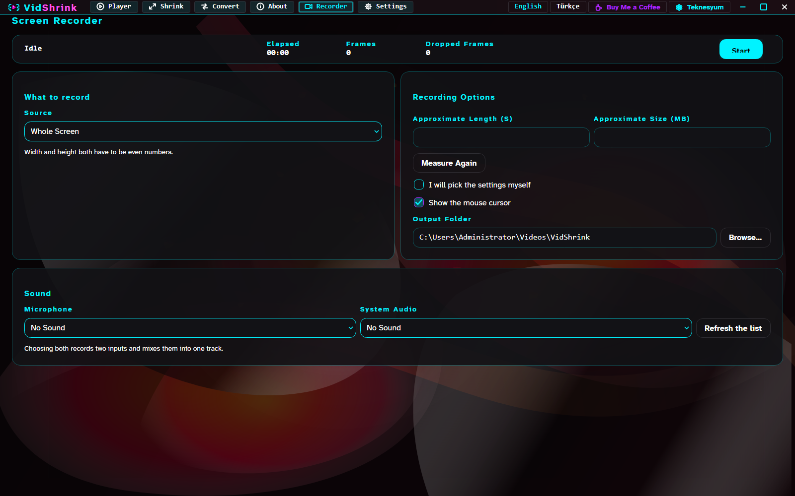

# Using VidShrink

A tour of the tabs. The short version is in the [README](../README.md).

## What it looks like in use

Once a file is loaded, every decision is on screen with the reasoning behind it, before you
start — the codec, the CRF, the resolution, the frame rate, the estimate and its range.



Each target chip is a real limit somewhere, and its `?` badge says which.

| Chip | Why that number |
|---|---|
| **8** | Discord without Nitro, older forums, strict e-mail gateways |
| **16** *(WhatsApp recommended)* | WhatsApp re-encodes in-chat video with its own weak encoder; under 16 MB it usually passes yours through instead |
| **25** | Gmail attachments, Discord Nitro Basic, most ticket systems |
| **100** | Archiving and uploads where quality matters more than transfer time |
| **128** *(sharing maximum)* | The measured ceiling of uguu.se, the narrower of the two anonymous share targets |
| **180** *(WhatsApp Web maximum)* | WhatsApp Web takes 180 MB per file, a user-reported number rather than a published one |
| **Half** | Half the source size; a mild request, so resolution and frame rate usually survive |

Any file `ffprobe` recognizes as containing a video stream is accepted. The filename
extension is never a gate: silent video, variable frame rate, animated GIF, rotation
metadata and uncommon containers all work whenever the installed ffmpeg can decode them.

AI mode is optional and not embedded. VidShrink writes a prompt you paste into any chat AI,
then validates the JSON you paste back against the current source and options. It stays
offline, needs no API key, and falls back to the automatic plan when a response is
malformed or stale.



The Convert tab is the manual side: container, video codec, CRF or bitrate, resolution,
frame rate, audio codec and bitrate, and a start and end time. Stream copy uses real
`-c:v copy` and `-c:a copy`, and incompatible container and source-codec pairs are blocked
before execution. GIF conversion goes through `palettegen` then `paletteuse`.



The Player tab plays the source in the window, through a decoder pipe that stays open
between seeks. The tab is the video and nothing else: no title line, no track buttons, no
overflow menu. The control strip sits over the picture and appears when the pointer comes
near the bottom edge; it carries the clock, a volume slider and a speed slider with their
numbers beside them, and -10 / play / +10 centred, with play the largest target of the
three. Everything else lives in the right-click menu. A notice from the program floats over
the player instead of pushing it down.

| Input | Effect |
|---|---|
| Wheel | step one second |
| Ctrl + wheel | step ten seconds |
| Shift + wheel | step sixty seconds |
| Ctrl + Shift + wheel | step five minutes |
| Alt + wheel | zoom |
| Right-click, or Space | toggle playback |
| Middle-click | toggle full screen, and put the window back where it was |

The context menu carries the same three actions.

### The Recorder tab



The Recorder records the whole screen, a single window or a region, through the capture
backend each platform actually has: gdigrab on Windows, avfoundation on macOS, x11grab on
Linux. It records a microphone, the system output, or both — chosen by name, so a device
list that reorders between two launches cannot quietly pick a different microphone. Stopping
asks ffmpeg to close the file rather than killing it, so a stopped recording plays back; a
recording killed by a timeout is reported as partial instead of being handed over as a
working file.

The encoding options are there — frame rate, quality, encoder, preset, container, scaling,
keyframe interval, profile, tune, pixel format, a duration limit and segment splitting — but
you do not have to touch any of them.

**Automatic mode** is one checkbox. The program builds a short ladder of candidate settings
from the machine itself: the first hardware H.264 encoder it has actually seen encode
(NVENC, then Quick Sync, then AMF) or `libx264` where none works, a frame rate rounded down
to {24, 30, 60, 120} from the screen's refresh rate, the capture size and then half of it,
Matroska throughout because that is the container a killed recording survives in, and a
preset from the chosen encoder's own vocabulary rather than x264's. Then it records three
real seconds per candidate and reads the dropped-frame counter. The first candidate that
drops nothing wins outright; otherwise the lowest drop ratio wins. The chosen settings and
the reason for each are written in one line under the checkbox, and the manual options are
hidden while the mode is on.

### Encoders

Twelve encoders can carry a shrink plan. Availability is not taken on trust: each candidate
is probed on your machine, the next one is tried when a probe fails, and an untested
candidate is never labelled unusable.

| Codec | Software | NVENC | Quick Sync | AMF |
|---|---|---|---|---|
| H.264 | `libx264` | `h264_nvenc` | `h264_qsv` | `h264_amf` |
| H.265 | `libx265` | `hevc_nvenc` | `hevc_qsv` | `hevc_amf` |
| AV1 | `libsvtav1` | `av1_nvenc` | `av1_qsv` | `av1_amf` |

VideoToolbox is recognized as a vendor in `CodecModel` but is not in the shrink path's
allowed list today. VP9 lives on the Convert tab.


- **H.264** plays on essentially every device ever made and is what WhatsApp expects.
- **H.265** needs roughly a third fewer bits for the same picture; every phone since about
  2016 decodes it in hardware, older handsets and some web players do not.
- **VP9** is a browser and WebM format.
- **AV1** compresses best and encodes slowest; only recent phones decode it.
- **Stream copy** is instant and lossless when the destination accepts the source streams.
- **Automatic** keeps H.264 while the target leaves room (less than about six times smaller
  than the source) and moves to AV1 when it is tighter. One exception: when the probe
  measures a dark source (mean luma below 44 on the 16–235 scale), where AV1 bands in the
  shadows, a tight target goes to H.265 with a fast first pass instead. A codec you pick
  yourself, or lock, is never changed.

### The right-click menu

Right-click a video in Explorer and **Open this video with VidShrink** is in the menu. On
Windows 11 it is in the primary menu, not behind "Show more options". That placement is
only available to a packaged application, so the installer registers a sparse package — a
manifest that carries the menu and points at the ordinary installation on disk — and writes
the classic entry alongside it. A Windows 10 machine, or a release without the package,
gets the classic entry alone and is told so during install. Uninstalling removes both.

The entry covers the same 24 extensions the application itself opens. That list lives once,
in `VidShrink.Core.ShellIntegration.MediaExtensions`, and a test fails if the installer and
the application ever disagree about it.

It is written per user under `HKCU\Software\Classes\SystemFileAssociations`, so it needs no
administrator rights, and it does not change your file associations — your default player
stays your default player. It points at `VidShrink.exe`, the launcher, for the same reason
the shortcuts do: an entry aimed straight at the application would leave a copy that never
updates.

The label follows the system interface language. Pass `-MenuLanguage tr` or
`-MenuLanguage en` to force one. `-RemoveShellMenu` deletes every VidShrink entry in one
pass, including entries from an older release with a longer extension list;
`-ShellMenuOnly` rewrites them against the installed launcher and touches nothing else;
`-SkipShortcuts` leaves the shell alone entirely.

```powershell
powershell -NoProfile -ExecutionPolicy Bypass -File C:\path\to\Install-VidShrink.ps1 -RemoveShellMenu
```

