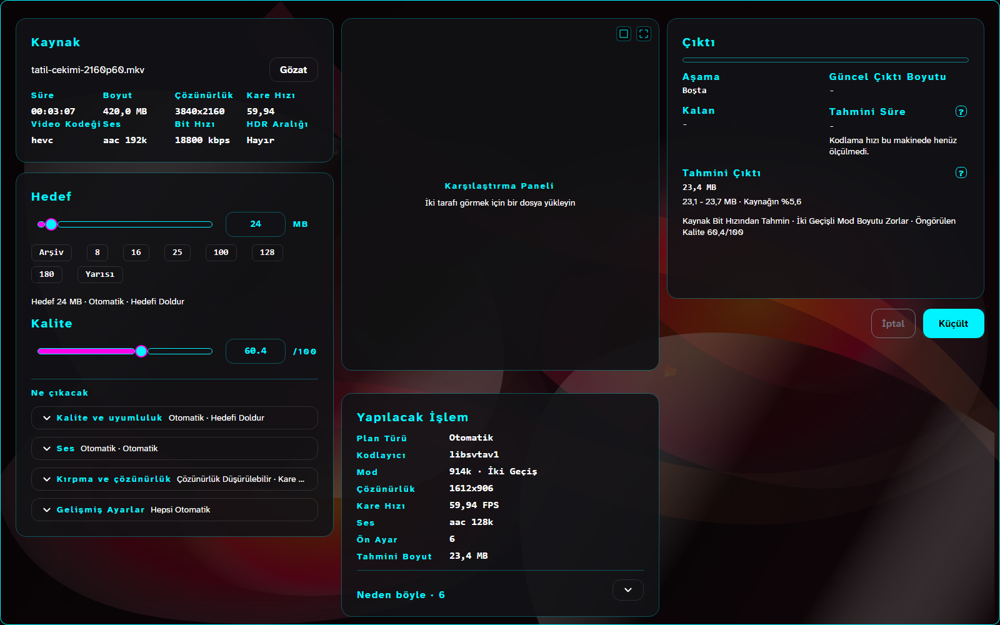
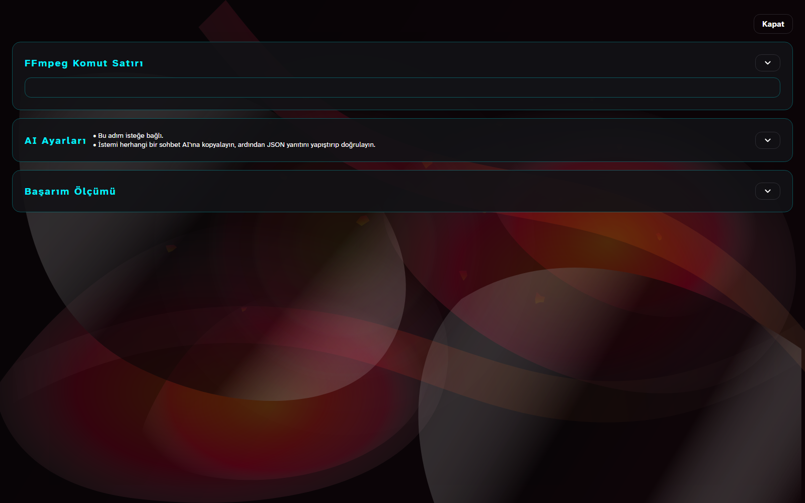
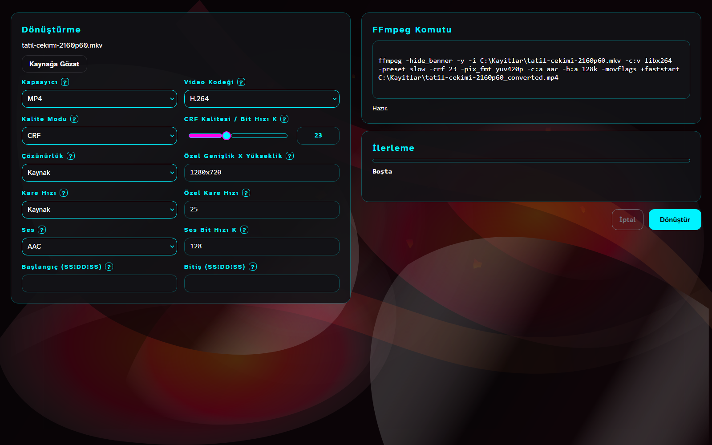
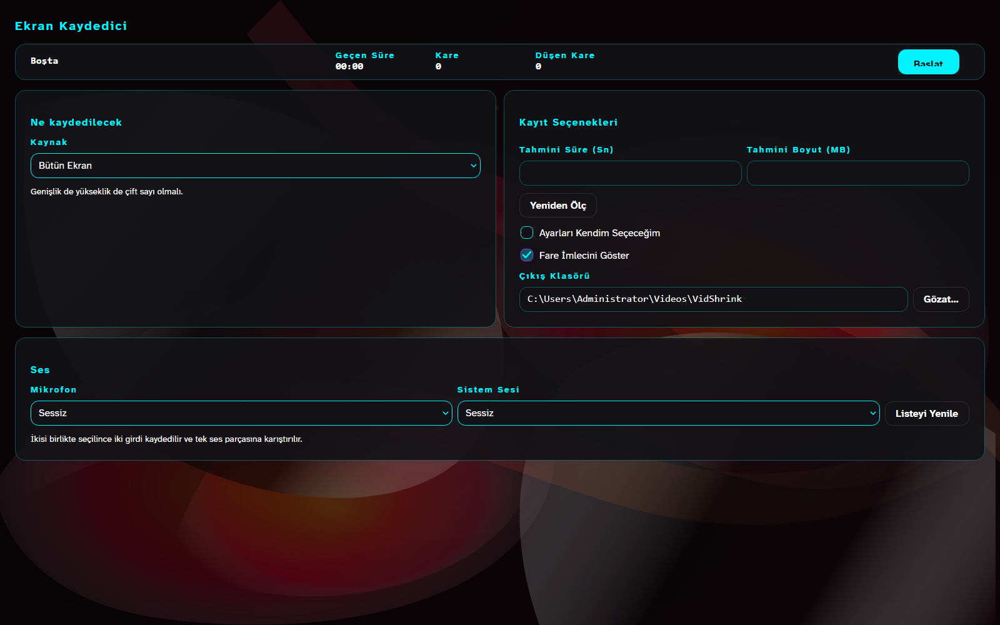

# VidShrink kullanımı

Sekmelerin turu. Kısa hâli [README](../README.tr.md) içinde.

## Kullanırken nasıl görünüyor

Dosya yüklendikten sonra her karar, gerekçesiyle birlikte, siz başlamadan önce ekrandadır —
kodek, CRF, çözünürlük, kare hızı, kestirim ve aralığı.



Her hedef yongası bir yerde gerçek bir sınırdır; `?` rozeti hangisi olduğunu söyler.

| Yonga | O sayı neden |
|---|---|
| **8** | Nitro'suz Discord, eski forumlar, katı e-posta ağ geçitleri |
| **16** *(WhatsApp için önerilen)* | WhatsApp sohbetteki videoyu kendi zayıf kodlayıcısıyla yeniden kodlar; 16 MB altında sizinkini genelde olduğu gibi geçirir |
| **25** | Gmail ekleri, Discord Nitro Basic, çoğu talep sistemi |
| **100** | Kalitenin aktarım süresinden önemli olduğu arşiv ve yüklemeler |
| **128** *(paylaşım için en fazla)* | İki anonim paylaşım hedefinin dar olanı uguu.se'nin ölçülmüş tavanı |
| **180** *(WhatsApp Web için en fazla)* | WhatsApp Web dosya başına 180 MB alıyor; sayı kullanıcı bildirimi, WhatsApp yayımlamıyor |
| **Yarısı** | Kaynağın yarısı; yumuşak bir istek olduğu için çözünürlük ve kare hızı genelde korunur |

`ffprobe`'un içinde video akışı gördüğü her dosya kabul edilir. Dosya uzantısı hiçbir zaman
kapı değildir: sessiz video, değişken kare hızı, hareketli GIF, döndürme üstverisi ve az
rastlanan kapsayıcılar, kurulu ffmpeg çözebildiği sürece çalışır.

AI kipi isteğe bağlıdır ve gömülü değildir. VidShrink bir istem yazar, siz onu herhangi bir
sohbet yapay zekâsına yapıştırırsınız; dönen JSON'u geri yapıştırdığınızda uygulama onu
şimdiki kaynağa ve seçeneklere karşı doğrular. Çevrimdışı kalır, API anahtarı istemez ve
yanıt bozuk ya da bayatsa otomatik plana döner.



Dönüştür sekmesi işin elle yapılan tarafı: kapsayıcı, video kodeği, CRF ya da bit hızı,
çözünürlük, kare hızı, ses kodeği ve bit hızı, bir de başlangıç ve bitiş zamanı. Akış
kopyası gerçek `-c:v copy` ve `-c:a copy` kullanır; uyumsuz kapsayıcı ve kaynak kodek
eşleşmeleri koşumdan önce engellenir. GIF dönüşümü `palettegen` ardından `paletteuse` ile
yapılır.



Oynatıcı sekmesi kaynağı pencerenin içinde oynatır; kod çözücü borusu aramalar arasında
açık kalır. Sekmede videodan başka bir şey yok: başlık satırı, parça düğmeleri ve üç nokta
kalktı. Denetim şeridi görüntünün üstünde duruyor ve fare alt kenara yaklaşınca beliriyor;
üstünde saat, sayıları yanında duran ses ve hız kaydırıcıları ve ortada -10 / oynat / +10
var, üçünün en büyüğü oynat. Geri kalan her şey sağ tık menüsünde. Programın uyarısı
oynatıcıyı aşağı itmiyor, üstünde beliriyor.

| Girdi | Etkisi |
|---|---|
| Tekerlek | bir saniye adımlar |
| Ctrl + tekerlek | on saniye adımlar |
| Shift + tekerlek | altmış saniye adımlar |
| Ctrl + Shift + tekerlek | beş dakika adımlar |
| Alt + tekerlek | yakınlaştırır |
| Sağ tık ya da boşluk | oynatmayı açıp kapatır |
| Orta tık | tam ekranı açıp kapatır, pencereyi eski yerine koyar |

Bağlam menüsü de aynı üç eylemi taşır.

### Kaydedici sekmesi



Kaydedici tüm ekranı, tek bir pencereyi ya da bir bölgeyi, her platformun gerçekten sahip
olduğu yakalama kolundan kaydeder: Windows'ta gdigrab, macOS'te avfoundation, Linux'ta
x11grab. Mikrofonu, sistem çıkışını ya da ikisini birden alır; cihaz sırayla değil adıyla
hatırlanır, böylece iki açılış arasında sırası değişen bir liste sessizce başka bir mikrofon
seçemez. Durdurma ffmpeg'i öldürmez, dosyayı kapatmasını ister; durdurulan kayıt oynar.
Zaman aşımında öldürülen kayıt çalışan bir dosya gibi teslim edilmez, yarım olduğu söylenir.

Kodlama ayarları da orada — kare hızı, kalite, kodlayıcı, ön ayar, kap, ölçekleme, anahtar
kare aralığı, profil, tune, piksel biçimi, süre sınırı ve bölme — ama hiçbirine dokunmak
zorunda değilsiniz.

**Otomatik kip** tek kutu. Program aday merdivenini makinenin kendisinden kuruyor: gerçekten
kodladığını gördüğü ilk donanım H.264 kolu (önce NVENC, sonra Quick Sync, sonra AMF), hiçbiri
çalışmıyorsa `libx264`; ekranın yenileme hızından aşağı yuvarlanmış bir kare hızı
({24, 30, 60, 120}); yakalama boyutu, sonra yarısı; her adayda Matroska, çünkü öldürülen bir
kaydın oynak kaldığı kap o; ve x264'ün değil seçilen kodlayıcının kendi sözlüğünden bir ön
ayar. Ardından aday başına üç saniyelik **gerçek** kayıt alıp düşen kare sayacını okuyor. Kare
düşürmeyen ilk aday doğrudan kazanıyor; hiçbiri sıfır değilse oranı en küçük olan kazanıyor.
Seçilen ayarlar ve her birinin gerekçesi kutunun altında tek satırda yazıyor; kip açıkken elle
ayar paneli gizleniyor.

### Kodlayıcılar

Küçültme planını on iki kodlayıcı taşıyabilir. Varlık güvene alınmaz: her aday sizin
makinenizde denenir, deneme başarısız olursa sıradakine geçilir ve denenmemiş bir aday asla
"bu makinede kullanılamaz" diye işaretlenmez.

| Kodek | Yazılım | NVENC | Quick Sync | AMF |
|---|---|---|---|---|
| H.264 | `libx264` | `h264_nvenc` | `h264_qsv` | `h264_amf` |
| H.265 | `libx265` | `hevc_nvenc` | `hevc_qsv` | `hevc_amf` |
| AV1 | `libsvtav1` | `av1_nvenc` | `av1_qsv` | `av1_amf` |

VideoToolbox `CodecModel` içinde bir sağlayıcı olarak tanınıyor ama bugün küçültme yolunun
izin listesinde değil. VP9 Dönüştür sekmesinde.


- **H.264** neredeyse yapılmış her aygıtta oynar ve WhatsApp'ın beklediği kodektir.
- **H.265** aynı resim için kabaca üçte bir daha az bit ister; 2016 sonrası her telefon onu
  donanımda çözer, eski cihazlar ve bazı web oynatıcılar çözemez.
- **VP9** bir tarayıcı ve WebM biçimidir.
- **AV1** en iyi sıkıştırır, en yavaş kodlar; yalnız yeni telefonlar çözer.
- **Akış kopyası** hedef kaynağın akışlarını kabul ettiğinde anlıktır ve kayıpsızdır.

### Sağ tık menüsü

Gezgin'de bir videoya sağ tıklayın, menüde **Bu videoyu VidShrink ile aç** durur. Windows
11'de bu girdi "Diğer seçenekleri göster"in arkasında değil, birincil menüdedir. Bu
yerleşim yalnız paketlenmiş uygulamalara açık olduğu için kurucu seyrek bir paket kaydeder
— menüyü taşıyan, diskteki sıradan kurulumu gösteren bir bildirim — ve klasik girdiyi de
yanına yazar. Windows 10 makinesi ya da paketi taşımayan bir sürüm yalnız klasik girdiyi
alır ve kurulum sırasında bunu söyler. Kaldırma ikisini birden siler.

Girdi, uygulamanın kendi açtığı 24 uzantıda görünür. O liste tek bir yerde,
`VidShrink.Core.ShellIntegration.MediaExtensions` içinde durur ve kurucu ile uygulama bu
konuda anlaşmazlığa düşerse bir test kırılır.

Girdi kullanıcı başına, `HKCU\Software\Classes\SystemFileAssociations` altına yazılır; bu
yüzden yönetici hakkı istemez ve dosya ilişkilendirmelerinizi değiştirmez — öntanımlı
oynatıcınız öntanımlı oynatıcınız olarak kalır. Gösterdiği şey `VidShrink.exe`, yani
başlatıcı; kısayolların gösterdiğiyle aynı nedenle: doğrudan uygulamayı gösteren bir girdi
hiç güncellenmeyen bir kopya bırakırdı.

Etiket sistem arayüz dilini izler. `-MenuLanguage tr` ya da `-MenuLanguage en` ile birini
dayatabilirsiniz. `-RemoveShellMenu` her VidShrink girdisini tek geçişte siler, uzantı
listesi daha uzun olan eski sürümlerin girdileri dahil; `-ShellMenuOnly` girdileri kurulu
başlatıcıya göre yeniden yazar ve başka hiçbir şeye dokunmaz; `-SkipShortcuts` kabuğa hiç
dokunmaz.

```powershell
powershell -NoProfile -ExecutionPolicy Bypass -File C:\path\to\Install-VidShrink.ps1 -RemoveShellMenu
```

