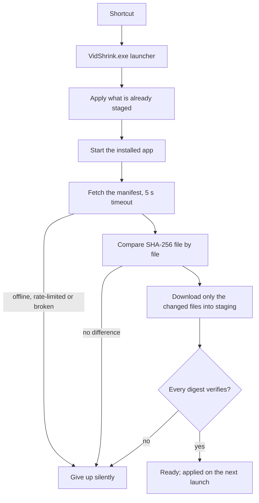

# Installing And Updating

The full detail. The one-line install commands are in the [README](../README.md).

## Install

### Windows — VidShrink-Setup.exe

Download [`VidShrink-Setup.exe`](https://github.com/Teknesyum/VidShrink/releases/latest/download/VidShrink-Setup.exe)
from the latest release (0.8.3 and later) and run it. It installs the same layout, shortcuts,
right-click entries and file associations as the script below, under the same registry keys,
and a test compares the two key trees value by value. What it does differently:

- It downloads the application archive, the launcher archive and the checksum list in
  parallel and hashes each file while it is being written.
- It unpacks both archives straight into the install root instead of a staging folder that
  is then copied, and moves the previous install aside first, so a failed install puts the
  old one back.
- When `ffmpeg` and `ffprobe` are not found it does not call WinGet: it range-reads only
  `ffmpeg.exe` and `ffprobe.exe` out of the pinned GyanD 9.0 archive and checks each against a
  fixed SHA-256 digest.
- It writes the registry and the shortcuts itself rather than through PowerShell cmdlets.

The locked-folder handling is the script's: six attempts from 200 ms doubling, and after two
rounds in which VidShrink still holds the folder it closes it and waits up to 120 seconds.

```text
VidShrink-Setup.exe                  install or update
VidShrink-Setup.exe --uninstall      remove shortcuts, right-click entries, associations and the install
VidShrink-Setup.exe --help           every switch
```

The release's `checksums-win-x64.txt` lists `VidShrink-Setup.exe` too.

### Windows — one line

```powershell
irm https://raw.githubusercontent.com/Teknesyum/VidShrink/main/Install-VidShrink.ps1 | iex
```

No administrator rights and no .NET SDK. The installer asks GitHub for the latest release,
downloads the `win-x64` archive and the launcher beside it, checks both against the
release's own SHA-256 list, and refuses to continue if either digest differs.

It installs under `%LOCALAPPDATA%\Programs\VidShrink`, fetches FFmpeg and FFprobe from
WinGet, downloads libmpv (the player tab's engine) from a pinned build and checks both its
archive and its DLL against fixed SHA-256 digests, creates Desktop and Start Menu shortcuts
pointing at the launcher, and adds the right-click entry. Running the same command again replaces the app with the newest release.

Only `win-x64` is published. A machine positively identified as ARM64 or 32-bit stops the
installer rather than getting an architecture whose updates would never be found. An
architecture that cannot be *read* is different: the installer tries
`RuntimeInformation.OSArchitecture`, then `PROCESSOR_ARCHITEW6432`, then
`PROCESSOR_ARCHITECTURE`, then the OS bit width, and if none of them answers, a 64-bit
Windows continues as `win-x64` and prints one line saying so.

`irm | iex` runs from memory, so the default `Restricted` execution policy does not block
it. If an organizational policy does, download
[`Install-VidShrink.ps1`](../Install-VidShrink.ps1), read it, and run it like this — as UTF-8,
not with `-File`, because Windows PowerShell 5.1 reads a mark-less script in the system
ANSI code page and turns every non-ASCII character into mojibake:

```powershell
powershell -NoProfile -ExecutionPolicy Bypass -Command "iex ([IO.File]::ReadAllText('C:\path\to\Install-VidShrink.ps1',[Text.Encoding]::UTF8))"
```

### macOS / Linux — one line

```bash
curl -fsSL https://raw.githubusercontent.com/Teknesyum/VidShrink/main/install-vidshrink.sh | sh
```

No root and no .NET SDK. The target comes from `uname` — `osx-arm64`, `osx-x64` or
`linux-x64` — the archive is verified against the release's checksum list, installed under
`~/.local/share/vidshrink` and linked as `~/.local/bin/vidshrink`. Any other architecture
stops the installer with a message naming it.

On macOS you get a real application bundle: an ad-hoc signed `~/Applications/VidShrink.app`
that opens from Finder with its own name and icon, and `--uninstall` removes the bundle,
the payload and the shortcut together. On Linux there is no bundle; the launcher link is
the whole of it.

FFmpeg and libmpv are the two things this installer will not put on your machine. If
`ffmpeg` or `ffprobe` is missing it prints your package manager's command —
`brew install ffmpeg`, `sudo apt install ffmpeg`, `sudo dnf install ffmpeg` — and stops
before downloading anything else. It does the same when libmpv is missing:
`brew install mpv`, `sudo apt install libmpv2`, `sudo dnf install mpv-libs`.

### Requirements

- Windows 10 or 11, macOS 15 or newer (the player tab’s libmpv dylibs carry `minos=15.0`), or a Linux desktop on X11 or Wayland
- `ffmpeg` and `ffprobe` in a `tools/ffmpeg` folder beside the application, or on `PATH`
- libmpv for the player tab: in `tools/libmpv` on Windows (the installer puts it there),
  Homebrew's `lib` folder on macOS, the system library on Linux, or the file or folder
  named by `VIDSHRINK_LIBMPV`
- No .NET runtime and no .NET SDK. Releases are self-contained

Hardware encoding is optional. A missing or broken GPU encoder is reported and the engine
moves to the next candidate; it is never fatal.


### Staying up to date

On Windows the application updates itself, without asking. The shortcuts point at
`VidShrink.exe`, a small launcher above the application. A typical release changes about
1.7 MB of a 519 MB installation, and that is all that comes down the wire.

Nothing on the startup path touches the network. Before the application opens, the launcher
only does local work: it finishes a half-done launcher swap and moves a staged update into
place. The manifest fetch and the download run **after** the application is on screen, and
what they collect is applied on the next launch — moving files that are already verified
takes milliseconds.



Staging survives a failed round. A dropped line or a timeout leaves the files that did come
down where they are, and the next round skips them by digest, so a slow connection converges
over several launches instead of starting from zero each time. Staging is thrown away only
when it was collected for a different version. An unverified byte is never written, so a
half-finished stage cannot carry the wrong file. One launcher stages at a time; a second one
finds the update already running and does nothing.

Releases carry no debug symbols. The `.pdb` files are useless to anyone who is not debugging
the build, and an installation that never had them counted every one as a missing file and
fetched it again on each launch.

The launcher never blocks the application from opening. No network, unresolved DNS, a rate
limit, a broken manifest, a full disk: it gives up silently and leaves the installed
version as it is. FFmpeg never travels with a release and is never re-downloaded; the
launcher only checks that `ffmpeg.exe` and `ffprobe.exe` are still there. libmpv does not
travel with a release either: an update replaces `app\` and leaves `tools\libmpv` as the
installer left it. An installation made before the player moved to libmpv gets it by
running the install command once more.

Automatic updates are on by default and can be switched off in the settings. The switch is
stored in `%APPDATA%\VidShrink\settings.json`, next to your other settings rather than next
to the executable, so reinstalling does not reset it. With it off, Windows behaves like the
others: the application asks once at startup whether a newer version exists and tells you.

That notice carries an **Install** button wherever a launcher is installed. The application
cannot update itself — it is the process holding its own DLLs — so the button starts the
launcher in manual-install mode, closes the application, and the launcher waits for it to
exit, downloads and applies the update behind the startup panel, then opens the new version.
One click, and the version on screen afterwards is the new one. The button does not read the
automatic-update switch and never writes it: installing once by hand leaves your preference
exactly as it was. The notice has one action and no shell command in it. Where there is no
launcher — a Linux installation, a plain macOS copy — the same button opens the releases
page, because there is nothing there to drive.

On macOS the update swaps the whole bundle. A bundle's signature covers every file inside
it, so a file-by-file update would break the signature and the application would refuse to
open. The new bundle is built beside the installed one while you work, its signature is
verified before anything moves, and only then do the two swap atomically — as the
application exits, so it is never pulled out from under a running process. Self-updating is
offered only where it is safe: a plain payload install under `~/.local/share`, or a bundle
macOS has translocated to a read-only path, keeps the switch closed and is told about new
versions instead.

On Linux the application only tells you a new version exists. Update by running the install
command again.

| | Windows | macOS | Linux |
|---|---|---|---|
| Published target | `win-x64` | `osx-arm64`, `osx-x64` | `linux-x64` |
| Installer | `Install-VidShrink.ps1` | `install-vidshrink.sh` | `install-vidshrink.sh` |
| Right-click menu | yes | no | no |
| Self-update | file-level, via the launcher | whole-bundle swap | notice only |
| FFmpeg comes from | WinGet `Gyan.FFmpeg` | your `brew` | your `apt` or `dnf` |
| libmpv comes from | pinned shinchiro build, SHA-256 checked | your `brew` (`mpv`) | your `apt` (`libmpv2`) or `dnf` (`mpv-libs`) |


## Licensing Of The External Binaries

FFmpeg is a separate program under its own license and VidShrink does not redistribute it.
On Windows the installer asks WinGet for `Gyan.FFmpeg`, whose builds are GPLv3; on macOS
and Linux the installer installs nothing and prints your package manager's command. Either
way the binary arrives on your own machine, under its own terms, at install time. VidShrink
runs `ffmpeg` and `ffprobe` as external processes and links no GPL code into the AGPL-3.0
application.

libmpv, the player tab's engine, is handled the same way: VidShrink does not redistribute
it. On Windows the installer downloads one pinned build from
[shinchiro/mpv-winbuild-cmake](https://github.com/shinchiro/mpv-winbuild-cmake) straight
onto your machine; on macOS and Linux it comes from your package manager. VidShrink loads
it at run time through its C API, under the library's own licence.

Releases do not carry FFmpeg, and the reason is size rather than licensing: FFmpeg and
FFprobe are 424 MB of a 519 MB installation and do not change when VidShrink does. Anyone
preparing a packaged release that does include FFmpeg should work the licensing through for
that specific build rather than rely on this paragraph.
