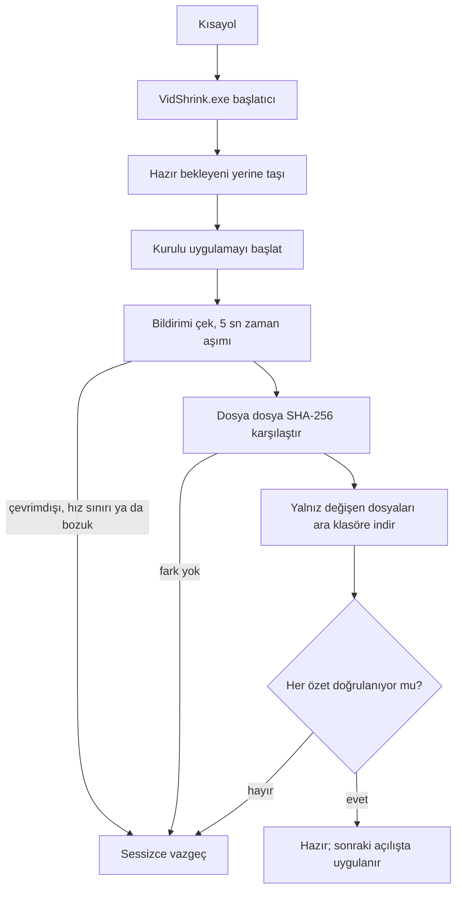

# Kurulum ve güncelleme

Tam ayrıntı. Tek satırlık kurulum komutları [README](../README.tr.md) içinde.

## Kurulum

### Windows — tek satır

```powershell
irm https://raw.githubusercontent.com/Teknesyum/VidShrink/main/Install-VidShrink.ps1 | iex
```

Yönetici hakkı da .NET SDK'sı da gerekmez. Kurucu GitHub'dan son sürümü ister, `win-x64`
arşivini ve yanındaki başlatıcıyı indirir, ikisini de sürümün kendi SHA-256 listesine karşı
sınar ve özetlerden biri tutmuyorsa devam etmez.

Kurulum `%LOCALAPPDATA%\Programs\VidShrink` altına yapılır; FFmpeg ve FFprobe WinGet'ten
çekilir; Masaüstü ve Başlat Menüsü kısayolları başlatıcıyı gösterir; sağ tık girdisi de
eklenir. Aynı komutu yeniden koşmak kurulu uygulamayı en yeni sürümle değiştirir.

Windows için yalnız `win-x64` yayımlanıyor. ARM64 ya da 32 bit olduğu kesin olarak
anlaşılan makinede kurucu durur; güncellemeleri hiç bulunamayacak bir mimariyi kurmaktansa
durmak doğrudur. *Okunamayan* mimari ayrı bir durum: kurucu sırayla
`RuntimeInformation.OSArchitecture`, `PROCESSOR_ARCHITEW6432`, `PROCESSOR_ARCHITECTURE` ve
işletim sisteminin bit genişliğine bakar; hiçbiri ad vermezse 64 bitlik Windows `win-x64`
olarak devam eder ve bunu varsaydığını tek satırla yazar.

`irm | iex` betiği dosyadan değil bellekten koşturur, bu yüzden öntanımlı `Restricted`
ilkesi engel olmaz. Kurumsal bir ilke engelliyorsa
[`Install-VidShrink.ps1`](../Install-VidShrink.ps1) dosyasını indirin, okuyun ve aşağıdaki gibi
koşturun. `-File` yerine dosyayı açıkça UTF-8 okutun: betik imzasız UTF-8 saklanıyor,
Windows PowerShell 5.1 ise imzasız betiği sistem ANSI kod sayfasıyla okuyup ASCII dışı her
karakteri bozuyor.

```powershell
powershell -NoProfile -ExecutionPolicy Bypass -Command "iex ([IO.File]::ReadAllText('C:\path\to\Install-VidShrink.ps1',[Text.Encoding]::UTF8))"
```

### macOS / Linux — tek satır

```bash
curl -fsSL https://raw.githubusercontent.com/Teknesyum/VidShrink/main/install-vidshrink.sh | sh
```

Kök yetkisi de .NET SDK'sı da gerekmez. Hedef `uname` çıktısından seçilir — `osx-arm64`,
`osx-x64` ya da `linux-x64` — arşiv sürümün sağlama listesine karşı doğrulanır,
`~/.local/share/vidshrink` altına kurulur ve `~/.local/bin/vidshrink` olarak bağlanır. Başka
her mimaride kurucu adını söyleyerek durur.

macOS'ta elinizde gerçek bir uygulama paketi kalır: Finder'da kendi adı ve simgesiyle açılan,
kendi kendine imzalanmış bir `~/Applications/VidShrink.app`. `--uninstall` paketi, yükü ve
kısayolu birlikte kaldırır. Linux'ta paket yok; başlatıcı bağlantısı her şeydir.

FFmpeg, bu kurucunun makinenize koymayacağı tek şey. `ffmpeg` ya da `ffprobe` yoksa paket
yöneticinizin komutunu yazar — `brew install ffmpeg`, `sudo apt install ffmpeg`,
`sudo dnf install ffmpeg` — ve başka hiçbir şey indirmeden durur.

### Gerekenler

- Windows 10 ya da 11, macOS 15 ve üstü (oynatıcı sekmesinin libmpv dylib’leri `minos=15.0` taşıyor), ya da X11/Wayland koşan bir Linux masaüstü
- Uygulamanın yanındaki `tools/ffmpeg` klasöründe ya da `PATH` üzerinde `ffmpeg` ve `ffprobe`
- .NET çalışma zamanı ve SDK gerekmez. Sürümler kendi kendine yeterli

Donanım kodlaması isteğe bağlıdır. Eksik ya da bozuk bir GPU kodlayıcısı bildirilir ve motor
sıradaki adaya geçer; ölümcül değildir.


### Güncel kalmak

Windows'ta uygulama kendini sormadan günceller. Kısayollar uygulamanın üstünde duran küçük
bir başlatıcıyı, `VidShrink.exe`'yi gösterir. Tipik bir sürüm 519 MB'lık kurulumun yaklaşık
1,7 MB'ını değiştirir; telden inen de yalnız o kadardır.

Açılış yolunda ağa çıkan hiçbir iş yok. Uygulama açılmadan önce başlatıcı yalnız yerel işi
yapar: yarım kalmış başlatıcı değişimini toplar ve hazır bekleyen güncellemeyi yerine taşır.
Bildirim çekmek ve indirmek uygulama ekrana geldikten **sonra** koşar; topladığı iş bir
sonraki açılışta uygulanır — doğrulanmış dosyaları taşımak milisaniyeler sürer.



Ara klasör başarısız turdan sağ çıkar. Kopan hat ya da zaman aşımı inen dosyaları yerinde
bırakır, sonraki tur onları özetinden tanıyıp atlar; böylece yavaş hat sıfırdan başlamak
yerine birkaç açılışta yakınsar. Ara klasör yalnız başka bir sürüm için toplanmışsa atılır.
Doğrulanmamış bayt hiç yazılmadığı için yarım bir klasör yanlış dosya taşıyamaz. Aynı anda
tek başlatıcı toplar; ikincisi işin zaten yürüdüğünü görüp hiç başlamaz.

Sürümler hata ayıklama simgesi taşımaz. `.pdb` dosyaları yapıyı ayıklamayan hiç kimseye
yaramaz; onlara hiç sahip olmamış bir kurulum ise her birini eksik dosya sayıp her açılışta
yeniden indiriyordu.

Başlatıcı uygulamanın açılmasını hiçbir zaman engellemez. Ağ yok, DNS çözülmüyor, hız
sınırı, bozuk bildirim, dolu disk: hepsinde sessizce vazgeçer, kurulu sürüm olduğu gibi
kalır. FFmpeg sürümlerle taşınmaz ve bir daha indirilmez; başlatıcı yalnız `ffmpeg.exe`
ile `ffprobe.exe` yerinde mi diye bakar.

Otomatik güncelleme öntanımlı olarak açıktır ve ayarlardan kapatılabilir. Anahtar
`%APPDATA%\VidShrink\settings.json` içinde, çalıştırılabilirin yanında değil öteki
ayarlarınızın yanında durur; bu yüzden yeniden kurmak onu sıfırlamaz. Kapalıyken Windows da
ötekiler gibi davranır: uygulama açılışta bir kez yeni sürüm var mı diye sorar ve size
söyler.

Başlatıcısı olan her kurulumda o uyarı bir **Yükle** düğmesi taşır. Uygulama kendini
güncelleyemez — kendi dll'lerini tutan süreç odur — bu yüzden düğme başlatıcıyı elle yükleme
kipinde açar ve uygulamayı kapatır; başlatıcı onun çıkışını bekler, güncellemeyi açılış
panelinin arkasında indirip uygular ve yeni sürümü açar. Tek tık, sonrasında ekrandaki sürüm
yeni olandır. Düğme kendiliğinden güncelleme anahtarını okumaz ve hiç yazmaz: elle bir kez
yüklemek tercihinizi olduğu gibi bırakır. Panelin tek eylemi budur; içinde kabuk komutu
yazmaz. Başlatıcı olmayan yerde — Linux kurulumu, düz bir macOS kopyası — aynı düğme yayın
sayfasını açar, çünkü orada sürülecek bir şey yok.

macOS'ta güncelleme paketin tamamını takas eder. Bir paketin imzası içindeki her dosyayı
kapsar; dosya dosya güncelleme imzayı bozar ve uygulama açılmayı reddeder. Yeni paket siz
çalışırken kurulu olanın yanında kurulur, imzası herhangi bir şey yer değiştirmeden *önce*
doğrulanır ve ancak ondan sonra ikisi atomik olarak yer değiştirir — üstelik uygulama
çıkarken, yani koşan bir sürecin altından çekilmeden. Kendini güncelleme yalnız güvenle
yapılabildiği yerde açıktır: `~/.local/share` altındaki düz yük kurulumu ya da macOS'un salt
okunur bir yola taşıdığı paket, anahtarı kapalı tutar ve yeni sürümü yalnız haber alır.

Linux'ta uygulama yalnız yeni sürüm olduğunu söyler. Kurulum komutunu yeniden koşarak
güncellersiniz.

| | Windows | macOS | Linux |
|---|---|---|---|
| Yayımlanan hedef | `win-x64` | `osx-arm64`, `osx-x64` | `linux-x64` |
| Kurucu | `Install-VidShrink.ps1` | `install-vidshrink.sh` | `install-vidshrink.sh` |
| Sağ tık menüsü | var | yok | yok |
| Kendini güncelleme | dosya düzeyinde, başlatıcıyla | paketin tamamını takas | yalnız haber |
| FFmpeg nereden | WinGet `Gyan.FFmpeg` | sizin `brew` | sizin `apt` ya da `dnf` |


## Dış ikililerin lisansı

FFmpeg kendi lisansı altında ayrı bir programdır ve VidShrink onu yeniden dağıtmaz.
Windows'ta kurucu WinGet'ten GPLv3 yapıları olan `Gyan.FFmpeg`'i ister; macOS ve Linux'ta
kurucu hiçbir şey kurmaz, paket yöneticinizin komutunu yazar. İki durumda da ikili kendi
makinenize, kendi koşullarıyla, kurulum anında iner. VidShrink `ffmpeg` ve `ffprobe`'u dış
süreç olarak koşturur ve AGPL-3.0 uygulamasının içine hiçbir GPL kodu bağlamaz.

Sürümler FFmpeg taşımaz; bunun nedeni lisans değil boyut: FFmpeg ve FFprobe 519 MB'lık
kurulumun 424 MB'ı ve VidShrink değişince onlar değişmiyor. FFmpeg içeren paketli bir sürüm
hazırlayan biri, lisansı bu paragrafa güvenerek değil o yapı için baştan çalışmalıdır.

Oynatıcı sekmesinin motoru libmpv de aynı biçimde ele alınır: VidShrink onu yeniden
dağıtmaz. Windows'ta kurucu [shinchiro/mpv-winbuild-cmake](https://github.com/shinchiro/mpv-winbuild-cmake)
üzerinden pinlenmiş tek bir yapıyı doğrudan makinenize indirir; macOS ve Linux'ta paket
yöneticinizden gelir. VidShrink onu çalışma anında C arayüzünden yükler, kütüphanenin kendi
lisansı altında.
