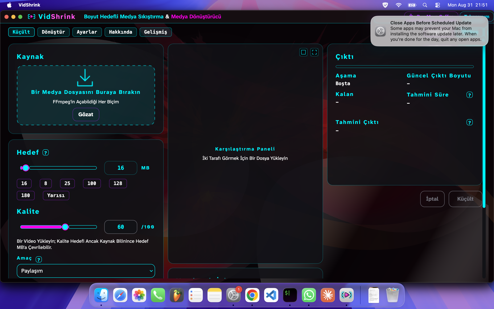
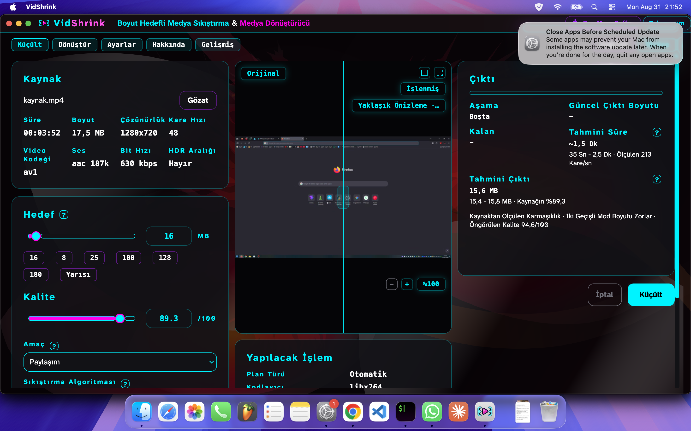

# macOS kendini güncelliyor, kurulum tek komutla uçtan uca koştu

Tarih: 2026-08-31 · Makine: Apple Silicon (arm64), macOS 26.5.2 (25F84) ·
ffmpeg 9.0.1 (Homebrew) · .NET SDK 8.0.424 · Dal: `serkan/macos-guncelleme`

`docs/macos-ilk-kosum.md` ve `docs/macos-paket.md`in devamı. Önceki paket macOS'ta kendini
güncelleme yolunu **tasarlamıştı, kod yazmamıştı**; bu paket o yolu uyguluyor ve `v0.2.5`
üstünde kurulumu baştan sona koşturuyor.

## İş 1 — macOS'ta kendini güncelleme

Kod `src/VidShrink.Core/UpdateCheck.cs` içinde, dosyanın kendi düzenine uyarak yeni bir
sınıfta: `MacUpdate`. Windows'un yolu (`LauncherUpdate`, `UpdateStage`, `UpdateRollout`)
aynı dosyada duruyor ve **hiç değişmedi**.

### 1. Kapı — hangi koşula bakıyor

`UpdateCheck.CanSelfUpdate` artık iki dallı:

```csharp
public static bool CanSelfUpdate =>
    OperatingSystem.IsWindows() || MacUpdate.CanSwap(Environment.ProcessPath);
```

Windows'ta cevap yalnız `IsWindows()`ten geliyor — kısa devre, hiçbir macOS koşulu o dala
karışmıyor. macOS'ta cevabın tamamı `CanSwap`, ve o üç şey birden istiyor:

1. Çalışan ikili bir `.app` paketinin `Contents/MacOS/` dizininde (`BundleOf`).
2. Paket **App Translocation** altında değil — oradaki bir kopya kendi paketine yazamaz.
3. Paketin durduğu dizin yazılabilir — takas o dizinde oluyor.

Düz kurulumda (`~/.local/share/vidshrink/VidShrink`) `BundleOf` null döndürüyor: kapı
kapalı, kullanıcı yeni sürümü eskisi gibi **haber olarak** görüyor ve kurulum komutunu
alıyor. Linux'ta `CanSwap` platform kontrolünde duruyor, kapı kapalı.

Ölçü: `MacUpdateTests.OnlyABinaryInsideAnAppBundleCounts` — paket yolunu, düz kurulum
yolunu, `Contents/Resources` altını ve `.app` ile bitmeyen bir kökü tek tek sayıyor.
`ATranslocatedBundleIsNotSwappable` ikinci koşulu tutuyor. İkisi de saf yol hesabı,
her platformda koşuyor.

### 2. Takas — atomik ve imza önce

Güncellemenin birimi dosya değil, paketin tamamı: paket imzası `Contents/`i mühürlüyor,
mühürden sonra içeriden tek bir dosya değişirse paket hiç açılmıyor. Bugünkü manifest
tabanlı dosya farkı bir `.app` üzerinde çalışamaz.

Sıra:

| Ne zaman | Ne oluyor |
|---|---|
| Açılışta | `~/Applications/.vidshrink-update/` **koşulsuz** siliniyor, sonra arka planda hazırlama başlıyor |
| Hazırlama | Arşivin tamamı iniyor → her dosyanın sha256'sı manifestle karşılaştırılıyor → yayının kendi `macos-app-bundle.sh`i paketi kuruyor ve ad-hoc imzalıyor → `codesign --verify` |
| Çıkışta | `renamex_np(hazırlanan, kurulu, RENAME_SWAP)` — tek çağrı |

Hazırlama dizini kurulu paketin **kardeşi**: `renamex_np` birim geçemiyor, aynı dizin aynı
birimi garanti ediyor. `Directory.Move` burada kullanılamıyor — dolu bir hedefin üstüne
geçmediği için iki adıma bölünür ve arada çökme kullanıcıyı paketsiz bırakır.

İmza takasın **önünde** doğrulanıyor, iki kez: hazırlama biter bitmez (`PrepareAsync`) ve
takasın hemen öncesinde (`Commit`). İkincisi tutmazsa hazırlama dizini atılıyor ve kurulu
pakete hiç dokunulmuyor.

**Yarım kalırsa:**

| Nerede kesilirse | Sonuç |
|---|---|
| İndirme ya da hazırlama sırasında | Kurulu paket el değmemiş. `Finish` yalnız **bu turda bitmiş** bir hazırlamayı takas ediyor; yarım kalan artık bir sonraki açılışta siliniyor. |
| Takas anında | `RENAME_SWAP` atomik: ya eski yerinde ya yeni yerinde, ara hâl yok. |
| Takastan sonra | Uygulama yeni sürüm. Eski paket hazırlama dizininde duruyor. |

### 3. Takas sonrası imza ve karantina

Aşağıdaki çıktı gerçek koşumdan; ayrıntısı "İş 2 · 6" başlığında.

```
$ codesign --verify --strict --verbose=1 ~/Applications/VidShrink.app
/Users/serkan/Applications/VidShrink.app: valid on disk
/Users/serkan/Applications/VidShrink.app: satisfies its Designated Requirement

$ xattr -p com.apple.quarantine ~/Applications/VidShrink.app
xattr: /Users/serkan/Applications/VidShrink.app: No such xattr: com.apple.quarantine
```

Karantina yazılmamasının sebebi yolun kendisi: paket **yerelde** üretiliyor. İnen tek şey
bir zip, ondan çıkan dosyalar `curl`ün yazdığı özniteliği taşımıyor ve `codesign` paketi
yeniden mühürlüyor. Noterleme gerekmiyor.

### 4. Eski paket ne zaman siliniyor

**Takas anında değil.** Takastan sonra eski paket `~/Applications/.vidshrink-update/`
altında duruyor ve orada kalıyor; onu **bir sonraki açılışın** koşulsuz silmesi alıyor
(`MacUpdate.Begin` → `Discard`, hazırlamadan önce). Çalışan sürecin altından hiçbir şey
silinmiyor: takas ettiğimiz an süreç hâlâ eski paketin ikilisinden koşuyor ve tembel
yüklenecek bir derlemeyi hâlâ oradan arayabilir.

Tek kural iki çökme penceresini birden kapatıyor: hazırlama dizininde ne bulunursa
bulunsun (yarım inen yeni paket ya da takastan artan eski paket) çalışan paket o değildir.

### 5. Windows ve Linux değişmedi

Windows'ta yan-ada-indir + çıkışta değiştir yolu olduğu gibi duruyor: `LauncherUpdate`,
`UpdateStage`, `UpdateRollout`, `VidShrink.Launcher/**` — hiçbirine dokunulmadı. Ölçü
söz değil, koşan bir iddia:

`MacUpdateTests.TheWindowsBranchDoesNotDependOnTheBundleGate` Windows'ta iki şey birden
istiyor — `CanSelfUpdate` açık **ve** `CanSwap` kapalı, hem çalışan ikilinin yolunda hem
Windows biçiminde yazılmış bir `.app` yolunda. Yani Windows'ta cevap paket kapısından
gelmiyor. macOS'ta aynı ölçü tersini tutuyor: `CanSelfUpdate` ile `CanSwap` eşit. Linux'ta
ikisi de kapalı.

Depodaki `UpdaterTests`in 41 ölçüsü değiştirilmedi; süitte olduğu gibi koşuyorlar (üçü bu
makinede `VIDSHRINK_LAUNCHER_EXE` yok diye atlanıyor, bu paketten önce de atlanıyordu).

### 6. Ölçü mutasyonla sınandı

`Commit` içindeki imza doğrulama adımı kaldırıldı:

```diff
-        if (!SignatureValid(staged))
-        {
-            Discard(bundle);
-            return false;
-        }
-
         return renamex_np(staged, bundle, RenameSwap) == 0;
```

```
[xUnit.net] VidShrink.Tests.MacUpdateTests.ABrokenSignatureStopsTheSwap [FAIL]
  Assert.False() Failure
  Expected: False
  Actual:   True
Başarısız! - Başarısız: 1, Başarılı: 5, Toplam: 6
```

Geri alındıktan sonra: `Başarılı! - Başarısız: 0, Başarılı: 6, Toplam: 6`.

Ölçü mührü gerçekten bozuyor: imzalı paketin `Contents/MacOS/VidShrink` dosyasına bir satır
ekliyor, `codesign --verify`ın düştüğünü doğruluyor, sonra `Commit`in takası reddettiğini
ve kurulu paketin hâlâ eski sürüm ve geçerli imzalı olduğunu istiyor.

### Kancanın yeri — ölçülen bir bulgu

Takas ilk denemede hiç koşmadı. Sebep: **macOS'ta AppKit'in sonlandırması Avalonia'nın
`Start`ından geri dönmüyor.** `Main`in sonuna konan bir satır menüden çıkışta hiç
çalışmıyor. Ölçüldü:

```
22:07:48 main-basladi
22:07:58 lifetime-shutdown-requested
22:07:58 lifetime-exit
(start-dondu yok, process-exit yok)
```

Bu yüzden `Finish` uygulama ömrünün `Exit` olayına bağlı (`App.axaml.cs`), `Main`in sonuna
değil. `Exit` hem menüden çıkışta hem son pencere kapanınca koşuyor — `Start`tan sonraki
satırdan daha çok yolu kapsıyor. Bu kancanın kendisinin ayrı bir ölçüsü yok; ölçü
`Commit`in üstünde, kancanın koştuğunu aşağıdaki uçtan uca koşum gösteriyor.

## İş 2 — tek komutluk kurulum uçtan uca

### 1. Temiz makineden tek komut

```
$ sh install-vidshrink.sh --uninstall
Silindi:
/Users/serkan/Applications/VidShrink.app
/Users/serkan/.local/bin/vidshrink

$ curl -fsSL https://raw.githubusercontent.com/Teknesyum/VidShrink/main/install-vidshrink.sh | sh
VidShrink kurulumu hazırlanıyor...
Son yayın aranıyor...
Kurulacak sürüm: 0.2.5
Yayın paketi indiriliyor...
İndirilenler doğrulanıyor...
VidShrink 0.2.5 kuruldu: /Users/serkan/Applications/VidShrink.app
Güncellemek için bu komutu yeniden çalıştırın.
Kaldırmak için: --uninstall
Çalıştırmak için: vidshrink
```

**6,5 saniye**, indirme dahil. Bu koşum `main`deki betiğe karşı yapıldı; `v0.2.5` paketleme
betiğini taşıdığı için kurulum artık düz kuruluma düşmüyor, gerçekten **paket** bırakıyor.
Geçen paketin ölçemediği tek şey buydu.

Kurulan: `~/Applications/VidShrink.app`, 106 MB. `~/.local/bin/vidshrink` paketin içindeki
`Contents/MacOS/VidShrink`i gösteriyor. `~/.local/share/vidshrink` hiç oluşmuyor.

Bu daldaki betik aynı kurulumu yapıyor, yalnız kapanış satırı artık doğru olanı söylüyor —
paket kurulduysa güncellemeyi uygulamanın kendisi yapacak:

```
$ sh install-vidshrink.sh
VidShrink 0.2.5 kuruldu: /Users/serkan/Applications/VidShrink.app
Yeni sürümleri uygulama kendisi kuruyor; Ayarlar altından kapatabilirsiniz.
Kaldırmak için: --uninstall
Çalıştırmak için: vidshrink
```

Paketsiz kurulumda ve Linux'ta eski satır ("Güncellemek için bu komutu yeniden
çalıştırın") duruyor; orada doğru olan o.

### 2. Paket açılıyor

Finder'dan açıldı (`tell application "Finder" to open`, çift tıkın gittiği aynı
LaunchServices yolu):

```
$ pgrep -fl VidShrink.app
42840 /Users/serkan/Applications/VidShrink.app/Contents/MacOS/VidShrink
$ lsappinfo info -only name <pid>
"LSDisplayName"="VidShrink"
```

Menü çubuğunda **VidShrink**, Dock'ta kendi simgesi:



(Sağ üstteki gri kutu macOS'un kendi sistem güncellemesi bildirimi, uygulamanın parçası
değil. Bildirimi kapatmak terminale Erişilebilirlik izni istiyor, o izin verilmedi.)

### 3. Simge bu kez geldi

`v0.2.5` arşivi `VidShrink.png` taşıyor, `macos-app-bundle.sh` de `.icns`i ondan üretiyor:

```
$ ls -la ~/Applications/VidShrink.app/Contents/Resources/
-rw-r--r--@ 1 serkan  staff  903981 31 Ağu 21:49 VidShrink.icns

$ sips -g pixelWidth -g pixelHeight ~/Applications/VidShrink.app/Contents/Resources/VidShrink.icns
  pixelWidth: 1024
  pixelHeight: 1024
```

`v0.2.4`te bu dosya hiç üretilmiyordu; görsel yayında yoktu.

### 4. Kurulan sürüm

```
$ plutil -p ~/Applications/VidShrink.app/Contents/Info.plist
{
  "CFBundleDisplayName" => "VidShrink"
  "CFBundleExecutable" => "VidShrink"
  "CFBundleIconFile" => "VidShrink"
  "CFBundleIdentifier" => "com.teknesyum.vidshrink"
  "CFBundleName" => "VidShrink"
  "CFBundlePackageType" => "APPL"
  "CFBundleShortVersionString" => "0.2.5"
  "CFBundleVersion" => "0.2.5"
  "LSMinimumSystemVersion" => "11.0"
  "NSHighResolutionCapable" => true
}

$ codesign -dv ~/Applications/VidShrink.app
Executable=/Users/serkan/Applications/VidShrink.app/Contents/MacOS/VidShrink
Identifier=com.teknesyum.vidshrink
Format=app bundle with Mach-O thin (arm64)
CodeDirectory v=20400 size=432 flags=0x2(adhoc) hashes=7+3 location=embedded
Signature=adhoc
Info.plist entries=10
TeamIdentifier=not set
Sealed Resources version=2 rules=13 files=232
```

### 5. Küçültme uçtan uca

Kaynak: 3 dk 52 sn, **17,5 MB**, 1280x720@48, av1 + aac 187k, 630 kbps.

Kurulu paket kaynağı açtı, yokladı, iki taraflı önizlemeyi çizdi ve planı kurdu — hedef
16 MB, tahmin **15,6 MB**, öngörülen kalite 94,6/100, tahmini süre ~1,5 dk, ölçülen
213 kare/sn:



Gerçek kodlama (`tools/VidShrink.Bench`, `Küçült` düğmesinin çağırdığı `PlanCalculator` +
`EncodeRunner` yolu):

```
16 MB -> 15,49 MB (96,8%), bant=ic tasma=yok taban=ok, 1280x720@48,
libx264/2pass, 432k, kalibre=evet, plan=3,3s, sure=83,7s,
VMAF-NEG harm=94.29 p10=93.55, XPSNR=45.45
```

**17,5 MB → 15,49 MB, kodlama 83,7 sn** (yoklama 6,9 sn, plan 3,3 sn). Çıkış dosyası
16.242.355 bayt. Uygulamanın 15,6 MB'lık tahmini 15,49 MB çıktı, ~1,5 dk'lık süre tahmini
83,7 sn çıktı.

`Küçült` düğmesine sentetik tıklama yine ölçüme katılamadı: terminale Erişilebilirlik izni
verilmediği için tıklama gönderilemiyor (`osascript ... System Events` → `-1728`). Aynı
sınır önceki iki pakette de vardı.

### 6. Kurulu paket kendini güncelledi

Yayında `0.2.5`ten yenisi yok, bu yüzden **yerelde sahte bir yayın** kuruldu ve
`VIDSHRINK_UPDATE_SOURCE` ona gösterildi. Sahte olan yalnız yayının adresi: manifest gerçek
`vidshrink-manifest` aracıyla üretildi, arşiv gerçek `dotnet publish` çıktısından ziplendi,
paketi kuran betik yine arşivin içinden geldi.

Kurulu paket de bu daldan derlendi (`-p:Version=0.2.5`) — yayındaki `0.2.5` bu kodu henüz
taşımıyor, dolayısıyla kendini güncelleyemez.

```
=== ÖNCE ===
CFBundleShortVersionString => 0.2.5
~/Applications içinde: VidShrink.app        (yan dizin yok)

=== uygulama açıldı, 75 sn ===
~/Applications/.vidshrink-update/VidShrink.app  ->  0.2.6   (imza geçerli)
~/Applications/VidShrink.app                    ->  0.2.5   (el değmemiş)

=== menüden çıkıldı ===
=== SONRA ===
CFBundleShortVersionString => 0.2.6
CFBundleVersion            => 0.2.6
.update-version            => 0.2.6
codesign --verify --strict --verbose=1  ->  valid on disk
                                            satisfies its Designated Requirement
xattr -p com.apple.quarantine           ->  No such xattr
~/Applications/.vidshrink-update/VidShrink.app  ->  0.2.5   (eski paket, silinmedi)

=== yeniden açıldı ===
çalışan paket 0.2.6, ~/Applications içinde yalnız VidShrink.app
(.vidshrink-update açılışta koşulsuz silindi)
```

Hazırlama 75 saniyeden kısa sürdü (43,5 MB arşiv yerelden, 230 dosyanın özeti, paketleme,
imzalama). `codesign --verify` 0,09 sn — çıkışa eklediği gecikme ölçülemeyecek kadar az.

**Bu koşumun bulduğu bir şey:** bu makinenin `settings.json`ında `"autoUpdate": false`
yazılıydı ve kapı doğru biçimde kapalı kaldı. Değer koşum için `true` yapıldı, koşum
bitince geri alındı. macOS'ta ayar satırı bugüne kadar gizliydi
(`AutoUpdateRow.IsVisible = UpdateCheck.CanSelfUpdate`); bu paketten sonra görünür oluyor,
ama diskte `false` yazılı olan kurulumlarda kullanıcı kutuyu bir kez işaretleyene kadar
kendini güncelleme açılmıyor. `MainWindow.*` bu paketin dosyası değil, orada bir şey
değiştirilmedi — satır sahibi için not.

## Süit

`dotnet test -c Release` (macOS, arm64), tüm süit tek koşumda:

```
Başarılı!  - Başarısız:     0, Başarılı:   946, Atlanan:    18, Toplam:   964, Süre: 1 h 15 m
```

964 ölçünün altısı bu dalın getirdiği `MacUpdateTests`; altısı da bu Mac'te gerçekten koştu,
hiçbirinde `Skip` yok. Atlanan 18, bir önceki macOS paketinin yazdığı 18'in aynısı: canlı
kodlayıcı isteyen `Live*` ölçüleri ile Windows başlatıcısını ölçen üç `UpdaterTests`. Bu
paket atlanan sayısını büyütmedi.

## Dokunulanlar

- `src/VidShrink.Core/UpdateCheck.cs` — `CanSelfUpdate` iki dallı, yeni `MacUpdate` sınıfı.
  `UpdateSettings`in 25 ayarına, `LauncherUpdate`e, `UpdateStage`e, `UpdateRollout`a
  dokunulmadı.
- `src/VidShrink.App/App.axaml.cs` — iki satır: açılışta `MacUpdate.Begin()`, ömrün `Exit`
  olayında `MacUpdate.Finish()`. Görev paketinin verdiği sınırlarda bu dosya adı geçmiyor;
  kancanın başka koşacak yeri yok ve `MainWindow.*`a dokunulmadı.
- `install-vidshrink.sh` — kendini güncellemenin macOS'ta kapalı olduğunu söyleyen iki
  yorum ve kapanış satırı artık doğru olanı söylüyor. Kurulum akışı değişmedi.
- `tests/VidShrink.Tests/MacUpdateTests.cs` — yeni, altı ölçü.

## Dokunulmayanlar

- Pencerenin saydamlığı ve arka planın sızması (ekran görüntülerinde görünüyor)
  `MainWindow.*` işi, bu paketin dosyası değil.
- `README.md` kendini güncellemeden söz etmiyor; bu paketin dosyası değil.
- `install-vidshrink.sh` düz kurulum yolunda hâlâ "bu komutu yeniden çalıştırın" diyor;
  paketsiz kurulumda doğru olan bu.
