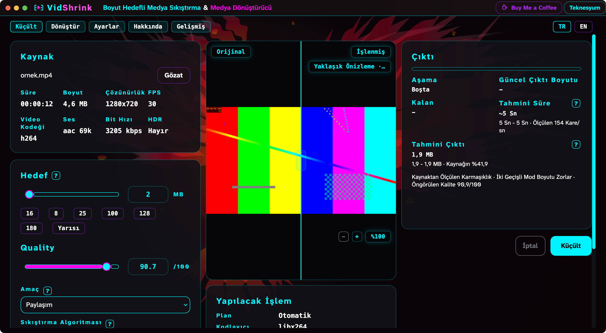
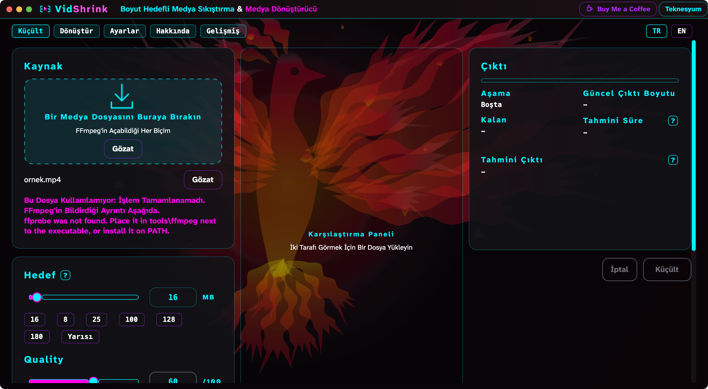
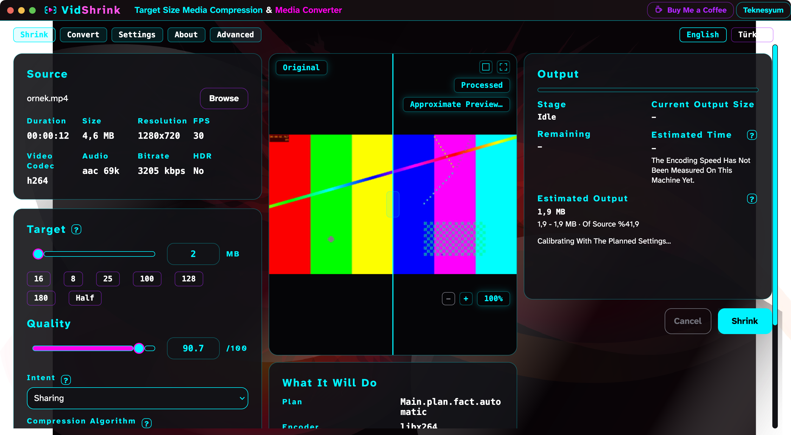

# macOS ilk koşum — teşhis, düzeltme, öneri

Tarih: 2026-08-30 · Makine: Apple Silicon (arm64), macOS 26.5 (25F84) ·
ffmpeg 9.0.1 (Homebrew) · .NET SDK 8.0.424 · Ölçülen sürümler: `main` (67d8b13) ve
yayınlanmış `v0.2.4`

Makinede .NET SDK kurulu değildi; ölçüm için `~/.dotnet` altına 8.0.424 kuruldu.

## Adım 1 — beş soru

### 1. Uygulama açılıyor mu?

**Hayır. Bugüne kadar hiç açılmadı.** Süreç `exec` anında öldürülüyor:

```
$ ./VidShrink.App
$ echo $?
137
```

137 = 128+9, yani SIGKILL. Çıktı yok, pencere yok, süre 0,007 sn — uygulama kodu hiç
çalışmıyor. Çekirdek günlüğü sebebi yazıyor:

```
kernel (AppleMobileFileIntegrity) AMFI: '.../VidShrink.App' is adhoc signed.
amfid  .../VidShrink.App not valid: Error Domain=AppleMobileFileIntegrityError Code=-423
       "The file is adhoc signed or signed by an unknown certificate chain"
kernel (AppleSystemPolicy) ASP: Security policy would not allow process: 5961, .../VidShrink.App
```

Sebep imza değil, **ad**. macOS adı `.app` ile biten bir dosyayı paket sayıyor ve
noterlenmemiş olanı çalıştırmayı reddediyor. Yalıtılmış deneme — aynı ikili, dört ad:

| Dosya adı | Sonuç |
|---|---|
| `h` | çalıştı (çıkış 42) |
| `h.App` | **öldürüldü (137)** |
| `h.app` | **öldürüldü (137)** |
| `h.zApp` | çalıştı (çıkış 42) |

`VidShrink.App` adı `<AssemblyName>` değerinden geliyor; Windows'ta sonuna `.exe`
eklendiği için sorun görünmüyor, macOS'ta ad olduğu gibi kalıyor.

Yayınlanmış pakette de aynısı:

```
$ unzip vidshrink-osx-arm64.zip && ./VidShrink.App      -> 137
$ cp VidShrink.App VidShrink && ./VidShrink             -> açılıyor
```

Sembolik bağ kurtarmıyor: çekirdek hedefin adına bakıyor. `install-vidshrink.sh`
`~/.local/bin/vidshrink` bağını `VidShrink.App`'e kuruyordu, o yüzden kurulum da
başlamıyordu.

### 2. Gatekeeper ne diyor?

Paket imzalı ama noterlenmemiş. SDK her iki yayında da ad-hoc imza atmış:

```
$ codesign --verify --verbose=2 VidShrink
VidShrink: valid on disk
VidShrink: satisfies its Designated Requirement

$ spctl -a -vvv -t exec VidShrink
VidShrink: rejected            # noterleme yok
syspolicyd: rejecting due to lack of matching active rule
```

Karantina bu yolda hiç devreye girmiyor: yayın arşivi `curl` ile iniyor ve `unzip`
karantina özniteliği yazmıyor. Elle karantina konmuş düz bir ikili bile kabuktan
çalışıyor — karantina kapısı `exec` değil, Finder/LaunchServices kapısı.

**Kullanıcının gördüğü şey bir uyarı değil, sessizlik.** Ne pencere ne diyalog çıkıyor;
süreç ölüyor, kabuk çıkış kodu 137 veriyor. Teşhis edilmesi en zor hâl bu.

Bir `.app` paketi denendiğinde: ad-hoc imzalı, karantinasız paket `open` ile açılıyor;
karantinalı paket açılıyor ama **App Translocation**'a giriyor, yani
`/var/folders/.../AppTranslocation/` altına salt-okunur bağlanıyor.

### 3. Pencere çiziliyorsa

Çiziliyor ve büyük ölçüde doğru.



- Gömülü Atkinson Hyperlegible düşmüyor.
- Türkçe harfler doğru: Küçült, Dönüştür, Karşılaştırma, Sıkıştırma, Yapılacak İşlem,
  Aşama, Çıktı, Paylaşım.
- `MainWindow` içindeki macOS dalı çalışıyor: sistem trafik ışıkları görünüyor,
  uygulamanın kendi pencere düğmeleri gizleniyor, başlık çubuğu içeriden kaydırılıyor.
- Kaynak yoklama, önizleme kareleri ve plan hesabı ekranda doğru çıkıyor.

Kozmetik farklar — **düzeltilmedi, listeleniyor** (ikisi de bu paketin dosyaları değil):

1. Menü çubuğunda uygulama adı **"Avalonia Application"** yazıyor. Sebep: `.app`
   paketi ve `Info.plist` yok, düz bir Unix ikilisi çalışıyor. Dock kimliği de yok.
2. `main` üzerinde pencere **saydam**. Pencerenin kendi tamponu ölçüldü:

   | Yayın | Alfa en düşük | Saydam piksel oranı |
   |---|---|---|
   | `v0.2.4` | 145 | %0,0 |
   | `main` (67d8b13) | 0 | **%10,4** |

   `MainWindow.axaml` `Background="Transparent"` ve
   `TransparencyLevelHint="Transparent"` veriyor; arkadaki `WorkspaceBackground`
   fırçası pencerenin tamamını örtmüyor ve arkadaki pencereler görünüyor.
3. `main` üzerinde ilk sekmenin yazısı boş çıkıyor ve plan satırı çevrilmiş metin
   yerine ham anahtar basıyor (`Main.plan.fact.automatic`); arayüz İngilizce ile
   Türkçe arasında karışık. Bunlar paralel yürüyen yerelleştirme birleştirmesinden.

### 4. ffmpeg bulunuyor mu?

**Terminalden açılınca evet, Finder'dan açılınca hayır.** Finder'dan açılan bir
uygulamanın `PATH`'i `/usr/bin:/bin:/usr/sbin:/sbin` ile sınırlı; Homebrew'un
`/opt/homebrew/bin` dizini orada yok. `ToolLocator` yalnız `PATH`e ve uygulama
klasörüne bakıyordu, ikisinde de bulamayınca dosya yüklenemiyordu:



> Bu Dosya Kullanılamıyor: İşlem Tamamlanamadı.
> ffprobe was not found. Place it in tools\ffmpeg next to the executable, or install it on PATH.

Kullanıcıya verilen tek yönerge de yanlış ayraçla yazılıyordu (`tools\ffmpeg`).

### 5. Küçültme yürüyor mu?

Motor macOS'ta uçtan uca çalışıyor. Tam `PATH` ile arayüz kaynağı yokladı
(00:00:12, 4,6 MB, 1280x720@30, h264, aac 69k, 3205 kbps), iki taraflı önizleme
kareleri çizdi ve planı kurdu (hedef 2 MB, tahmin 1,9 MB, kalite 90,7/100,
ölçülen 154 kare/sn).

Gerçek kodlama `tools/VidShrink.Bench` ile koşuldu:

```
2 MB -> 1,92 MB (95,8%), bant=ic tasma=yok taban=ok, 794x446@30,
libx264/2pass, 1266k, kalibre=evet, plan=3,3s, sure=2,2s
```

Arayüzdeki `Küçült` düğmesine tıklama ölçüme katılmadı: terminale Erişilebilirlik
izni verilmediği için sentetik tıklama gönderilemiyor. Düğmenin çağırdığı yol
(`PlanCalculator` + `EncodeRunner`) yukarıdaki Bench koşusuyla aynı koddur.

## Adım 2 — düzeltilenler

Yalnız açılışı ya da iş yapmayı engelleyen iki şey düzeltildi.

**1. Yayın ikilisinin adı.** `VidShrink.App.csproj` içine yayın sonrası bir hedef
eklendi; yalnız `osx` ile başlayan çalışma zamanı kimliklerinde yerel başlatıcıyı
`VidShrink` adına taşıyor. `<AssemblyName>` değişmedi — `VidShrink.App.dll` ve
`avares://VidShrink.App/...` kaynak adresleri ona bağlı; yerel başlatıcı beklediği
derleme adını kendi içinde taşıdığı için yeniden adlandırma onu bozmuyor.

`install-vidshrink.sh` artık önce `VidShrink`, yoksa `VidShrink.App` arıyor; böylece
Linux paketi ve eski yayınlar da kurulmayı sürdürüyor.

**2. ffmpeg'in bulunması.** `ToolLocator`, `PATH`te bulamazsa macOS'ta paket
yöneticilerinin standart dizinlerine bakıyor: `/opt/homebrew/bin`, `/usr/local/bin`,
`/opt/local/bin`. Bulunamayınca basılan yönergedeki ayraç da artık platforma göre
yazılıyor.

Düzeltmelerden sonra, Finder'ın verdiği dar `PATH` ile:



### Düzeltilemeyen

`dotnet test -c Release` macOS'ta tamamlanamıyor. `tests/VidShrink.Tests/AppHost.cs`
Avalonia'yı sabit `UseWin32()` ile kuruyor ve koşu ilk arayüz ölçümünde
`kernel32.dll` bulunamadığı için tüm ana işlemi düşürüyor:

```
Etkin test çalıştırması iptal edildi. Nedeni: Test ana işlemi kilitlendi :
System.TypeInitializationException: ... 'Avalonia.Win32.Win32Platform'
   at VidShrink.Tests.AppHost...Ensure...b__0() in .../AppHost.cs:line 37
```

Bu, bu paketteki değişikliklerden gelmiyor: değişiklikler bir yana konup temiz ağaçta
koşulduğunda aynı yerde aynı biçimde duruyor. `UseWin32()` yerine platform seçimi
konarak da çözülmüyor — Avalonia Native, AppKit'in ana iş parçacığı kuralı yüzünden
`AppHost`'un kendi iş parçacığında kurulamıyor ve `Call from invalid thread` ile
düşüyor. `AppHost` bu paketin dosyası değil ve `release.yml` zaten kapıyı Windows'ta
koşuyor. macOS'ta arayüze dokunmayan ölçümler yeşil geçiyor (168–193 arası; koşunun
nerede düştüğüne göre değişiyor), bu paketin eklediği beş ölçüm de yeşil.

## Adım 3 — iki karar için ölçüm

### 1. macOS kurulum yolu

| Yol | İmza | Noterleme | Kullanıcıya maliyeti |
|---|---|---|---|
| Düz `install.sh` (bugünkü) | SDK'nın ad-hoc imzası yeter | Gerekmiyor | Terminalde tek komut. `curl`+`unzip` karantina koymaz, Gatekeeper hiç devreye girmez. Dock kimliği, çift tık, Finder bütünleşmesi yok. |
| İndirilen `.app` paketi (zip/dmg) | Developer ID Application sertifikası | **Gerekir** | Notersiz: "Apple doğrulayamadı" diyaloğu, Sistem Ayarları > Gizlilik ve Güvenlik'ten elle izin, üstüne App Translocation. Noterliyse çift tık ve temiz açılış. |
| Homebrew | Cask ise `.app`in koşulları aynen; formula ise ad-hoc yeter | Cask'ta pratikte gerekir | `brew install` ve `brew upgrade` ile güncelleme. Karşılığında Homebrew'un depo kuralları ve sürüm bağlı URL zorunluluğu. |

Noterleme için Apple Developer Program üyeliği gerekiyor: yılda 99 ABD doları, üstüne
CI'da `notarytool` ve `stapler` adımı.

**Öneri:** Bugünkü `install-vidshrink.sh` korunsun ama indirdiği düz yayını yerelde bir
`~/Applications/VidShrink.app` paketine sarıp ad-hoc imzalasın — yerelde üretilen paket
karantina almadığı için tek kuruş ödemeden ve noterlemeden açılıyor (ölçüldü), kullanıcı
da gerçek bir Mac uygulaması, Dock kimliği ve doğru menü adı kazanıyor; noterlenmiş
`.dmg` ya da Homebrew cask'ı ancak tarayıcıdan çift tıkla dağıtım istendiğinde,
99 dolar/yıl karşılığı gündeme gelsin.

### 2. macOS'ta kendini güncelleme

Windows'taki yol çalışan ikiliyi yan ada indirip çıkışta tek bir atomik `File.Move` ile
değiştiriyor. macOS'ta karşılıkları ölçüldü:

- **Çalışan ikilinin üstüne yazmak** dosya sistemince serbest, ama imzalı bir ikilide
  çekirdek sayfaları geç doğruladığı için çalışan süreç değişmiş bir sayfaya
  dokunduğunda öldürülüyor. Bu yol kullanılamaz.
- **`rename` ile değiştirmek** çalışıyor: çalışan süreç eski düğümünü tutmayı sürdürdü,
  ayakta kaldı, yeni ikili sonraki açılışta çalıştı. Düz yayın düzeninde Windows'takinin
  birebir karşılığı bu.
- **Paket imzası dosya bazlı güncellemeye kapalı.** `Contents/` mühürlü:

  ```
  içerideki bir dosya değiştirilince : invalid or unsupported format for signature
  içeriye bir dosya eklenince        : a sealed resource is missing or invalid
  ```

  Mührü bozulan paket açılmıyor; çekirdek yine
  `ASP: Security policy would not allow process` ile öldürüyor. Yani manifestteki
  dosya farkını uygulayan bugünkü güncelleyici bir `.app` üzerinde çalışamaz.
- Tarayıcıdan inmiş bir paket ayrıca App Translocation'a giriyor ve salt-okunur
  bağlandığı için kendi paketine hiç yazamıyor.

**Öneri:** macOS'ta güncellemenin birimi dosya değil, paketin tamamı olmalı. Yeni paket
aynı bölümde geçici bir dizine inip ad-hoc imzalanmalı, sonra dizin takası tek adımda
yapılmalı; `rename(2)` dolu bir hedefin üstüne geçmediği için .NET'in `Directory.Move`'u
iki adıma bölünüyor ve arada çökme uygulamayı yok ediyor — güvenli olanı `renamex_np`'yi
`RENAME_SWAP` ile P/Invoke etmek. Bu yapılana kadar `UpdateCheck.CanSelfUpdate`
macOS'ta kapalı kalmalı; bugünkü hâli doğru ve bu pakette değiştirilmedi.
