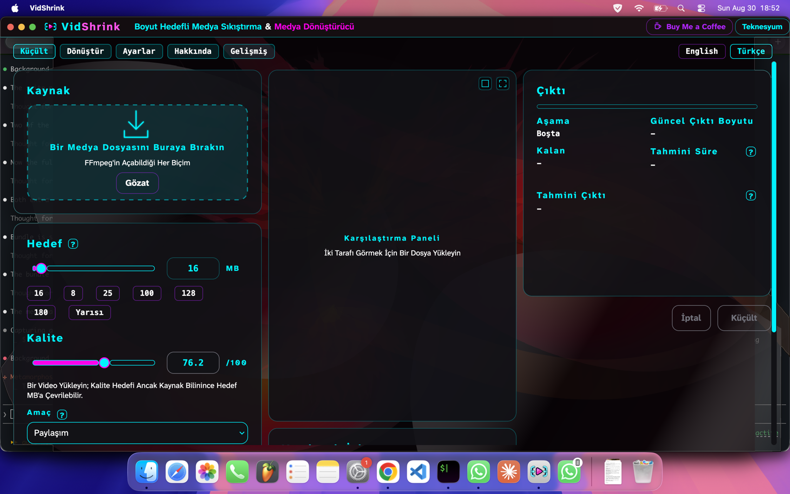

# macOS paketi — ölçüm süiti, `.app` kurulumu, kendini güncelleme yolu

Tarih: 2026-08-30 · Makine: Apple Silicon (arm64), macOS 26.5 (25F84) ·
ffmpeg 9.0.1 (Homebrew) · .NET SDK 8.0.424 · Dal: `serkan/macos-paket`

`docs/macos-ilk-kosum.md`in devamı. O paket uygulamanın macOS'ta hiç açılmadığını bulup
düzeltmişti; bu paket ölçüm süitini Mac'te koşturuyor ve kurulumu gerçek bir uygulama
paketine çeviriyor.

## İş 1 — süit Mac'te koşuyor

### Neden düşüyordu

`AppHost` Avalonia'yı sabit `UseWin32()` ile kuruyordu. macOS'ta `kernel32.dll`
bulunamayınca ilk arayüz ölçümü test ana işlemini düşürüyor, koşu **iptal** oluyordu:
sonuç yok, sayı yok. İlk koşum paketi `UsePlatformDetect()` denemiş, bu kez Avalonia
Native'in AppKit kuralına takılmıştı — pencere sürecin **ana** iş parçacığında kurulmak
zorunda, o iş parçacığı da xUnit koşucusunun elinde.

### Ne yapıldı

Pencere arka ucu platforma göre seçiliyor. Windows'ta yine `UseWin32()`; başka her yerde
Avalonia'nın kendi başsız arka ucu, `UseHeadlessDrawing = false` ile — yani çizimi yine
Skia yapıyor, ölçümler gerçek piksel ve gerçek metin dizgisi görüyor. Başsız arka uç ana
iş parçacığı şartı koymadığı için `AppHost`'un kendi iş parçacığında kuruluyor.

Böylece pencere kuran ölçüler macOS'ta **atlanmıyor, gerçekten koşuyor**. Tek yeni
bağımlılık `Avalonia.Headless` 11.3.20 — Avalonia'nın kendi paketi, uygulamaya değil
yalnız ölçüm projesine giriyor.

Windows dalının değişmediğini bir ölçü tutuyor
(`MacOsStartupTests.TheWindowingBackendIsWin32OnWindowsAndHeadlessElsewhere`): bir
`Window` kurup platform tutamağının tanımlayıcısını okuyor. Win32 bunu `HWND`, başsız
arka uç `STUB` yazıyor. Ölçü betiğe değil kurulmuş çalışma zamanına bakıyor; Windows'ta
hâlâ `HWND` okunuyorsa Windows tarafında hiçbir şey değişmemiş demektir.

### Süit tamamlanınca çıkan üç düşme

Süit ilk kez sonuna kadar koşabildiğinde, arka uçla ilgisi olmayan üç makine bağımlı
düşme ortaya çıktı. Üçü de kökünden düzeltildi; üçünde de Windows'ta koşan dal aynı
kaldı.

1. **`zscale` her ffmpeg'de yok.** `QualityMeter` karşılaştırma zincirini `zscale` ile
   kuruyordu; Homebrew'un ffmpeg 9.0.1'i libzimg olmadan derlendiği için filtre yok ve
   ölçüm `Filter not found` ile düşüyordu. Kod zaten `libvmaf`, `xpsnr`, `ssim` için
   yetenek soruyordu, `zscale` için sormuyordu. Artık soruyor; yoksa `scale`e düşüyor.
   Bu yalnız macOS'un derdi değil — libzimg'siz her ffmpeg'de kalite ölçümü ölüydü.
2. **İşlemci zamanı sayacı yalnız Windows'ta okunuyor.**
   `PerformanceProbe.CalibrateCpuClock` Windows dışında tanımı gereği 0 dönüyor, yani
   hiçbir şey yakmıyor. Ölçüm buna rağmen yakımın 1,5 saniye sürdüğünü iddia ediyordu.
   O iddia artık `OperatingSystem.IsWindows()` dalında.
3. **`h264_nvenc` olmayan makinede nvenc geçişleri.** Aynı ölçüm iki nvenc geçişi
   koşturup çıkış kodu 0 istiyordu; NVIDIA'sız her makinede — her Mac dahil — düşüyordu.
   Geçişler artık kodlayıcı varsa koşuyor, yoksa günlüğe not düşülüyor.

### Sayılar

`dotnet test -c Release` (macOS, arm64):

```
Başarılı!  - Başarısız: 0, Başarılı: 931, Atlanan: 18, Toplam: 949, Süre: 54 m 29 s
```

Koşu **tamamlanıyor**: iptal yok, sıfır başarısız. 949 ölçüden 931'i koştu, 18'i atlandı.
Bu paketten önce aynı makinede süit hiç sonuna varmıyordu; `main` üstünde koşturulduğunda
bu makine 944 ölçü buluyor, paketin eklediği beş ölçüyle 949 oluyor. (Görev paketindeki
939 sayısı Windows'ta daha eski bir taahhütte ölçülmüş; arada birleşen ölçüler var.)

Atlanan ölçülerin hiçbiri arayüzle ilgili değil; hepsi bu makinede bulunmayan bir
donanıma ya da açıkça istenmesi gereken canlı kodlamaya bağlı ve **bu paketten önce de
atlanıyordu**:

| Kaç | Neden atlandı |
|---|---|
| 9 | `VIDSHRINK_LIVE_SOURCE` bir dosyayı göstermiyor — canlı kaynakla kodlama istenmedi (`CalibrationProbeTests` 3, `ExtremeCompressionTests` 3, `PlaybackFrameSourceTests` 2, `FillBandTests` 1) |
| 5 | `VIDSHRINK_LIVE_PROBE` verilmedi — gerçek donanım yoklaması istenmedi (`HardwareVerdictTests` 2, `HardwareRateControlTests` 2, `HardwareFlagTests` 1) |
| 3 | `VIDSHRINK_LAUNCHER_EXE` bir dosyayı göstermiyor — Windows başlatıcısı yok (`UpdaterTests`) |
| 1 | Bu ffmpeg derlemesinde `zscale`/`tonemap` yok (`FrameGrabberTests` HDR ton eşlemesi) |

Windows'ta atlanan 17 ile aradaki tek fark sondaki satır: aynı libzimg boşluğu. Bu
atlama zaten depoda vardı ve gerekçesi somut; bu paket eklemedi.

Windows'ta atlanan sayısı artmıyor. Bu paketin eklediği beş ölçünün hiçbirinde `Skip`
yok: macOS'a özgü olanlar Windows'ta erken dönüp **geçiyor**, atlanmıyor — depodaki
`MacOsStartupTests` deseninin aynısı. Değiştirilen üç ölçümün Windows dalları da olduğu
gibi duruyor: `zscale` Windows koşucusunda var, sayaç orada okunuyor, nvenc orada
mevcut.

## İş 2 — `~/Applications/VidShrink.app`

`install-vidshrink.sh` macOS'ta indirdiğini bir uygulama paketine sarıyor ve ad-hoc
imzalıyor. Sarma işi `macos-app-bundle.sh`ta; betik **yayın arşivinin içinden** geliyor,
yani sağlaması doğrulanmış kodla koşuyor ve sardığı yayınla her zaman aynı sürümden.

Paketin içi düz kurulumun kendisi: yük `Contents/MacOS/` altında, ana çalıştırılabilirin
adı her zaman `VidShrink`. macOS'ta artık `~/.local/share/vidshrink` kullanılmıyor —
yükü hem orada hem paket içinde tutmak yayını iki kez saklamak olurdu. `~/.local/bin/vidshrink`
kısayolu paketin içini gösteriyor. Windows ve Linux yolları değişmedi.



### 1. Paket açılıyor, kimliği doğru

```
$ open ~/Applications/VidShrink.app
$ pgrep -fl VidShrink.app
25817 /Users/serkan/Applications/VidShrink.app/Contents/MacOS/VidShrink

$ lsappinfo info -only name <pid>
"LSDisplayName"="VidShrink"
```

Menü çubuğunda **VidShrink** yazıyor, Dock'ta kendi adı ve kendi simgesiyle duruyor.

**Bir önceki paketin teşhisi bu noktada yanlıştı.** Menü çubuğundaki
"Avalonia Application" `.app` paketinin ya da `Info.plist`in yokluğundan gelmiyordu:
`CFBundleName=VidShrink` taşıyan, imzalı, LaunchServices'a kayıtlı bir paketle bile
"Avalonia Application" yazmayı sürdürdü. Ad `Application.Name`den geliyor; `App.axaml`e
`Name="VidShrink"` konunca menü çubuğu düzeldi. Dize uygulamanın hiçbir ikilisinde
geçmiyor, macOS onu çalışma anında uygulamadan alıyor.

### 2. Sürüm tek yerden

`Info.plist`in iki sürüm alanı da kurulum betiğinin yayın etiketinden okuduğu sürümü
alıyor; `release.yml` de etiketi `Directory.Build.props`taki `<Version>` ile eşitliyor.
Betikte sabit yazılı sürüm yok.

```
$ plutil -p ~/Applications/VidShrink.app/Contents/Info.plist
  "CFBundleShortVersionString" => "0.2.4"
  "CFBundleVersion" => "0.2.4"
```

`MacOsBundleTests.TheBundleCarriesTheVersionTheTreeDeclares` zincirin paketleyici ucunu
tutuyor: `Directory.Build.props`taki sürümü okuyor, paketleme betiğini gerçekten
koşturuyor ve üretilen `Info.plist`in iki alanını da o sürümle karşılaştırıyor.

### 3. Simge

Depoda macOS için `.icns` yoktu ve dışarıdan görsel getirilmedi. Uygulamanın kendi
simgesi depoda var — `src/VidShrink.App/Assets/VidShrink.png`, 1254x1254 RGBA — ve paket
simgesi ondan üretiliyor: `sips` on boy çıkarıyor, `iconutil` `.icns`e çeviriyor. İkisi
de her macOS'ta kurulu, yeni bir araç gerekmiyor.

Görsel bugün derlemeye `AvaloniaResource` olarak gömülü; paketleyici derlemenin içini
açamayacağı için `VidShrink.App.csproj` onu macOS yayınlarının yanına düz dosya olarak da
kopyalıyor. Görselin bulunmadığı bir yayında paket simgesiz kalıyor, kurulum durmuyor —
`v0.2.4` arşivinde olduğu gibi.

### 4. Kaldırma

```
$ sh install-vidshrink.sh --uninstall
Silindi:
/Users/serkan/Applications/VidShrink.app
/Users/serkan/.local/share/vidshrink
/Users/serkan/.local/bin/vidshrink

$ ls ~/Applications
Chrome Apps.localized
Claude Code URL Handler.app
```

Üç iz birlikte gidiyor: paket, düz kurulum dizini, kısayol. Kısayol yalnız bu ikisinden
birini gösteriyorsa siliniyor; kullanıcının kendi koyduğu bir `vidshrink` başka bir yeri
gösteriyorsa ona dokunulmuyor. `~/Applications` altında VidShrink izi kalmıyor; dizinin
kendisi ve içindeki başka uygulamalar duruyor.
`MacOsBundleTests.UninstallLeavesNothingBehind` bunu kendi `HOME`unda koşturarak
doğruluyor.

### 5. Karantina

`curl` hiçbir adımda karantina özniteliği yazmıyor. Uçtan uca ölçüldü:

```
$ curl -fsSL .../serkan/macos-paket/install-vidshrink.sh -o kurulum.sh
$ xattr -p com.apple.quarantine kurulum.sh
xattr: kurulum.sh: No such xattr: com.apple.quarantine

$ curl -fsSL .../releases/download/v0.2.4/vidshrink-osx-arm64.zip -o r.zip
$ xattr -p com.apple.quarantine r.zip
xattr: r.zip: No such xattr: com.apple.quarantine

$ sh kurulum.sh
...
VidShrink 0.2.4 kuruldu: /Users/serkan/.local/share/vidshrink

$ xattr -p com.apple.quarantine ~/.local/share/vidshrink/VidShrink.App
xattr: ...: No such xattr: com.apple.quarantine
```

O çekilmiş yükten üretilen paket de karantinasız ve imzası geçerli:

```
$ sh macos-app-bundle.sh ~/.local/share/vidshrink VidShrink.App 0.2.4 <hedef>
$ xattr -p com.apple.quarantine <hedef>/VidShrink.app
xattr: ...: No such xattr: com.apple.quarantine
$ codesign --verify <hedef>/VidShrink.app   -> geçerli
$ ls <hedef>/VidShrink.app/Contents/MacOS/VidShrink   -> var
```

Son satır ikinci bir şeyi daha gösteriyor: `v0.2.4` yükünün başlatıcısı hâlâ eski
`VidShrink.App` adını taşıyor ve paketleyici onu `VidShrink` adına taşıyor. Adı `.app`
ile biten dosyayı çekirdek paket sanıp öldürdüğü için bu şart;
`MacOsBundleTests.TheBundleRenamesAnOldReleaseLauncher` tutuyor.

**Uçtan uca koşumun bugün gördüğü sınır.** Yukarıdaki `curl | sh` gerçek koşumdur ve
`v0.2.4`e karşı yapılmıştır; o arşiv paketleme betiğini taşımadığı için kurulum
tasarlandığı gibi düz kuruluma düşmüş ve nedenini söylemiştir
("Bu yayın paketleme betiğini taşımıyor; uygulama paketi olmadan kuruldu"). Paket yolunun
tamamı ancak betiği taşıyan ilk yayından sonra tek komutla koşabilir. Bu paketteki paket
ölçümleri bu yüzden iki parçadan: `curl` ile inen, sağlaması doğrulanmış yükün üstünde
kurulumun çağırdığı **birebir aynı** komut satırı (yukarıda), ve bir sonraki yayının
biçimindeki yerel yayın çıktısı (ekran görüntüsü, simge, sürüm alanları).

### 6. Windows ve Linux

Linux yolu değişmedi: paketleme betiği yalnız `Darwin`de çağrılıyor, geri kalan akış
aynı. Windows kurucusuna hiç dokunulmadı;
`MacOsBundleTests.TheWindowsInstallerStartsWithoutAByteOrderMark` `Install-VidShrink.ps1`in
ilk üç baytını okuyup `70 61 72` olduğunu doğruluyor — bayt sırası işareti `irm | iex`
yolunu kırıyor.

## İş 3 — macOS'ta kendini güncelleme (yalnız tasarım, kod yazılmadı)

İlk koşum paketinin ölçtüğü iki gerçek bu yolu belirliyor: paket imzası `Contents/`i
mühürlüyor, mühürden sonra içeriden bir dosya değişir ya da eklenirse paket hiç
açılmıyor; ve `rename` ile değiştirme çalışıyor, çalışan süreç eski düğümünü tutmayı
sürdürüyor. Yani **güncellemenin birimi dosya değil, paketin tamamı**; bugünkü
manifest tabanlı dosya farkı bir `.app` üzerinde çalışamaz.

### Adım adım

1. **Kapı.** `UpdateCheck.CanSelfUpdate` macOS'ta yalnız dördü birden sağlanınca açılır:
   çalışan ikili bir `.app` paketinin `Contents/MacOS/` dizini altındadır; paketin kökü
   bu kullanıcı için yazılabilirdir; paket **App Translocation** altında değildir
   (çözülmüş yol `/var/folders/.../AppTranslocation/` ile başlıyorsa uygulama kendi
   paketine yazamaz — bizim kurduğumuz paket karantinasız olduğu için oraya girmez, ama
   kullanıcı tarayıcıdan inmiş bir kopyayı sürüklemişse girer); ve `codesign` makinede
   bulunur, çünkü inen paket yeniden ad-hoc imzalanacaktır.

2. **İndirme.** Yeni sürümün arşivinin **tamamı** ve `checksums-<rid>.txt` inilir, sha256
   açmadan önce doğrulanır. Dosya farkı yok: mühür yüzünden parça güncelleme mümkün değil.

3. **Hazırlama.** Arşiv paketin **yanına**, `~/Applications/.vidshrink-update/` altına
   açılır — aynı dizin, dolayısıyla garantili aynı birim; `renamex_np` birim geçemez.
   Orada kurulumun çağırdığı paketleme adımı koşar ve paket ad-hoc imzalanır. Sonuç
   `codesign --verify` ile doğrulanır. Bu adımların herhangi biri düşerse hazırlama
   dizini silinir ve durulur: **kurulu pakete bu ana kadar hiç dokunulmamıştır.**

4. **Takas.** Çıkışta — Windows'taki gibi, uygulama kapanırken — tek bir çağrı:
   `renamex_np(hazırlanan, kurulu, RENAME_SWAP)`. İki yol ya birlikte yer değiştirir ya
   hiçbiri; çekirdekte arada bir hâl yoktur. .NET'in `Directory.Move`u burada
   kullanılamaz: dolu bir hedefin üstüne geçmediği için iki adıma bölünür ve arada çökme
   uygulamayı yok eder.

5. **Eskisinin silinmesi.** Takas 0 döndükten **sonra** `~/Applications/.vidshrink-update`
   silinir. Silme başlatmada da yapılır ve koşulsuzdur: orada ne bulunursa bulunsun
   (yarım hazırlanmış yeni paket ya da takastan artan eski paket) çalışan paket o değildir.
   Tek kural iki çökme penceresini birden kapatıyor.

### Yarım kalırsa ne olur

| Nerede kesilirse | Sonuç |
|---|---|
| İndirme ya da hazırlama sırasında | Kurulu paket el değmemiş. Artık dizin bir sonraki açılışta silinir. |
| Takas anında | `RENAME_SWAP` atomik: ya eski yerinde ya yeni yerinde. Yarım hâl yok. |
| Takastan sonra, silmeden önce | Uygulama zaten yeni sürüm. Eski kopya bir sonraki açılışa kadar disk yer kaplar. |

Çalışan süreç bunların hepsinde ayakta kalır: açtığı düğümleri tutmayı sürdürür ve takas
sonrasında bile eski paketten koşar. Yeni sürüm **bir sonraki açılışta** devreye girer;
bu yüzden takas, paketten kod yüklemenin bittiği ana — çıkışa — konur.

Bu yol yazılana kadar `CanSelfUpdate` macOS'ta kapalı kalmalı ve güncelleme
`install-vidshrink.sh`in yeniden çalıştırılmasıyla olmalı; kurulum betiği bunu zaten
söylüyor. Windows'un başlatıcısının macOS'ta karşılığı yok: takas dosya dosya bir uygulama
değil, tek bir dizin çağrısı olduğu için araya ayrı bir süreç girmesi gerekmiyor.

## Bu paketin dokunmadıkları

- Pencerenin saydamlığı ve arka planın sızması (ekran görüntüsünde görünüyor) bu paketin
  dosyalarında değil; `MainWindow.*` başkasının.
- README'de `--uninstall` anlatılmıyor. Kurulum bitince betik satırı basıyor
  ("Kaldırmak için: --uninstall"), ama README bu paketin dosyası değil.
