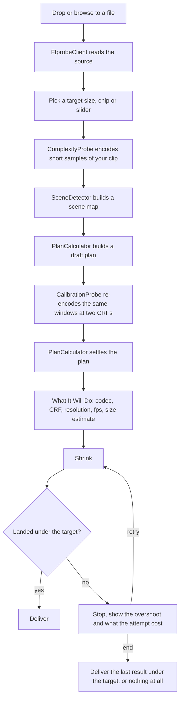
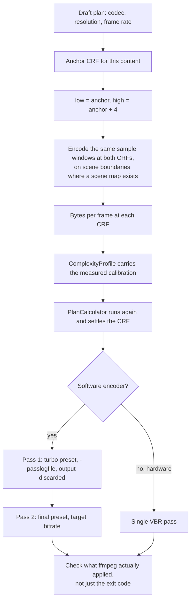

# The Engine

How VidShrink decides what to encode, and what that decision has been measured to be worth.
This is the long version of the *Under The Hood* section of the [README](../README.md).

## How it works

Nothing here is a lookup table. Every step that says *measure* runs ffmpeg against your
actual file before a decision is made.

### Why measurement beats a table

Most size-target compressors apply a lookup table: so many megabytes per minute becomes so
much resolution, whether you handed it a static screen recording or a handheld night shot.
That table is wrong for every clip that is not average, which is most clips.

Two numbers come off the sample encodes. The first is how many bits this content really
costs — a gradient and a confetti cannon at the same 1080p30 are not the same encoding
problem, and the source bitrate does not tell you which one you have.

The second is how much of that cost disappears when the picture is scaled down. On
measurements taken during development, one test clip lost 87% of its per-pixel cost when
halved; another lost 22%. A fixed assumption is wrong for both.

| | Typical size-target tool | VidShrink |
|---|---|---|
| Content complexity | inferred from source bitrate | measured by encoding samples of your file |
| Detail falloff on downscale | fixed assumption, or ignored | measured per clip at two resolutions |
| Resolution choice | fixed ladder, 1080 to 720 to 480 | continuous search, any scale that fits |
| Frame rate choice | applied after resolution, if at all | searched jointly with resolution |
| Codec choice | whatever you picked | can follow how hard the target actually is |
| Audio budget | fixed bitrate | share that shrinks as the target tightens |
| Size estimate | often none for quality mode | measured number with a stated range, up front |
| Overshoot handling | retry loop | plan lands in one pass; retry is the fallback |

### Calibration and the two passes

The engine does not assume how the bit cost moves when the CRF moves. It encodes the same
sample windows twice, four CRF steps apart, and reads the curve off the two results.

Two details that are easy to get wrong. The first pass runs at a turbo preset, so the
analysis does not cost as much as the encode. And ffmpeg returns `0` while silently
dropping a parameter it did not understand, so success is checked against what was applied
rather than against the exit code.

### It knows when to stop

Filling the target is not the goal, hitting the quality ceiling is. Once more bits stop
buying anything a viewer could see, VidShrink hands back a smaller file rather than padding
it out to the number you typed. Ask for 25 MB on an easy clip and you may get 9 MB that
looks identical to the source.

The reverse also holds. When the target genuinely constrains quality, the whole budget gets
spent rather than a third of it going unused.

### It adapts to how hard you are pushing

`CompressionRegime` has four values, and the reduction ratio picks one.

| Regime | Reduction | Engine behaviour |
|---|---|---|
| Light | under 1.5× | keeps resolution and frame rate, simply spends the budget |
| Balanced | 1.5–6× | allows resolution scaling |
| Aggressive | 6–30× | unlocks frame-rate reduction, moves to H.265, trims audio share |
| Extreme | over 30× | maximum compression, mono audio, and it says so |

Below a certain bit budget something has to give, and the loss goes where the eye is least
sensitive: softness before blocking, fewer pixels before broken pixels, mono audio before a
starved picture. No target, however tight, silences the audio track.

### HDR stays HDR when it can

An HDR source keeps its wide colour and its ten bits whenever the encoder that will run can
actually write them. Which encoders those are is not a list of names in the source code:
the application encodes a frame with each candidate on your machine and keeps the ones that
come back as genuine 10-bit HDR.

When nothing available can carry it, the picture is tone-mapped down to SDR rather than
failing, and the app says that this is what happened. Tone-mapping is a visible loss and is
never silent.

### Quality is measured perceptually, or not at all

Results are scored with **VMAF-NEG**, **XPSNR** and **SSIM**, and reported as four VMAF
numbers rather than one: mean, harmonic mean, 10th percentile and minimum. The average
hides the frames that actually look bad, and those are the frames a viewer notices.

Comparing two files means bringing both into one explicitly stated colour space and range
first. Where the two sides cannot honestly be brought together — an HDR original against a
tone-mapped result — the comparison returns *not comparable* instead of a number.

Be clear about where this sits today. Perceptual scoring is the measurement rig, not the
planner: the engine plans from the two bit-cost measurements above, and VMAF is what the
plan is judged by afterwards, in `tools/VidShrink.Bench`.

### Measured Results

Source: [`docs/olcumler/bench-2026-09-13.md`](olcumler/bench-2026-09-13.md) — 36 cases,
three 1080p30 clips (high detail, high motion, heavy noise) × three targets × a software
and a hardware arm × two repeats. Machine: AMD Ryzen 7 9700X, 64 GB, RTX 5070 Ti, ffmpeg
9.0-full (gyan.dev). The earlier table in `motor-dogrulama-raporu.md` was measured on the
0.1.0 engine and is marked stale there; do not mix the two.

| Gate | Result |
|---|---|
| Over target | **0 / 36** — the ceiling was never crossed |
| Inside the fill band | 31 / 36 |
| Hard-floor violation | 1 / 36 |
| Calibration held | 36 / 36 |
| Mode chosen | 36 / 36 two-pass; single-pass CRF never won |
| Encoder chosen | `h264_nvenc` 18, `libsvtav1` 12, `libx264` 6 |

All five band misses and the one hard-floor violation (6.68 MB against a 6.80 MB floor) are
`libsvtav1`: `libx264` was 6/6 in band and `h264_nvenc` 18/18. Run-to-run drift collects in
the same branch — up to 2.484 MB and 73.5 s — because the same input takes a different
number of correction rounds on different runs. The hardware arm was bit-identical across
repeats in 18/18 cases.

Hardware encoding is behind software at small targets: the peak rate is pinned to a fixed
multiple of the source regardless of target size, so a tight target can need a second
attempt. The fix is on the roadmap; no hardware landing table is published here until it
has been re-measured on the current engine.

### Where VidShrink Still Loses

Source: [`docs/olcumler/handbrake-acigi.md`](olcumler/handbrake-acigi.md), 2026-09-01, real
17-minute 1080p60 HDR source, equal delivered size within ±2%. Only the figures that
document's own stamp does **not** mark as suspect are repeated here — mean VMAF-NEG, XPSNR,
SSIM, size and duration. The harmonic and p10 columns of that report were measured before
the frame lock landed and are not quoted.

| | HandBrake (x265, slow, ABR) | VidShrink, old engine | Gap |
|---|---|---|---|
| VMAF-NEG, mean | 48.96 | 40.17 | **8.79** |
| XPSNR | — | — | **2.60 dB** |
| SSIM | — | — | **0.0299** |

The gap is attributed to psycho-visual encoder settings: HandBrake's x265 preset runs
psy-rd, psy-rdoq and adaptive quantisation, and VidShrink's arguments carry no equivalent
yet. HDR→SDR colour loss is held separate and is never folded into these numbers.

### Current Limits

- **No HDR10+ passthrough; Dolby Vision only for profile 8.1.** A Dolby Vision 8.1 source
  keeps its RPU through libx265 and SVT-AV1 (`-dolbyvision 1`, plus `-strict unofficial`
  in MP4/MOV). HDR10+, other Dolby Vision profiles, hardware encoders and a colour-matrix
  conversion all fall back to static HDR10, and the plan says so in its reason line.
- **No right-click menu on macOS or Linux.** Windows only, and nothing equivalent is
  installed elsewhere.
- **No FFmpeg or libmpv in the box.** The installers fetch them (WinGet, or a pinned and
  hash-checked download) or tell you your package manager's command; releases do not carry
  them.
- **No perceptual planner yet.** VMAF judges the plan afterwards in the bench harness; it
  does not yet set the planner's constants. See the roadmap.
- **No hardware win at small targets yet.** `av1_amf` still needs a second attempt at the
  tightest targets; see *Measured results* above.
- **No telemetry, no account, no paid tier.** There is nothing to sign up for.

