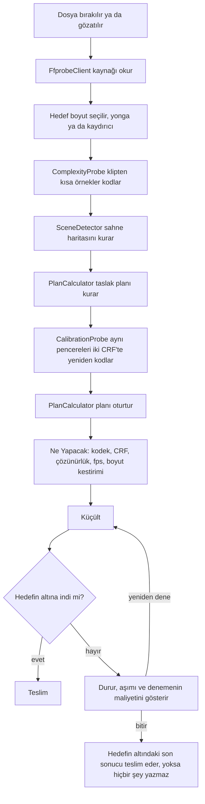
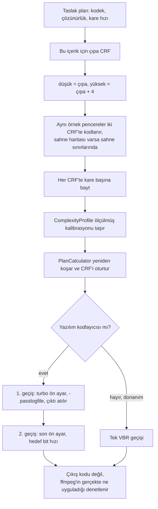

# Motor

VidShrink neyin nasıl kodlanacağına nasıl karar veriyor ve o kararın ölçülmüş değeri ne.
Bu, [README](../README.tr.md) içindeki *Kaputun altında* bölümünün uzun hâli.

## Nasıl çalışıyor

Burada arama tablosu yok. *Ölçüm* diyen her adım, karar verilmeden önce sizin dosyanıza
ffmpeg koşturur.

### Ölçüm neden tablodan iyi

Hedef boyutlu sıkıştırıcıların çoğu arama tablosu uygular: dakikada şu kadar megabayt şu
çözünürlük demektir, elinizdeki duruk bir ekran kaydı da olsa elde çekilmiş gece görüntüsü
de. O tablo, ortalama olmayan her klip için yanlıştır — yani kliplerin çoğu için.

Örnek kodlamalardan iki sayı çıkar. Birincisi bu içeriğin gerçekten kaç bite mal olduğu.
Aynı 1080p30'daki bir renk geçişi ile bir konfeti patlaması aynı kodlama sorunu değildir ve
kaynağın bit hızı hangisiyle karşı karşıya olduğunuzu söylemez.

İkincisi, resim küçültüldüğünde bu maliyetin ne kadarının kaybolduğu. Geliştirme sırasında
alınan ölçümlerde bir deneme klibi yarıya indirilince piksel başına maliyetinin %87'sini
kaybetti; bir başkası %22'sini. Sabit bir varsayım ikisi için de yanlış.

| | Sıradan hedef boyut aracı | VidShrink |
|---|---|---|
| İçerik karmaşıklığı | kaynağın bit hızından çıkarılır | dosyanızdan örnek kodlanarak ölçülür |
| Küçültmede ayrıntı kaybı | sabit varsayım, ya da hiç | klip başına iki çözünürlükte ölçülür |
| Çözünürlük seçimi | sabit merdiven: 1080, 720, 480 | sürekli arama, sığan her ölçek |
| Kare hızı seçimi | varsa çözünürlükten sonra | çözünürlükle birlikte aranır |
| Kodek seçimi | ne seçtiyseniz o | hedefin gerçekte ne kadar zor olduğuna göre |
| Ses bütçesi | sabit bit hızı | hedef daraldıkça küçülen pay |
| Boyut kestirimi | kalite kipinde çoğu zaman yok | aralığıyla birlikte, baştan verilen ölçülmüş sayı |
| Aşım | yeniden deneme döngüsü | plan tek geçişte oturur; deneme yedek çözümdür |

### Kalibrasyon ve iki geçiş

Motor, CRF değişince bit maliyetinin nasıl değiştiğini varsaymaz. Aynı örnek pencereleri
dört CRF adımı arayla iki kez kodlar ve eğriyi bu iki sonuçtan okur.

Yanlış yapılması kolay iki ayrıntı. Birinci geçiş turbo ön ayarda koşar, böylece çözümleme
kodlama kadar pahalıya gelmez. Ve ffmpeg anlamadığı bir parametreyi sessizce yutup yine de
`0` döndürür; bu yüzden başarı, çıkış koduna değil gerçekte uygulanana bakılarak denetlenir.

### Ne zaman duracağını bilir

Amaç hedefi doldurmak değil, kalite tavanına ulaşmak. Fazladan bit izleyicinin görebileceği
bir şey satın almamaya başladığı anda VidShrink dosyayı yazdığınız sayıya kadar şişirmek
yerine daha küçük teslim eder. Kolay bir klipte 25 MB isteyip kaynaktan ayırt edilemeyen
9 MB alabilirsiniz.

Tersi de geçerli. Hedef kaliteyi gerçekten kısıtlıyorsa bütçenin üçte biri boşta kalmaz,
tamamı harcanır.

### Ne kadar zorladığınıza göre davranır

`CompressionRegime` dört değer taşır; küçültme oranı birini seçer.

| Kip | Küçültme | Motorun davranışı |
|---|---|---|
| Hafif | 1,5× altı | çözünürlüğü ve kare hızını korur, yalnızca bütçeyi harcar |
| Dengeli | 1,5–6× | çözünürlük ölçeklemesine izin verir |
| Sert | 6–30× | kare hızı düşürmeyi açar, H.265'e geçer, ses payını kısar |
| Uç | 30× üstü | en yüksek sıkıştırma, tek kanal ses, ve bunu söyler |

Belli bir bit bütçesinin altında bir şeyden vazgeçmek gerekir; kayıp gözün en az duyarlı
olduğu yere yazılır: bozulmadan önce yumuşama, kırık pikselden önce az piksel, aç kalmış
resimden önce tek kanal ses. Hiçbir hedef, ne kadar dar olursa olsun, ses izini susturmaz.

### HDR olabildiğince HDR kalır

HDR kaynak, koşacak kodlayıcı gerçekten yazabiliyorsa geniş rengini ve on bitini korur.
Bunu yapabilen kodlayıcılar kaynak kodda bir ad listesi değildir: uygulama sizin
makinenizde her adayla bir kare kodlar ve gerçekten 10 bit HDR dönenleri tutar.

Elde bunu taşıyabilen hiçbir şey yoksa resim başarısız olmak yerine SDR'ye ton eşlenir ve
uygulama bunun olduğunu söyler. Ton eşleme görünür bir kayıptır ve asla sessiz kalmaz.

### Kalite algısal olarak ölçülür, ya da hiç ölçülmez

Sonuçlar **VMAF-NEG**, **XPSNR** ve **SSIM** ile puanlanır ve tek sayı yerine dört VMAF
sayısıyla bildirilir: ortalama, harmonik ortalama, 10. yüzdelik ve en düşük. Ortalama
gerçekten kötü görünen kareleri gizler; izleyicinin fark ettiği kareler ise tam onlardır.

İki dosyayı karşılaştırmak, ikisini de açıkça belirtilmiş tek bir renk uzayına ve aralığına
getirmek demektir. İki tarafın dürüstçe bir araya getirilemediği yerde — HDR bir özgün
karşısında ton eşlenmiş bir sonuç gibi — karşılaştırma sayı yerine *karşılaştırılamaz*
döner.

Bugün nerede durduğu açık olsun. Algısal puanlama planlayıcı değil, ölçüm düzeneğidir:
motor yukarıdaki iki bit maliyeti ölçümünden plan yapar, VMAF ise planı sonradan
`tools/VidShrink.Bench` içinde yargılar.

### Ölçülen sonuçlar

Kaynak: [`docs/olcumler/bench-2026-09-13.md`](olcumler/bench-2026-09-13.md) — 36 vaka,
üç 1080p30 klip (yüksek detay, yüksek hareket, ağır gürültü) × üç hedef × yazılım ve
donanım kolu × ikişer tekrar. Makine: AMD Ryzen 7 9700X, 64 GB, RTX 5070 Ti, ffmpeg
9.0-full (gyan.dev). `motor-dogrulama-raporu.md` içindeki eski tablo 0.1.0 motoruyla
ölçüldü ve orada bayat işaretli; ikisi karıştırılmaz.

| Kapı | Sonuç |
|---|---|
| Hedef aşımı | **0 / 36** — tavan hiç geçilmedi |
| Bant içi | 31 / 36 |
| Sert taban ihlali | 1 / 36 |
| Kalibrasyon tuttu | 36 / 36 |
| Seçilen mod | 36 / 36 iki geçişli; tek geçişli CRF hiç kazanmadı |
| Seçilen kodek | `h264_nvenc` 18, `libsvtav1` 12, `libx264` 6 |

Beş bant kaçağının beşi de, tek sert taban ihlali de (6,80 MB tabana karşı 6,68 MB)
`libsvtav1`: `libx264` 6/6, `h264_nvenc` 18/18 bant içi. Tekrarlar arası sapma da aynı
dalda toplanıyor — 2,484 MB'a ve 73,5 saniyeye kadar — çünkü aynı girdiye farklı koşumda
farklı sayıda düzeltme turu koşuluyor. Donanım kolu 18/18 vakada tekrarlar arasında bit
düzeyinde aynı.

Donanım kodlaması küçük hedeflerde yazılımın gerisinde: tepe hızı hedef boyuttan bağımsız
olarak kaynağın sabit bir katına çakılı, bu yüzden sıkı bir hedef ikinci deneme
isteyebiliyor. Düzeltme yol haritasında; bugünkü motorla yeniden ölçülmeden burada donanım
tablosu yayımlanmıyor.

### VidShrink'in hâlâ geride olduğu yer

Kaynak: [`docs/olcumler/handbrake-acigi.md`](olcumler/handbrake-acigi.md), 2026-09-01,
gerçek 17 dakikalık 1080p60 HDR kaynak, teslim edilen boyut ±%2 içinde eşit. Burada yalnız
o belgenin kendi DAMGA'sının **şüpheli ilan etmediği** sayılar tekrarlanıyor: ortalama
VMAF-NEG, XPSNR, SSIM, boyut ve süre. O raporun harmonik ve p10 sütunları kare kilidi
üretime girmeden önce ölçüldü ve buraya alınmadı.

| | HandBrake (x265, slow, ABR) | VidShrink, eski motor | Fark |
|---|---|---|---|
| VMAF-NEG, ortalama | 48,96 | 40,17 | **8,79** |
| XPSNR | — | — | **2,60 dB** |
| SSIM | — | — | **0,0299** |

Fark psiko-görsel kodlayıcı ayarlarına yazılıyor: HandBrake'in x265 preset'i psy-rd,
psy-rdoq ve uyarlamalı nicemleme koşturuyor, VidShrink'in argümanlarında henüz karşılığı
yok. HDR→SDR renk kaybı ayrı tutulur ve bu sayılara karıştırılmaz.

### Bugünkü sınırlar

- **HDR10+ ve Dolby Vision taşınmıyor.** HDR10+ kaynak duruk HDR10 olarak teslim edilir.
- **macOS ve Linux'ta sağ tık menüsü yok.** Yalnız Windows'ta var, ötekilere benzeri bir
  şey kurulmuyor.
- **FFmpeg kutunun içinde gelmiyor.** Kurucular onu paket yöneticinizden çeker ya da
  komutu yazar; sürümlerin içinde taşınmaz.
- **Algısal planlayıcı henüz yok.** VMAF planı sonradan, ölçüm düzeneğinde yargılıyor;
  planlayıcının sabitlerini henüz o belirlemiyor. Yol haritasına bakın.
- **Küçük hedeflerde donanım henüz kazanmıyor.** `av1_amf` en sıkı hedeflerde hâlâ ikinci bir
  denemeye ihtiyaç duyuyor; yukarıdaki *Ölçülen sonuçlar* bölümüne bakın.
- **Telemetri, hesap, ücretli sürüm yok.** Kaydolunacak bir şey bulunmuyor.

